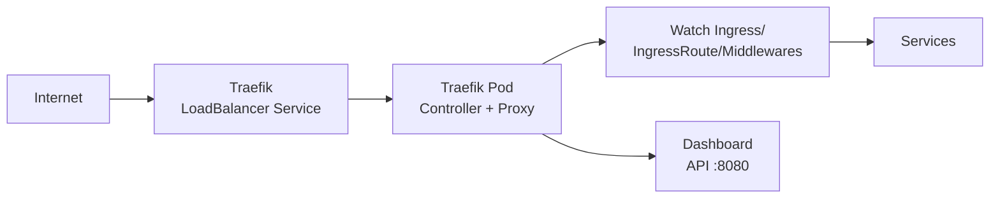

# Traefik Ingress Controller

> **Category:** Networking / Ingress

## What It Is

**Traefik** is an **open-source HTTP reverse proxy / load balancer** and an **Ingress Controller** for Kubernetes. Unlike NGINX (which uses static config + reloads), Traefik uses **dynamic configuration** with a modern architecture (Go, hot-reloading config, automatic service discovery).

## Key Features

- **Auto-discovery** — detects new services/pods automatically
- **Dynamic configuration** — reloads config on-the-fly (no NGINX-style reloads)
- **Built-in dashboard** — web UI for visualizing services/routes
- **Let's Encrypt** integration — automatic TLS cert management
- **CRDs** — `IngressRoute`, `Middleware`, `TLSOptions`, `TraefikService` extend beyond Ingress
- **Middlewares** — rate-limit, headers, redirects, stripPrefix, replacePath, etc.

## Architecture



## Installing Traefik

### Via Helm (recommended)

```bash
# 1. Add the repo
helm repo add traefik https://traefik.github.io/helm-charts
helm repo update

# 2. Install
helm install traefik traefik/traefik --namespace kube-system

# 3. Get the external IP
kubectl get svc -n kube-system traefik

# 4. Enable the dashboard (port-forward)
kubectl port-forward -n kube-system svc/traefik 8080:8080
# Open http://localhost:8080/dashboard
```

### Via static manifest

```bash
kubectl apply -f https://raw.githubusercontent.com/traefik/traefik/v3.0/docs/content/reference/dynamic-configuration/k8s-crd-definition.yml
kubectl apply -f https://raw.githubusercontent.com/traefik/traefik/v3.0/docs/content/reference/static-configuration/k8s-deploy.yml
```

## Static vs Dynamic Configuration

Traefik has two types of config:

- **Static config** (YAML file or CLI args or args on the `traefik` binary): defines what Traefik exposes (entrypoints, providers, API). Set via the Helm `values.yaml` or `Deployment`.
- **Dynamic config** (applied at runtime): defines routing rules (routers, services, middlewares). Updated via CRDs or Ingress resources.

### Static Config (Helm `values.yaml`)

```yaml
# values.yaml
entryPoints:
  web:
    address: ":80"
  websecure:
    address: ":443"

api:
  dashboard: true

providers:
  kubernetesCRD: {}       # Watch CRDs (IngressRoute, Middleware)
  kubernetesIngress: {}   # Watch standard Ingress resources

certificatesResolvers:
  letsencrypt:
    acme:
      email: admin@example.com
      storage: /data/acme.json
      httpChallenge:
        entryPoint: web   # HTTP-01 challenge
```

## Traefik CRDs (Beyond Ingress)

Traefik **extends** the Ingress API with its own CRDs:

| CRD | Purpose |
|-----|---------|
| `IngressRoute` | Replacement for Ingress (more powerful) |
| `Middleware` | Rate-limit, headers, redirects, stripPrefix, replacePath |
| `TLStore` / `TLSOptions` | TLS configuration |
| `TraefikService` | Load balancing between services (mirroring, weighted) |
| `Plugin` | Custom plugins |

### IngressRoute Example (recommended over plain Ingress)

```yaml
apiVersion: traefik.io/v1alpha1
kind: IngressRoute
metadata:
  name: myapp
spec:
  entryPoints:
    - web
  routes:
  - match: Host(`example.com`) && PathPrefix(`/api`)   # Traefik matchers
    kind: Rule
    paths:
      - path: /api
        pathType: Prefix
        middlewares:
          - stripprefix               # Middleware to strip /api
      - services:
        - name: api-service
          port: 80
  - match: Host(`example.com`) && PathPrefix(`/static`)
    kind: Rule
    services:
      - name: static-service
        port: 80
  # TLS configuration
  tls:
    certResolver: letsencrypt
```

### Middleware Example

```yaml
apiVersion: traefik.io/v1alpha1
kind: Middleware
metadata:
  name: stripprefix
spec:
  stripPrefix:
    prefixes:
      - /api
    forceSlash: false
---
apiVersion: traefik.io/v1alpha1
kind: Middleware
metadata:
  name: rate-limit
spec:
  rateLimit:
    average: 100
    burst: 50
    sourceKey: X-Forwarded-For
```

## TLS with Traefik (and Let's Encrypt)

Traefik integrates with Let's Encrypt via the `certificatesResolvers`:

```go
certificatesResolvers:
  letsencrypt:
    acme:
      email: admin@example.com
      storage: /data/acme.json
      httpChallenge:
        entryPoint: web
```

Then reference it in an IngressRoute:

```yaml
spec:
  tls:
    certResolver: letsencrypt   # ACME HTTP-01 challenge
```

## Dashboard

The Traefik dashboard is available at `/` on the API entrypoint (default `:8080`):

```bash
# Enable via port-forward or dashboard ingress
kubectl port-forward -n kube-system svc/traefik 8080:8080
```

The dashboard shows:
- Live routers, services, middlewares
- Incoming requests (metrics)
- Health status

## Commands

```bash
# Install via Helm
helm repo add traefik https://traefik.github.io/helm-charts
helm install traefik traefik/traefik -n kube-system

# Get the LoadBalancer IP
kubectl get svc -n kube-system traefik

# Port-forward the dashboard
kubectl port-forward -n kube-system svc/traefik 8080:8080

# View Traefik logs
kubectl -n kube-system logs -f deployment/traefik

# Describe CRDs
kubectl get ingressroute
kubectl get middleware
kubectl describe ingressroute <name>

# Test routing
curl -H "Host: example.com" http://<external-ip>/
```

## Traefik vs NGINX Ingress

| Feature | Traefik | NGINX Ingress |
|---------|---------|---------------|
| Configuration | CRDs (`IngressRoute`) | Standard Ingress + annotations |
| Reload | Hot (dynamic) | Full reload (`nginx -s reload`) |
| Dashboard | Built-in (`/dashboard`) | Requires extra tool |
| ACME / TLS | Native (built-in) | Requires annotation + external secret |
| Middlewares | Custom resources (`Middleware`) | NGINX-specific annotations |
| Canary | Via `TraefikService` mirroring | `canary` annotation |
| Learning curve | Easy (dashboard) | Medium (annotations) |
| Stability | Newer, faster-moving | Mature, stable |

## Common Issues

### Dashboard not accessible
```bash
# Ensure api.enabled: true and the service is correct:
helm get values traefik
# Fix:
helm upgrade traefik traefik/traefik --set api.dashboard=true
```

### IngressRoute not routing
```bash
kubectl get ingressroute
kubectl describe ingressroute <name>
# Check: entryPoints match, CRD installed, matches syntax correct
```

### TLS not enabled / "no certificates"
```yaml
# Must set tls.certResolver:
spec:
  tls:
    certResolver: letsencrypt
```

### Let's Encrypt HTTP-01 failing
```bash
# Needs port 80 exposed and the letsencrypt entrypoint:
entryPoints:
  web:
    address: ":80"
  websecure:
    address: ":443"
certificatesResolvers:
  letsencrypt:
    acme:
      httpChallenge:
        entryPoint: web
```

### Middleware not applied
```bash
# Name must match the middleware resource name exactly:
middlewares:
  - my-mw               # Name of the Middleware CR
# And the Middleware must exist in the same namespace.
```

## Best Practices

1. **Prefer IngressRoute** over Ingress (gives you more control)
2. **Use Middlewares** for reusable transforms (header injection, rate-limit)
3. **Enable the dashboard** for observability during development
4. **Set a `defaultBackend`** — so unmatched routes land somewhere
5. **Use labels** (`traefik.enable: "true"`) to selectively enable routing
6. **Restrict to namespaces** via `--providers.kubernetesCRD.ingressClass`
7. **Health check entrypoint** (`:10254`) for LBs
8. **External metrics** (Prometheus) via the `traefik-metrics` config
9. **Canary with mirroring** — `TraefikService` supports `mirroring`
10. **Use named entrypoints** (`web`, `websecure`) — makes config clearer

## Traefik Canary (Mirroring)

```yaml
apiVersion: traefik.io/v1alpha1
kind: TraefikService
metadata:
  name: myapp-mirroring
spec:
  mirroring:
    name: myapp
    port: 80
    mirrors:
    - name: myapp-v2
      port: 80
      percent: 20    # Send 20% to v2
```

## Interview Questions

**Q: What does Traefik add over plain Ingress?**
A: CRDs (`IngressRoute`, `Middleware`), a dynamic (hot-reload) config, a built-in dashboard, native ACME, and mirroring — going beyond what plain Ingress + annotations offer.

**Q: What is an IngressRoute?**
A: A Traefik-specific CRD that extends Ingress with richer matchers (e.g., `Host(`x`) && PathPrefix(`/y`)`), middlewares, TLS cert resolvers, and `traefik.service` definitions — more expressive than standard Ingress.

**Q: How do you enable Let's Encrypt with Traefik?**
A: Configure a `certificatesResolvers.letsencrypt.acme` entry in static config (with `email` + `httpChallenge`), then set `spec.tls.certResolver: letsencrypt` on an IngressRoute.

**Q: How are rate limiting and headers implemented in Traefik?**
A: Via **Middleware** CRDs (e.g., `rateLimit`, `headers`, `stripPrefix`), attached in the `routes[].middlewares` field — cleaner and reusable across routes.

**Q: What's the difference between Traefik and NGINX reload behavior?**
A: Traefik updates config **dynamically** (hot reload — no restart). NGINX Ingress writes a whole new `nginx.conf` and reloads the NGINX process each time.

## Related Resources

- [Ingress](ingress.md)
- [Ingress Controllers](ingress-controllers.md)
- [NGINX Ingress](nginx-ingress.md)
- [Networking Model](networking.md)
- [Services](services.md)