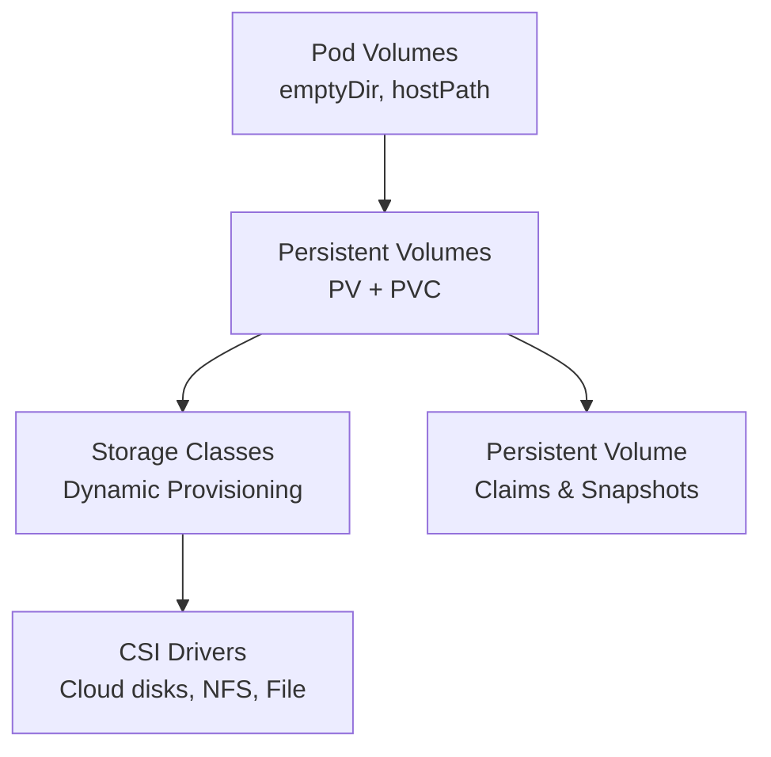

# 05. Storage

> **Category:** Storage & Volumes

Kubernetes storage provides ways for Pods to **persist data** beyond their lifecycle, share files, and connect to external block/disk storage. This category covers the storage primitives, drivers, and patterns.

## Core Concepts

| File | Topic |
|------|-------|
| [storage.md](storage.md) | Volumes, PV, PVC, StorageClass fundamentals |
| [persistent-volumes.md](persistent-volumes.md) | PV, PVC, access modes, reclaim policies |
| [storage-classes.md](storage-classes.md) | Dynamic provisioning of volumes |
| [volume-snapshots.md](volume-snapshots.md) | Snapshot/backup of PVCs |
| [inline-volumes.md](inline-volumes.md) | Volumes declared in the Pod spec (hostPath, emptyDir, configMap) |

## Storage Layers

| Layer | Component | Example |
|-------|-----------|---------|
| **Container** | Filesystem | `/data` inside container |
| **Pod** | Volume | `emptyDir`, `hostPath`, `configMap` |
| **Pod** | PVC | Claims external storage |
| **Cluster** | PV + PV | Bound to a PVC |
| **Provisioner** | CSI Driver | Dynamic volume provisioning |
| **Backend** | Cloud disk / NAS / SAN | EBS, PD, NFS, Ceph |

## Learning Path

## Core Storage API Objects

| Resource | Purpose |
|----------|---------|
| `PersistentVolume` (PV) | A piece of storage in the cluster (admin-provisioned) |
| `PersistentVolumeClaim` (PVC) | A request for storage by a Pod (developer-facing) |
| `StorageClass` (SC) | Defines a type of storage and its provisioner (e.g., "fast-ssd") |
| `Volume` | Ephemeral storage defined in the Pod spec |
| `CSIDriver` | Container Storage Interface driver object |

## Access Modes

These define **how many nodes** can mount the volume and in what mode:

| Access Mode | Meaning | Can be mounted |
|-------------|---------|----------------|
| `ReadWriteOnce` (RWO) | Read-write by **a single node** | 1 node (r/w) |
| `ReadOnlyMany` (ROX) | Read-only by **many nodes** | Many nodes (r/o) |
| `ReadWriteMany` (RWX) | Read-write by **many nodes** | Many nodes (r/w) |
| `ReadWriteOncePod` (RWOP) | (K8s 1.11+) Read-write by **a single Pod** | 1 Pod |

Not all storage backends support all modes. e.g., AWS EBS = RWO; AWS EFS = RWX.

## Reclaim Policies

What happens to the PV (and the underlying disk) when the PVC is deleted:

| Policy | Behavior |
|--------|----------|
| `Retain` | Keep the volume and data (manual cleanup) — "preserve" |
| `Delete` | Delete the volume and data (e.g., cloud disk destroyed) |
| `Recycle` | (Deprecated) Wipe and return to pool |

## Key Questions

- **How do pods get persistent storage?** Via a PVC claim against a PV.
- **How is a PV created?** Statically (admin) or dynamically (via StorageClass + CSI driver).
- **How do you back up a database's data?** Use `VolumeSnapshot` (or external backup tool).
- **How is storage connected?** Via a CSI driver talking to the cloud / NFS / SAN.

## Related Resources

- [Networking](../04-networking/README.md)
- [Security](../06-security/README.md)
- [Cluster Operations](../08-cluster-operations/README.md)
EOF
echo "05-storage/README.md written"