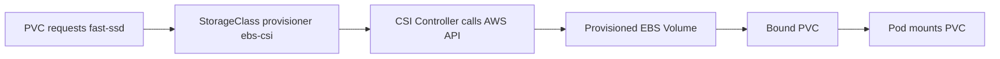

# Storage Classes & Dynamic Provisioning

> **Category:** Storage

## What It Is

A **StorageClass** is a Kubernetes object that describes **dynamic storage parameters** and a **provisioner**. When a `PersistentVolumeClaim` references a StorageClass, Kubernetes automatically provisions a volume using the named CSI driver — letting developers self-service storage without admin intervention.

## Why It Exists

- **Manual provisioning** of PVs is slow — each disk must be tied to a PV by hand
- **Developer friction** — waiting for ops to create storage
- **Storage variety** — workloads need different tiers (SSD vs HDD) behind the same interface
- **Self-service** — `kubectl apply -f pvc.yaml` just works

A StorageClass is a "storage menu" — "give me some fast SSD" — and the provisioner knows how to build it.

## Architecture



## StorageClass API

```yaml
apiVersion: storage.k8s.io/v1
kind: StorageClass
metadata:
  name: fast-ssd
  annotations:
    storageclass.kubernetes.io/is-default-class: "true"
provisioner: ebs.csi.aws.com          # CSI driver to call
parameters:                           # Driver-specific (passed to CSI)
  type: io2                          # Disk type
  iops: "3000"                       # Provisioned IOPS
  fsType: ext4                       # Filesystem
reclaimPolicy: Delete                # Delete | Retain
volumeBindingMode: WaitForFirstConsumer   # Immediate | WaitForFirstConsumer
allowVolumeExpansion: true           # Allow resizing PVCs
mountOptions:
- noexec
```

## Provisioners (CSI Drivers)

| Provisioner | Provider | Volume Type |
|-------------|----------|-------------|
| `ebs.csi.aws.com` | AWS | Block (EBS) |
| `efs.csi.aws.com` | AWS | File (EFS) |
| `pd.csi.google.com` | GCP | Block (Persistent Disk) |
| `disk.csi.azure.com` | Azure | Block (Managed Disk) |
| `file.csi.azure.com` | Azure | File (Azure Files) |
| `rook-cephfs` | Ceph | File |
| `rook-rbd` | Ceph | Block (RBD) |
| `pxd.portworx.com` | Portworx | Block/File |

## volumeBindingMode

| Mode | Behavior | When to use |
|------|----------|-------------|
| `Immediate` (default) | Provision immediately | Single-zone / non-cloud |
| `WaitForFirstConsumer` | Provision when Pod is scheduled | Multi-AZ cloud volumes |

### Why WaitForFirstConsumer?

Cloud volumes (EBS, PD, Disk) are **zone-bound** — provisioned in one AZ, attachable to nodes in that AZ only. `WaitForFirstConsumer` lets the **scheduler pick a zone**, then provisions there.

## Reclaim Policy

What happens after the PVC/PV are deleted:

| Policy | Result |
|--------|--------|
| `Delete` | Volume **destroyed** (cloud disk deleted) |
| `Retain` | Volume **kept** (manual recovery) — safe for sensitive data |
| `Recycle` | (Deprecated) Wiped and returned to pool |

## allowVolumeExpansion + Resizing

```yaml
allowVolumeExpansion: true
```

To resize, update the PVC's `spec.resources.requests.storage`:

```bash
# Resize to 20Gi
kubectl patch pvc my-pvc --type merge -p 'spec: {resources: {requests: {storage: 20Gi}}}'
# Or use the edit command: kubectl edit pvc my-pvc
```

The **filesystem** is resized automatically (if `fsType` supports it — ext4/xfs do).

## Mount Options

```yaml
mountOptions:
- hard          # NFS hard mount (retry on failure)
- noexec        # Prevent execution from volume
- vers=4.1      # NFS version
```

## Default StorageClass

Used when the PVC has no `storageClassName`. To change:

```bash
# Set as default
kubectl annotate storageclass fast-ssd storageclass.kubernetes.io/is-default-class=true

# List
kubectl get storageclass           # (default) marks the default

# Remove default annotation
kubectl annotate storageclass fast-ssd storageclass.kubernetes.io/is-default-class-
```

## StorageClass Parameters

`parameters` are **passed directly** to the CSI driver (not standardized).

### EBS CSI

```yaml
parameters:
  type: io2
  iops: "3000"
  throughput: "250"
  fsType: ext4
```

### GCE PD

```yaml
parameters:
  type: pd-ssd
  fsType: ext4
```

### Azure Disk

```yaml
parameters:
  skuname: Premium_LRS
  kind: Managed
```

## Volume Snapshot Classes

A **VolumeSnapshotClass** does for snapshots what a StorageClass does for volumes:

```yaml
apiVersion: snapshot.storage.k8s.io/v1
kind: VolumeSnapshotClass
metadata:
  name: csi-ebs-snapclass
driver: ebs.csi.aws.com
deletionPolicy: Delete
parameters:
  csiSnapshotLocation: ""
```

## Commands

```bash
kubectl get sc
kubectl get sc <name> -o yaml
kubectl describe sc <name>
kubectl patch pvc <name> -p '{...}'   # See allowVolumeExpansion above
```

## Common Issues

### No default StorageClass
```bash
kubectl get sc     # none marked (default)
# A PVC with no storageClassName fails to bind
# Fix: annotate one as default
```

### PVC stuck "Pending" — no StorageClass
```bash
kubectl describe pvc <name>
# "no storageclass.storageclassname"
# Fix: set storageClassName on the PVC, or set a default SC
```

### Resize not working
```bash
# Ensure allowVolumeExpansion: true on the StorageClass
# Ensure your CSI driver supports resize
kubectl get pvc <name>             # Check the new size reflects
kubectl get events -n <pod-ns>     # Check for resize-related events
```

## Best Practices

1. **Use WaitForFirstConsumer** for cloud volumes
2. **Use `Retain` for prod databases** — prevents accidental data loss
3. **Set `allowVolumeExpansion: true`** if you might need to grow volumes
4. **One StorageClass per tier** (e.g., `gp2`, `io1`, `efs`) — keep parameters clean
5. **Don't overload the default SC** — keep the default for general workloads
6. **Set reclaimPolicy carefully** — `Delete` means data is destroyed
7. **Use `mountOptions` sparingly** — they are driver-specific
8. **Monitor for unbound PVCs** — they cause Pods to hang

## Interview Questions

**Q: When is a PV provisioned for a PVC?**
A: When the PVC references a StorageClass (with a provisioner), the CSI driver **dynamically creates** the PV and underlying volume upon `kubectl apply`.

**Q: What's the difference between Immediate and WaitForFirstConsumer?**
A: Immediate provisions at PVC creation. WaitForFirstConsumer delays creation until the Pod is scheduled, placing the volume in the correct zone (important for AZ-bound disks like EBS).

**Q: Can you resize a PVC?**
A: Yes, if the StorageClass has `allowVolumeExpansion: true` and the CSI driver supports it. Update the PVC's request, and the filesystem is grown automatically.

**Q: What's the `reclaimPolicy`? Why does it matter?**
A: It decides if the underlying disk is **deleted** (`Delete`) or **kept** (`Retain`) when the PVC is deleted. `Retain` is safer for production data.

**Q: Can you have multiple StorageClasses?**
A: Yes — common is one per disk type/zone (`fast-ssd`, `slow-hdd`, `efs`). Only one can be the default.

## Related Resources

- [Storage Fundamentals](storage.md)
- [Persistent Volumes](persistent-volumes.md)
- [Volume Snapshots](volume-snapshots.md)
EOF
echo "storage-classes.md written"