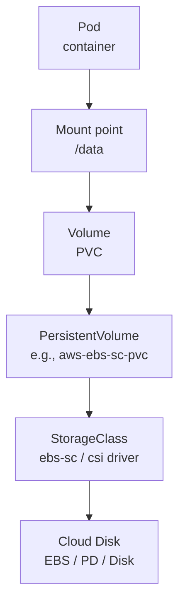

# Storage Fundamentals

> **Category:** Storage

## What It Is

Kubernetes exposes several **storage primitives** for Pods to attach external storage:
- **Volumes** (Pod-scoped) — ephemeral or mounted directly
- **PersistentVolumes (PV)** + **PersistentVolumeClaims (PVC)** — cluster-scoped storage decoupled from Pods
- **StorageClasses** — enable dynamic provisioning
- **VolumeSnapshots** — backups
- **CSI (Container Storage Interface)** — plugin model for any storage backend

## Why It Exists

Containers are **ephemeral** — when a Pod dies, its filesystem dies. Kubernetes needs:
- **Persistence** — survive Pod restarts/recreation
- **Sharing** — multiple Pods share a volume
- **Portability** — abstract the cloud-specific disk
- **Dynamic allocation** — let developers request storage without admins pre-creating it

## Storage Architecture



## Volumes (in Pod spec)

A **Volume** is defined **inside** a Pod spec — its lifecycle is tied to the Pod. Ephemeral.

```yaml
apiVersion: v1
kind: Pod
metadata:
  name: my-pod
spec:
  containers:
  - name: app
    image: nginx
    volumeMounts:
    - name: cache-volume      # Mount the volume
      mountPath: /cache
  volumes:                    # Declare the volume
  - name: cache-volume        # Give it a name
    emptyDir: {}             # Empty directory (pod-scoped, deleted on pod death)
  - name: config-volume       # Mount a ConfigMap as a volume
    configMap:
      name: my-config
  - name: host-data
    hostPath:
      path: /mnt/data         # Mount the NODE's /mnt/data
```

### Volume Types

| Volume Type | Description | Persistent? | Scope |
|-------------|-------------|-------------|-------|
| `emptyDir` | Empty directory on the node | ❌ (deleted with Pod) | Pod-local |
| `hostPath` | Mounts a path on the **Node** | Depends on disk | Node-scoped (not portable!) |
| `configMap` | Injects a ConfigMap as files | ❌ | Pod-local |
| `secret` | Injects a Secret as files | ❌ | Pod-local |
| `downwardAPI` | Exposes Pod metadata as files | ❌ | Pod-local |
| `persistentVolumeClaim` | Mounts an existing PVC | ✅ | Cluster-wide |
| `csi` | Mounts a CSI volume directly | ✅ | Cluster-wide |
| `projected` | Projects multiple sources | ❌ | Pod-local |

### emptyDir

Empty to start — shared between containers in the Pod, or for scratch space:

```yaml
volumes:
- name: shared
  emptyDir: {}
```

- Lives in `/var/lib/kubelet/pods/<pod-id>/volumes/kubernetes.io~emptyDir/...` (on the node)
- When the Pod is deleted, it is deleted
- Can use `medium: Memory` for tmpfs (in-RAM — fast, but lost on reboot):

```yaml
volumes:
- name: scratch
  emptyDir:
    medium: Memory
```

### hostPath

Mounts a directory **from the node's filesystem** into the Pod:

```yaml
volumes:
- name: logs
  hostPath:
    path: /var/log/pods
    type: Directory
```

**⚠️ Security risk** — Pod can read/write node files. Use with `podSecurityPolicy` / `fsGroup`.

### projected Volume

Combines several volume sources into one mount point:

```yaml
volumes:
- name: combined
  projected:
    sources:
    - configMap:
        name: my-config
    - secret:
        name: my-secret
    - downwardAPI:
        items:
        - path: "labels"
          fieldRef:
            fieldPath: metadata.labels
```

## PersistentVolumes (PV) and Claims (PVC)

These decouple storage **allocation** (admin) from **consumption** (developer). A Pod requests storage via a PVC, which binds to a PV.

### Lifecycle

1. A developer creates a `PersistentVolumeClaim` (requesting storage)
2. Kubernetes (admin) creates a matching `PersistentVolume`, or a `StorageClass` dynamically provisions one
3. They `bind` to each other
4. The Pod mounts the PVC
5. When the PVC is deleted, the PV follows its `reclaimPolicy`

### PersistentVolumeClaim

```yaml
apiVersion: v1
kind: PersistentVolumeClaim
metadata:
  name: my-pvc
spec:
  accessModes:
  - ReadWriteOnce        # Only RWO supported in most cases
  resources:
    requests:
      storage: 5Gi       # Request 5GB
  storageClassName: fast-ssd  # Which StorageClass (dynamic); "" = default
```

### PersistentVolume

```yaml
apiVersion: v1
kind: PersistentVolume
metadata:
  name: pv-nfs
spec:
  capacity:
    storage: 5Gi
  accessModes:
  - ReadWriteMany
  csi:
    driver: efs.csi.aws.com
    volumeHandle: fs-12345
  persistentVolumeReclaimPolicy: Retain
  storageClassName: fast-ssd
```

### How PVCs Bind to PVs

Kubernetes matches based on:
1. Requested `storageClassName`
2. `accessModes` (must be a subset)
3. `resources.requests.storage` (PV must be ≥ claim)
4. The first matching PV (if multiple, it's **first-match**)

### In a Pod

```yaml
apiVersion: v1
kind: Pod
metadata:
  name: my-pod
spec:
  containers:
  - name: app
    volumeMounts:
    - name: data
      mountPath: /data
  volumes:
  - name: data
    persistentVolumeClaim:
      claimName: my-pvc
```

## StorageClass (Dynamic Provisioning)

A StorageClass lets developers request storage **without pre-creating PVs**. The CSI driver provisions a disk on-demand.

```yaml
apiVersion: storage.k8s.io/v1
kind: StorageClass
metadata:
  name: fast-ssd
provisioner: ebs.csi.aws.com   # The CSI driver
parameters:
  type: io2
  iops: "3000"
reclaimPolicy: Delete          # What happens after PVC deletion
volumeBindingMode: WaitForAnyPersistentVolume
```

When a PVC references `storageClassName: fast-ssd`, a `PersistentVolume` is **automatically created** (in `Bound` state) and the cloud disk is provisioned.

### Volume Binding Modes

| Mode | Behavior | Use Case |
|------|----------|----------|
| `Immediate` (default) | Provision + bind when the PVC is created | Stateless/fast storage |
| `WaitForFirstConsumer` | Wait until a Pod uses the PVC (then schedule-aware) | Multi-zone disks (AZ-bound) |

## Reclaim Policies

| Policy | Behavior |
|--------|----------|
| `Delete` | Delete the disk/claim after PVC deletion (e.g., AWS EBS) — default for dynamic |
| `Retain` | Keep the disk/data (manual recovery) — safe for backups |
| `Recycle` | (Deprecated) Wipe and return to pool |

## Multi-attach

For shared storage where **multiple pods on multiple nodes** need it:
- `volumeMounts` must have `mountPropagation: Bidirectional`
- Volume must support `RWX` or multi-node RWO
- Storage driver / backend must support it (e.g., NFS, EFS, Portworx, Rook)

## CSI (Container Storage Interface)

CSI replaces the old "in-tree" volume plugins. It lets **any storage vendor** write a driver as a Pod (no K8s core code changes needed).

### CSI Driver Components

| Component | Role |
|-----------|------|
| **CSI Controller** | Runs as a Deployment — creates/attaches/deletes volumes |
| **CSI Node Driver** | Runs as a DaemonSet — mounts volumes on each Node |
| **Sidecar containers** | Manage snapshots, resize, attach/detach |

### Common CSI Drivers

| Cloud | CSI Driver |
|-------|------------|
| AWS | `ebs.csi.aws.com` (EBS) |
| GCP | `pd.csi.google.com` (Persistent Disk) |
| Azure | `disk.csi.azure.com` (Managed Disk) |
| NFS | `nfs.csi.k8s.io`, `efs.csi.aws.com` |
| Ceph | `cephfs.csi.ceph.com`, `rbd.csi.ceph.com` |
| Portworx | `pxd.portworx.com` |

## Commands

```bash
# Create a PVC
kubectl apply -f pvc.yaml

# Check status
kubectl get pvc
kubectl get pvc <name> -o wide        # Shows PV name

# Describe
kubectl describe pvc <name>
# Check: Status (Bound/Pending), Conditions (e.g., "volume is already bound")

# Get PVs
kubectl get pv
kubectl get pv <name> -o yaml         # Full details

# Delete (depends on reclaim policy)
kubectl delete pvc <name>             # PVC deleted; PV follows reclaim policy

# List StorageClasses
kubectl get sc                        # short name for storageclass
kubectl get sc <name> -o yaml

# Describe
kubectl describe sc <name>

# Create / patch a default SC:
kubectl patch storageclass <name> -p '{"metadata": {"annotations":{"storageclass.kubernetes.io/is-default-class":"true"}}}'
```

## Common Issues

### PVC stuck in `Pending`
```bash
kubectl describe pvc <name>
# Look for: "waiting for a volume to be provisioned" or "no persistent volumes"
# Causes:
#  - No StorageClass set and no static PV exists
#  - No CSI driver installed
#  - Access mode mismatch (e.g., claim is RWX, PV is RWO)

kubectl get sc                       # Is the StorageClass there?
kubectl get csidrivers               # Is the driver installed?
kubectl get sc <name> -o yaml        # Check reclaimPolicy / parameters
```

### "volume is already bound to a different claim"
```bash
# A PV is already bound — delete the PVC or the PV manually:
kubectl delete pvc <name>
kubectl get pv <name>
kubectl delete pv <name>       # Force; may need to delete the actual disk too
```

### StorageClass is slow to provision
```bash
# WaitForFirstConsumer + AZ-bound volumes can delay scheduling
# Check: Pod is also Pending — scheduler and provisioner wait for each other
# Fix: ensure topology constraints match node labels, or use multi-AZ storage
```

### `hostPath` permission denied
```bash
# The host directory may not exist or be writable:
kubectl exec <pod> -- ls -ld /path/on/host
# Fix: create it on the host, or use securityContext.fsGroup
```

### PV not mounting on Pod
```bash
kubectl describe pod <pod>
# Look for: "MountVolume.SetUp failed" with a mount error
# Check: the CSI driver is running, the volume exists, access mode/zone correct
kubectl -n kube-system get pods -l app=ebs-csi-controller
kubectl -n kube-system logs -l app=ebs-csi-controller
```

## Interview Questions

**Q: What is the difference between a PV and a PVC?**
A: A **PersistentVolume (PV)** is a piece of storage **in the cluster** (admin-provisioned, cluster-scoped). A **PersistentVolumeClaim (PVC)** is a **request for storage** by a Pod (namespace-scoped). The Pod uses a PVC; Kubernetes binds it to a suitable PV.

**Q: What does "dynamic provisioning" mean?**
A: A `StorageClass` tells Kubernetes how to create storage on-demand. When a developer creates a PVC referencing a SC, the **CSI driver** (provisioner) automatically creates a PV (and the underlying cloud disk) — no admin intervention.

**Q: What happens when you delete a PVC?**
A: The PV is released. Its `persistentVolumeReclaimPolicy` dictates what happens next: `Delete` wipes the volume (and disk), `Retain` keeps it.

**Q: When would you use `WaitForFirstConsumer`?**
A: When the storage backend is **topology-constrained** (e.g., an AWS EBS volume can only be in one AZ). It delays provisioning until the Pod is scheduled (so the volume lands in the right AZ).

**Q: What is a CSI driver?**
A: A plugin (following the Container Storage Interface spec) that lets Kubernetes talk to a storage system (EBS, NFS, Ceph, etc.) to create, attach, and mount volumes. It runs as Pods in the cluster (controller + node plugin).

**Q: Can multiple Pods mount the same PV?**
A: Only if the access mode allows: `ReadOnlyMany` and `ReadWriteMany` allow this (NFS, EFS). `ReadWriteOnce` mounts on **one node only**.

## Related Resources

- [Storage Classes](storage-classes.md)
- [Persistent Volumes](persistent-volumes.md)
- [Volume Snapshots](volume-snapshots.md)
- [Inline Volumes](inline-volumes.md)
- [Networking](../04-networking/README.md)