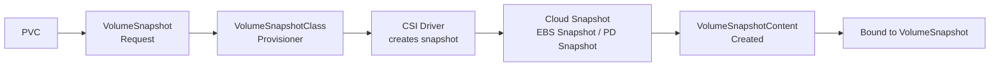

# Volume Snapshots

> **Category:** Storage

## What It Is

A **VolumeSnapshot** is a Kubernetes object (beta in 1.17+, GA in 1.20) that captures a **point-in-time snapshot** of a PersistentVolumeClaim (PVC) — creating a **backup** of the underlying storage (e.g., an AWS EBS snapshot, a GCP PD snapshot).

Snapshots are taken by the **CSI driver** and managed via:
- `VolumeSnapshotContent` — the actual snapshot (admin / dynamic)
- `VolumeSnapshot` — the developer's request (namespace-scoped)
- `VolumeSnapshotClass` — the "menu" for snapshots (analog of StorageClass)

## Why It Exists

- **Data protection** — take backups without stopping the app
- **Disaster recovery** — restore to a previous state
- **Cloning** — create a new PVC from a snapshot (instant clone)
- **Compliance** — point-in-time recovery requirements

## Architecture



## VolumeSnapshot API

```yaml
apiVersion: snapshot.storage.k8s.io/v1
kind: VolumeSnapshot
metadata:
  name: my-snapshot
  namespace: default
spec:
  volumeSnapshotClassName: csi-ebs-snapclass      # Which driver / policy
  source:
    persistentVolumeClaimName: my-pvc           # Snapshot this PVC
```

### From a PVC

```yaml
spec:
  source:
    persistentVolumeClaimName: my-claim
# The snapshot is created from the *current data* on the PVC at creation time
```

### From a VolumeSnapshot (Copy)

```yaml
spec:
  source:
    volumeSnapshotContentName: existing-snapshot
# Creates a new snapshot from an existing one — fast cloning
```

## VolumeSnapshotClass

Defines the **provisioner** and **deletion policy** for snapshots (analogous to a StorageClass):

```yaml
apiVersion: snapshot.storage.k8s.io/v1
kind: VolumeSnapshotClass
metadata:
  name: csi-ebs-snapclass
driver: ebs.csi.aws.com                    # CSI snapshotter driver
deletionPolicy: Delete                       # Delete | Retain
parameters:
  csiSnapshotPrefix: ebs-snap                # Optional prefix
```

### Deletion Policy

| Policy | Behavior |
|--------|----------|
| `Delete` | Snapshot is deleted in the cloud when the VolumeSnapshot is deleted |
| `Retain` | Cloud snapshot is **kept** (manual cleanup required) |

## Creating & Verifying a Snapshot

```bash
# 1. Create a snapshot from a PVC
kubectl apply -f my-snapshot.yaml

# 2. Check the snapshot is ready
kubectl get volumesnapshot
kubectl get volumesnapshot <name> -o yaml
# Status .readyToRestore: true

# 3. Describe for details
kubectl describe volumesnapshot <name>
# Look at: Status, Creation Time, Restore Size, Error
```

## Restoring a PVC from a Snapshot

```yaml
apiVersion: v1
kind: PersistentVolumeClaim
metadata:
  name: restored-pvc
spec:
  storageClassName: fast-ssd
  dataSourceRef:
    name: my-snapshot                # Name of the VolumeSnapshot
    kind: VolumeSnapshot
    apiGroup: snapshot.storage.k8s.io
  resources:
    requests:
      storage: 5Gi
  accessModes:
  - ReadWriteOnce
```

- The new PVC is provisioned **from the snapshot** (data is copied or linked — driver dependent)
- The restored size must be **≥** the snapshot size

## Snapshot States

| State | In VolumeSnapshot | In VolumeSnapshotContent |
|-------|--------------------|---------------------------|
| Created (pending) | `.status` empty | `CreationTimestamp` set, no `snapshot` ref |
| Ready | `.status.readyToRestore: true` | `.status.ready: true` |
| Deleted | Removed from API | `.status` empty or `.spec` gone |

## Commands

```bash
# List snapshots
kubectl get volumesnapshot -n <ns>
kubectl get volumesnapshotcontent           # Cluster-scoped content
kubectl get volumesnapshotclass

# Wait for ready
kubectl wait --for=condition=ready volumesnapshot <name>

# Delete a snapshot
kubectl delete volumesnapshot <name>

# Describe (check status, conditions)
kubectl describe volumesnapshot <name>
# Look at: Status, Bound VolumeSnapshotContent, Error, Creation Time
```

## Common Issues

### `Error: no volume snapshots in progress`
```bash
# Check: is the Snapshotter CRD and CRD installed?
kubectl get crd volumesnapshotcontents.snapshot.storage.k8s.io
# Check: is the CSI driver running?
kubectl -n kube-system get pods -l app=ebs-csi-controller
# Check: does the PVC exist in the same namespace?
```

### `VolumeSnapshotClass not found`
```bash
kubectl get volumesnapshotclass
# If listed empty, no class is installed — the CSI driver must ship it
# Or use the default (the oldest matching class becomes default)
```

### `snapshot is not ready` / status `Error`
```bash
kubectl describe volumesnapshot <name>
# Look under Status > Error: usually the CSI driver / snapshotter failed
# Check the csi-snapshotter controller logs:
kubectl -n kube-system logs -l app=csi-snapshotter
```

### Restore fails: "snapshot is too small" or "insufficient disk space"
```bash
# The restored PVC must request at least the snapshot size:
kubectl get volumesnapshot <name> -o yaml | grep restoreSize
# And set resources.requests.storage: >= restoreSize
# Also: the StorageClass must allow resize up
```

### Snapshot doesn't delete the cloud snapshot (orphaned)
```bash
# DeletionPolicy: Retain → snapshot stays in the cloud even after kubectl delete
# Manually delete the cloud snapshot (EBS snapshot ID) to free space
# Check the VolumeSnapshotContent for the cloud snapshot ID
kubectl get volumesnapshotcontent <name> -o yaml
# Under spec.csi.volumeSnapshotHandle (e.g., snap-0123456789abcdef)
```

### Snapshot from a `hostPath` or non-snapshotter PVC
```bash
# Not all PVCs support snapshots — the underlying CSI driver must implement Snapshotter
# hostPath / in-tree plugins: NO snapshot support
# Use a CSI driver that supports snapshots
```

## Snapshot Limitations

- **CSI required** — in-tree volume plugins (e.g., `kubernetes.io/aws-ebs` hostpath) don't support snapshots
- **Same StorageClass?** Not required — but recommended to avoid conflicts
- **One snapshot at a time per PVC** (mostly) — driver dependent
- **Size on restore** — must be ≥ the snapshot size
- **Access mode** — must match the storage driver capability

## Snapshot Cleanup

| Action | Cleanup required? |
|--------|-------------------|
| `kubectl delete` the VolumeSnapshot | Triggers deletion (if `Delete`) |
| Delete the PVC | Does **not** delete the snapshot |
| Delete the PV | Does **not** delete the snapshot |
| `DeletionPolicy: Retain` | Yes — manually delete cloud snapshot |

## Commands Example

```bash
# Create a snapshot
cat > snap.yaml <<EOF
apiVersion: snapshot.storage.k8s.io/v1
kind: VolumeSnapshot
metadata:
  name: my-snapshot
spec:
  volumeSnapshotClassName: csi-ebs-snapclass
  source:
    persistentVolumeClaimName: my-pvc
kubectl apply -f snap.yaml

# Wait for readiness
kubectl wait --for=condition=ready volumesnapshot my-snapshot --timeout=120s

# Restore: create a PVC from the snapshot
cat > restore.yaml <<EOF
apiVersion: v1
kind: PersistentVolumeClaim
metadata:
  name: restored-pvc
spec:
  storageClassName: gp2
  dataSourceRef:
    name: my-snapshot
    kind: VolumeSnapshot
    apiGroup: snapshot.storage.k8s.io
  resources:
    requests:
      storage: 5Gi
  accessModes:
  - ReadWriteOnce
kubectl apply -f restore.yaml

# Check the new PVC is Bound
kubectl get pvc restored-pvc
```

## Interview Questions

**Q: How do you back up a PVC?**
A: Create a `VolumeSnapshot` object (referencing the PVC). The CSI driver takes a point-in-time snapshot of the underlying disk (e.g., AWS EBS snapshot).

**Q: What's the difference between a VolumeSnapshot and a VolumeSnapshotContent?**
A: A `VolumeSnapshot` is a namespace-scoped developer request (like a PVC). A `VolumeSnapshotContent` is the actual snapshot resource (cluster-scoped, like a PV). They bind together — `VolumeSnapshotContent` is to `VolumeSnapshot` as `PV` is to `PVC`.

**Q: How do you restore a PVC from a snapshot?**
A: Create a new PVC whose `dataSourceRef` points to the `VolumeSnapshot`. The CSI driver provisions the volume from the snapshot.

**Q: When would you use `deletionPolicy: Retain`?**
A: For compliance or long-term archives — you want the cloud snapshot to persist even if the VolumeSnapshot object is deleted (e.g., accidental delete protection).

**Q: Do all PVCs support snapshots?**
A: No — only PVCs provisioned by a CSI driver that implements the snapshotter (e.g., EBS CSI, PD CSI). In-tree volume plugins and `hostPath` do not.

## Related Resources

- [Storage Fundamentals](storage.md)
- [Persistent Volumes](persistent-volumes.md)
- [Storage Classes](storage-classes.md)