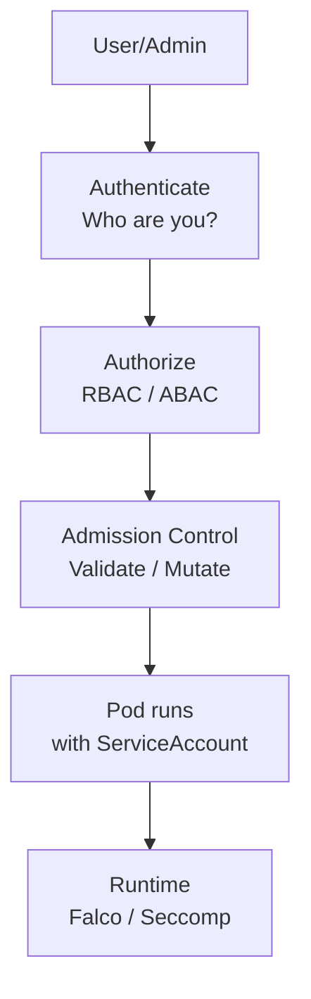

# 06. Security

> **Category:** Security & Compliance

This category covers Kubernetes' built-in security primitives: **authentication, authorization (RBAC), admission control, secrets, and policy enforcement**.

## Core Security Concepts

| File | Topic |
|------|-------|
| [rbac.md](rbac.md) | RBAC: roles, bindings, service accounts |
| [service-accounts.md](service-accounts.md) | ServiceAccounts, tokens, IAM integration |
| [secrets.md](secrets.md) | Secret management (etcd encryption, external secrets) |
| [pod-security-admission.md](pod-security-admission.md) | PSA (replaced PodSecurityPolicy) |
| [admission-controllers.md](admission-controllers.md) | Admission controllers (PodSecurity, NamespaceLifecycle, etc.) |

## Advanced Policy & Enforcement

| File | Topic |
|------|-------|
| [opa-gatekeeper.md](opa-gatekeeper.md) | OPA / Gatekeeper (rego policy-as-code) |
| [kyverno.md](kyverno.md) | Kyverno (Kubernetes-native policy engine) |

## Security Architecture

## The Four Layers of Kubernetes Security

| Layer | Control | Component |
|-------|-------|-----------|
| **1. Identity** | Who is the user? | Certificate, token (Authenticate) |
| **2. Access** | What can they do? | RBAC (Role, RoleBinding, ServiceAccount) |
| **3. Admission** | Is this allowed to run? | Admission Controllers (PodSecurity, OPA) |
| **4. Runtime** | What happens at runtime? | SELinux, Seccomp, PSP/PSA, Falco |

## Key Questions

- **How is access controlled?** RBAC (Roles + Bindings) on authenticated users/service accounts
- **How are pods constrained?** Pod Security Admission (PSA) / PodSecurityPolicy (legacy)
- **How are secrets stored?** etcd (encrypted at rest), optionally externalized
- **How are requests validated?** Admission controllers (mutating + validating)
- **How are secrets injected into pods?** As env vars or mounted volumes

## Related Resources

- [Networking](../04-networking/README.md)
- [Cluster Operations](../08-cluster-operations/README.md)
- [Observability](../08-cluster-operations/README.md)
