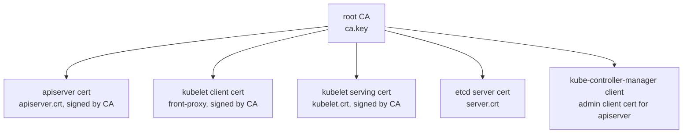

# TLS Certificates & PKI

> **Category:** Security / Identity / PKI

## What It Is

Kubernetes uses **X.509 certificates and a public-key infrastructure (PKI)** for both **cluster identity** (proving a node/leaf is really itself) and **API authentication** (proving a user/service is who they claim).

There are **two planes** of certificates:
- **Control-plane (cluster) certificates** — used by kube-apiserver, kubelet, etcd, and components on each node
- **User / ServiceAccount certificates** — presented by humans and Pods to authenticate to the API

## Why It Exists

- **Mutual TLS** between components (apiserver <-> etcd, kubelet <-> apiserver)
- **Node identity** — prove a kubelet is really that Node
- **User authentication** — x509 client certs map to Users (e.g., admin kubeconfig)
- **Service identity** — `serving` cert for API server / ingress via cert-manager

## Cluster PKI Overview



For a **kubeadm** cluster, the CA and all certs are in `/etc/kubernetes/pki/`:

```
/etc/kubernetes/pki/
  ca.crt          ca.key           # Root cluster CA
  apiserver.crt   apiserver.key     # API server serving cert
  apiserver-etcd-backup-client...
  apiserver-kubelet-client.crt/.key   # kubelet client (apiserver -> kubelet)
  apiserver-kubeconfig   # (config using the above client cert)
  front-proxy-ca.*       # Aggregation-layer CA
  front-proxy-client.*
  etcd/
    server.crt/.key
    peer.crt/.key
    ca.*  # etcd's own CA
  sa.pub  sa.key  # ServiceAccount token signing key
```

## Key Certificate Files (kubeadm)

| File | Purpose |
|------|---------|
| `ca.crt` / `ca.key` | Root CA — signs all other certs |
| `apiserver.crt` / `.key` | API server serving cert (used by clients) |
| `apiserver-kubelet-client.crt/.key` | apiserver client cert (auth'd by kubelet TLS auth) |
| `front-proxy-ca.crt/.key` | Aggregation layer CA |
| `front-proxy-client.crt/.key` | apiserver's client cert to the proxy |
| `etcd/server.crt/.key` | etcd server cert |
| `etcd/peer.crt/.key` | etcd peer-to-peer cert |
| `sa.pub/.key` | ServiceAccount **token signing** key (the token issuer) |

## Certificate Rotation

Certificates have an expiry — you must **rotate** them:

```bash
# Check expiry (kubeadm)
kubeadm certs check-expiration
# Output: CERTIFICATE        EXPIRES         ...
# Example: /etc/kubernetes/pki/apiserver.crt   2025-01-..
```

### Rotating certificates (kubeadm)

```bash
# Rotate ALL certs (non-disruptively if HA)
sudo kubeadm certs renew all

# Rotate a specific cert
sudo kubeadm certs renew apiserver

# After renewal, you may need to restart static pods (if non-HA control plane)
sudo systemctl restart kubelet   # or restart the static-pod pods

# Then regenerate kubeconfig files that embed the certs:
sudo kubeadm init phase kubeconfig all
```

### Automated rotation (newer)

- kubelet certs auto-rotate (with `--rotate-certificates=true`)
- kubelet **serving** certs auto-rotate when `RotateKubeletServerCertificate` feature gate is on

## Users & kubeconfig (x509 client certs)

A human authenticates to the API by presenting an x509 **client certificate**, signed by the cluster CA. The **Common Name (CN)** becomes the username; the **Organization (O)** becomes a group.

```bash
# Generate a client cert for user "alice" in group "dev"
openssl genrsa -out alice.key 2048
openssl req -new -key alice.key -out alice.csr -subj "/CN=alice/O=dev"

# Sign it with the cluster CA
openssl x509 -req -in alice.csr -CA ca.crt -CAkey ca.key -CAcreateserial \
  -out alice.crt -days 365 -extfile <(printf "subjectAltName=DNS:alice")

# Build a kubeconfig
kubectl config set-credentials alice --client-key alice.key --client-certificate alice.crt --client-certificate-data <base64>
kubectl config set-context alice-context --cluster=my-cluster --user=alice
kubectl config use-context alice-context

# Verify
kubectl --context alice-context auth can-i get pods -n default
```

The CN is the **user** (`alice`); the O is the **group** (`dev`). RBAC grants permissions to user/group:

```yaml
subjects:
- kind: User        # or Group, or ServiceAccount
  name: alice
  apiGroup: rbac.authorization.k8s.io
```

## kubeconfig

A **kubeconfig** is the file (default `~/.kube/config`) holding cluster connection details: clusters, users/auth, contexts.

```yaml
apiVersion: v1
kind: Config
clusters:
- name: my-cluster
  cluster:
    server: https://<api-server>:6443
    certificate-authority-data: <base64 CA>    # verify the server
users:
- name: admin
  user:
    client-certificate-data: <base64 cert>   # the admin x509 client cert
    client-key-data:       <base64 key>
contexts:
- name: admin@my-cluster
  context:
    cluster: my-cluster
    user: admin
    namespace: default
current-context: admin@my-cluster
```

`kubectl`-specific: a kubeconfig with **tokens** (for users) or **exec** plugins (for cloud auth) is also common.

### Token-based kubeconfig
```yaml
users:
- name: my-user
  user:
    token: <bearer token>   # e.g., a ServiceAccount token
```

## Service Accounts & Tokens

Pods authenticate via a **ServiceAccount token** (a JWT). Two flavors:
1. **Legacy** (`default-token` Secret) — static, long-lived
2. **Bound tokens** (TokenRequest API) — projected, short-lived, with `aud` (audience) and expiry

```bash
# Bound token
kubectl create token <sa-name> --duration=1h
```

Bound tokens are signed by the `sa` key (`jwt` signing). The API verifies the `iss` (issuer URL) and `aud` claims.

## Issuer & Audience

| Field | Default | Purpose |
|-------|---------|---------|
| `--service-account-issuer` | `https://kubernetes.default.svc` | What the API sets as `iss` in tokens |
| `--service-account-key-file` | the `sa.pub` | Public key used to verify SA tokens |
| `--service-account-signing-key` | the `sa.key` | Private key used to sign |

Tokens issued with a custom `--service-account-issuer` (e.g., `https://my-cluster.example.com`) work for **OIDC federation** and for **bound tokens** to cloud IAM (IRSA, Workload Identity).

## cert-manager (automated certs)

`cert-manager` manages certificates **as Kubernetes resources** (`Certificate`, `CertificateRequest`, `Issuer`, `ClusterIssuer`):

```yaml
apiVersion: cert-manager.io/v1
kind: ClusterIssuer
metadata:
  name: letsencrypt-prod
spec:
  acme:
    email: admin@example.com
    server: https://acme-v02.api.letsencrypt.org/directory
    privateKeySecretRef:
      name: letsencrypt-prod
    solvers:
    - http01:
        ingress:
          class: nginx
---
apiVersion: cert-manager.io/v1
kind: Certificate
metadata:
  name: example-com
  namespace: default
spec:
  secretName: example-com-tls        # The cert is stored here (for Ingress/TL)
  issuerRef:
    name: letsencrypt-prod
    kind: ClusterIssuer
  dnsNames:
  - example.com
```

## TLS to the API Server

- The kubelet verifies the API server's cert via `certificate-authority-data` in its `--config` / defaults
- Clients (kubectl) verify via the kubeconfig's `certificate-authority-data` or `insecure-skip-tls-verify` (avoid the latter!)

## Commands

```bash
# Check cert expiry (kubeadm-based)
kubeadm certs check-expiration

# Rotate
sudo kubeadm certs renew apiserver
sudo kubeadm certs renew all

# Generate a user cert
openssl genrsa -out user.key 2048
openssl req -new -key user.key -out user.csr -subj "/CN=user/O=group"
openssl x509 -req -in user.csr -CA ca.crt -CAkey ca.key -CAcreatesol \
  -out user.crt -days 365

# Build a kubeconfig
kubectl config set-cluster my-cluster --server=https://... --certificate-authority=ca.crt
kubectl config set-credentials user --client-certificate=user.crt --client-key=user.key
kubectl config set-context user-context --cluster=my-cluster --user=user
kubectl config use-context user-context

# List kubeconfig contexts
kubectl config get-contexts

# View the current user/cert in a context
kubectl config view
```

## Common Issues

### "x509: certificate signed by unknown authority"
```bash
# The client does not trust the server's CA
# Fix: ensure the kubeconfig's certificate-authority-data matches the cluster CA
# Fix: use the right CA when connecting with curl:
curl -n --cacert /etc/kubernetes/pki/ca.crt https://<host>:6443
```

### "certificate signed by unknown authority" when talking to etcd
```bash
# etcd uses its own CA (/etc/kubernetes/pki/etcd/ca.crt) — NOT the main cluster CA
# The apiserver must be configured with the etcd CA/cert to connect
```

### Certificate expired
```bash
# "x509: certificate has expired"
# Rotate: kubeadm certs renew all (then restart static pods / kubelet)
# For HA: rotate one control plane node at a time; for non-HA: brief downtime
```

### Kubelet cert rotation fails
```bash
# Ensure KubeletConfiguration:
authentication:
  x509:
    clientCA: /var/lib/kubelet/pki/kubelet-client.pem
  webhook:
    enabled: true
authorization:
  mode: Webhook
# And: kubelet --rotate-certificates=true (auto-rotate client certs)
# And: --rotate-server-certificates=true with serverTLSConfiguration.AllowedCertificates...
```

### Token: "serviceaccounts" not found / OIDC
```bash
# If using an external OIDC issuer, ensure:
# --service-account-issuer=https://your-issuer
# --service-account-key-file=<OIDC public key or JWKS>
# And the service account tokens' iss claim matches what the cloud expects
```

## Certificate Summary Table

| Cert | Who needs it | Common path (kubeadm) |
|------|--------------|----------------------|
| Cluster CA (root) | All components | `/etc/kubernetes/pki/ca.{crt,key}` |
| apiserver serving | Clients (kubelet, kubectl) | `/etc/kubernetes/pki/apiserver.crt` |
| apiserver -> kubelet | apiserver client | `/etc/kubernetes/pki/apiserver-kubelet-client.crt` |
| kubelet serving | apiserver (for exec/logs/proxy) | `/var/lib/kubelet/pki/kubelet.crt` |
| kubelet client | kubelet -> apiserver | `/var/lib/kubelet/pki/kubelet-client.crt` |
| etcd server | apiserver -> etcd | `/etc/kubernetes/pki/etcd/server.crt` |
| etcd peer | etcd -> etcd | `/etc/kubernetes/pki/etcd/peer.crt` |
| Front proxy client | apiserver -> extension apiservers | `/etc/kubernetes/pki/front-proxy-client.crt` |

## Interview Questions

**Q: What's the difference between the cluster CA and the etcd CA?**
A: The **cluster CA** (`pki/ca.crt`) signs control-plane component certs (apiserver, kubelet). `etcd` runs its **own CA** (`pki/etcd/ca.crt`) — the apiserver must trust etcd's CA to connect (etcd isn't trusted by the cluster CA).

**Q: How is a user authenticated via a client certificate?**
A: The user presents an x509 cert signed by the cluster CA. The API reads the **Common Name (CN)** as the username and **Organization (O)** as a group. RBAC grants permissions to that user/group.

**Q: How are certificates renewed?**
A: Via `kubeadm certs renew all` (manual) — or component-level auto-rotation (kubelet certificates auto-rotate).

**Q: What is a kubeconfig?**
A: The file holding cluster/user/contexts — how kubectl knows which cluster/user/namespace to talk to. It embeds the CA (to verify TLS) and the user's client cert/key.

**Q: What is `--service-account-issuer` and why set it?**
A: It sets the `iss` (issuer) claim in service-account tokens. Custom issuers enable OIDC federation and cloud IAM (IRSA, Workload Identity).

**Q: What are bound service account tokens?**
A: Short-lived, scoped tokens (exp with `aud`) obtained via the TokenRequest API — replacing legacy static `default-token` Secrets. They are projected (ephemeral) and auto-refreshed.

## Related Resources

- [Service Accounts](service-accounts.md)
- [Secrets](secrets.md)
- [RBAC](rbac.md)
- [Pod Security Admission](pod-security-admission.md)
