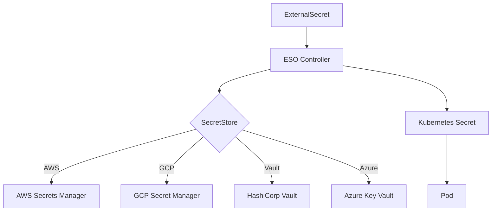

# External Secrets Operator

> **Category:** Security / Secrets Management

## What It Is

**External Secrets Operator (ESO)** is a Kubernetes operator that syncs secrets from external APIs (AWS Secrets Manager, GCP Secret Manager, HashiCorp Vault, etc.) into Kubernetes Secrets. It solves the problem of managing secrets outside the cluster while making them available as native K8s Secrets.

## Why It Exists

| Problem | Native Secrets | External Secrets |
|---------|---------------|------------------|
| Secret storage | etcd (cluster-internal) | External provider (AWS/GCP/Vault) |
| Rotation | Manual | Automatic sync |
| Access control | RBAC only | Provider IAM + RBAC |
| Audit trail | K8s audit logs | Provider audit logs |
| Cross-cluster | Copy secrets manually | Same source, multiple clusters |

## Architecture



## Key Resources

| Resource | Description |
|----------|-------------|
| **SecretStore** | Namespace-scoped connection to external provider |
| **ClusterSecretStore** | Cluster-wide connection to external provider |
| **ExternalSecret** | Defines which secrets to sync |
| **ClusterExternalSecret** | Cluster-wide secret sync |

## Example: AWS Secrets Manager

```yaml
apiVersion: external-secrets.io/v1beta1
kind: SecretStore
metadata:
  name: aws-secrets-manager
  namespace: production
spec:
  provider:
    aws:
      service: SecretsManager
      region: us-east-1
      auth:
        secretRef:
          accessKeyIDSecretRef:
            name: aws-credentials
            key: access-key-id
          secretAccessKeySecretRef:
            name: aws-credentials
            key: secret-access-key
---
apiVersion: external-secrets.io/v1beta1
kind: ExternalSecret
metadata:
  name: db-credentials
  namespace: production
spec:
  refreshInterval: 1h
  secretStoreRef:
    name: aws-secrets-manager
    kind: SecretStore
  target:
    name: db-credentials
    creationPolicy: Owner
  data:
  - secretKey: password
    remoteRef:
      key: prod/database/password
      property: password
  - secretKey: username
    remoteRef:
      key: prod/database/credentials
      property: username
```

## Example: HashiCorp Vault

```yaml
apiVersion: external-secrets.io/v1beta1
kind: SecretStore
metadata:
  name: vault-backend
  namespace: production
spec:
  provider:
    vault:
      server: "https://vault.example.com"
      path: "secret"
      version: "v2"
      auth:
        kubernetes:
          mountPath: "kubernetes"
          role: "external-secrets"
          serviceAccountRef:
            name: external-secrets
---
apiVersion: external-secrets.io/v1beta1
kind: ExternalSecret
metadata:
  name: api-keys
  namespace: production
spec:
  refreshInterval: 30m
  secretStoreRef:
    name: vault-backend
    kind: SecretStore
  target:
    name: api-keys
    creationPolicy: Owner
  data:
  - secretKey: stripe-key
    remoteRef:
      key: prod/api/stripe
```

## Example: GCP Secret Manager

```yaml
apiVersion: external-secrets.io/v1beta1
kind: SecretStore
metadata:
  name: gcp-secret-manager
  namespace: production
spec:
  provider:
    gcpsm:
      projectID: my-project
      auth:
        secretRef:
          secretAccessKeySecretRef:
            name: gcp-credentials
            key: credentials.json
---
apiVersion: external-secrets.io/v1beta1
kind: ExternalSecret
metadata:
  name: gcp-secrets
  namespace: production
spec:
  refreshInterval: 1h
  secretStoreRef:
    name: gcp-secret-manager
    kind: SecretStore
  target:
    name: gcp-secrets
  data:
  - secretKey: api-key
    remoteRef:
      key: projects/my-project/secrets/api-key/versions/latest
```

## Commands

```bash
# Install ESO
helm repo add external-secrets https://charts.external-secrets.io
helm install external-secrets external-secrets/external-secrets -n external-secrets --create-namespace

# List ExternalSecrets
kubectl get externalsecrets -n production

# Check sync status
kubectl get externalsecrets -n production -o yaml

# Describe ExternalSecret
kubectl describe externalsecret db-credentials -n production

# List SecretStores
kubectl get secretstores -n production

# Force refresh
kubectl annotate externalsecret db-credentials force-sync=$(date +%s) -n production
```

## Best Practices

1. **Use ClusterSecretStore** for shared credentials across namespaces
2. **Set refreshInterval** — shorter for critical secrets, longer for stable ones
3. **Use IRSA/workload identity** — avoid static credentials when possible
4. **Monitor sync status** — check `status.conditions` for errors
5. **Use creationPolicy: Owner** — let ESO manage the Secret lifecycle

## Common Issues

| Symptom | Cause | Fix |
|---------|-------|-----|
| Secret not syncing | Wrong credentials or IAM | Check SecretStore auth |
| Sync delay | refreshInterval too long | Decrease refreshInterval |
| Permission denied | IAM policy missing | Add IAM permissions |
| SecretStore error | Provider unreachable | Check network/firewall |

## Related

- [Secrets](../01-core-concepts/secrets.md)
- [Secrets Management](../06-security/secrets.md)
- [Service Accounts](service-accounts.md)
- [RBAC](rbac.md)
