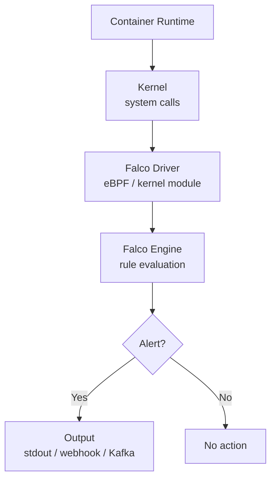

# Falco — Runtime Security

> **Category:** Security / Runtime

## What It Is

**Falco** is a cloud-native runtime security tool that detects anomalous behavior in containers and Kubernetes. It monitors system calls in real-time and alerts on suspicious activity using rules.

## Why It Exists

| Threat | Detection Method | Falco |
|--------|-----------------|-------|
| Unauthorized shell in container | System call monitoring | Detects `execve` in container |
| Sensitive file access | File read monitoring | Detects reads to `/etc/shadow` |
| Unexpected network connections | Network call monitoring | Detects outbound to unknown IPs |
| Privilege escalation | Process monitoring | Detects `setuid` calls |
| Crypto mining | Process + network | Detects mining pool connections |

## Architecture



## Install

```bash
# Helm install
helm repo add falcosecurity https://falcosecurity.github.io/charts
helm install falco falcosecurity/falco --namespace falco --create-namespace

# With falcoctl driver
helm install falco falcosecurity/falco --namespace falco \
  --set driver.kind=ebpf \
  --set falcosidekick.enabled=true \
  --set falcosidekick.config.slack.webhookurl="https://hooks.slack.com/..."
```

## Default Rules

| Rule | Severity | Description |
|------|----------|-------------|
| Terminal shell in container | Warning | Shell spawned in container |
| Sensitive file opened | Notice | Read/write to sensitive files |
| Unexpected outbound connection | Warning | Outbound to unknown IP |
| Container drift | Notice | New executable after image start |
| Write below /etc | Warning | Write to /etc directory |
| Launch privileged container | Error | Privileged container started |
| K8s Pod created in default ns | Notice | Pod in default namespace |

## Custom Rule Example

```yaml
# Custom rule: detect crypto mining
- rule: Detect Crypto Mining
  desc: Detect cryptocurrency mining processes
  condition: >
    spawned_process and container and
    proc.name in (xmrig, minerd, cpuminer, cgminer)
  output: >
    Crypto mining process detected
    (user=%user.name container=%container.name proc=%proc.name)
  priority: CRITICAL
  tags: [crypto, mining, mitre_execution]

# Custom rule: detect kubectl exec
- rule: Kubectl Exec into Pod
  desc: Detect kubectl exec commands
  condition: >
    spawned_process and container and
    proc.name = "kubectl" and proc.args contains "exec"
  output: >
    kubectl exec detected
    (user=%user.name proc=%proc.name args=%proc.args)
  priority: WARNING
  tags: [k8s, exec, mitre_lateral_movement]
```

## Falco as Sidecar

```yaml
apiVersion: apps/v1
kind: DaemonSet
metadata:
  name: falco
  namespace: falco
spec:
  selector:
    matchLabels:
      app: falco
  template:
    metadata:
      labels:
        app: falco
    spec:
      serviceAccountName: falco
      containers:
      - name: falco
        image: falcosecurity/falco:latest
        args:
        - /usr/bin/falco
        - --driver=ebpf
        - --k8s-api-url=https://kubernetes.default.svc:443
        - --k8s-cert=/var/run/secrets/kubernetes.io/serviceaccount/ca.crt
        - --k8s-token=/var/run/secrets/kubernetes.io/serviceaccount/token
        securityContext:
          privileged: true
```

## Commands

```bash
# Check Falco status
kubectl get pods -n falco

# View Falco logs
kubectl logs -n falco -l app=falco

# List rules
kubectl exec -n falco falco-xxxxx -- falco --list

# Test rule
kubectl exec -n falco falco-xxxxx -- falco --validate /etc/falco/rules.d/custom-rules.yaml
```

## Best Practices

1. **Use eBPF driver** — modern, no kernel module needed
2. **Deploy as DaemonSet** — monitors all nodes
3. **Enable falcosidekick** — sends alerts to Slack, PagerDuty, etc.
4. **Customize rules** — disable irrelevant rules, add org-specific rules
5. **Test rules** — validate before deploying

## Common Issues

| Symptom | Cause | Fix |
|---------|-------|-----|
| High CPU usage | Too many rules firing | Tune rules, reduce noise |
| Missing alerts | Driver not loaded | Check eBPF/kernel module |
| Permission denied | Missing privileged | Add `privileged: true` |
| No container events | Wrong namespace | Check falco namespace |

## Related

- [Security Overview](security.md)
- [Pod Security Context](pod-security-context.md)
- [Security Hardening Guide](../docs/security-hardening-guide.md)
- [Incident Case Studies](../14-troubleshooting/incidents/README.md)
