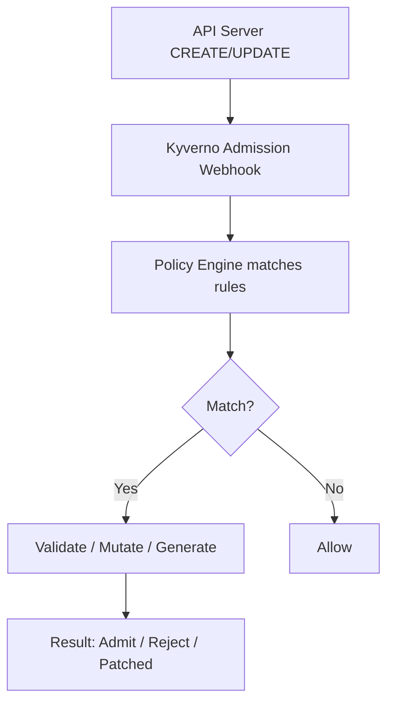

# Kyverno

> **Category:** Security / Policy Engine

## What It Is

**Kyverno** is a **Kubernetes-native policy engine** that validates, mutates, and generates Kubernetes resources. Unlike OPA/Gatekeeper (which uses **Rego**), Kyverno uses **Kubernetes-native YAML** — policies are written the same way you write Deployments and Pods.

Kyverno runs as an admission controller (validating + mutating webhooks) — it checks every CREATE/UPDATE request against your policies.

## Why It Exists

- **Declarative policies** in YAML (no new language to learn)
- Enforce compliance: "all pods must set resource limits", "only allow specific images"
- **Mutate resources** — e.g. set defaults, or rewrite a public image to an internal registry
- **Generate resources** — auto-create ConfigMaps, NetworkPolicies, RoleBindings when a namespace appears
- Works alongside or instead of OPA/Gatekeeper and Pod Security Admission

## Architecture



## Kyverno Policy API

A `ClusterPolicy` (cluster-scoped) or `Policy` (namespace-scoped) holds one or more `rules`:

```yaml
apiVersion: kyverno.io/v1
kind: ClusterPolicy
metadata:
  name: require-resource-limits
  annotations:
    pod-policies.kyverno.io/autogen-alive: true
spec:
  validationFailurePolicy: audit
  background: true
  rules:
  - name: check-limits
    match:
      resources:
        kinds:
        - Pod
    validate:
      message: You must set memory and cpu limits
      pattern:
        spec:
          containers:
          - resources:
              limits:
                memory: "?*"
                cpu: "?*"
```

## Rule Types

Every rule has `match` (what to check) plus one action:

| Type | Field | Purpose |
|------|-------|---------|
| **Validate** | `validate:` | Accept or reject (resource must match pattern) |
| **Mutate** | `mutate:` | Modify the resource (e.g. add default resources) |
| **Generate** | `generate:` | Create a new related resource |

### match / exclude

```yaml
match:
  resources:
    kinds:
    - Deployment
    - DaemonSet
    selector:
      matchLabels:
        app: my-app
exclude:
  resources:
    kinds:
    - Namespace
```

## validate (enforce & audit)

```yaml
rules:
- name: require-non-root
  match:
    resources:
      kinds:
      - Pod
  validate:
    message: Containers must not run as root
    pattern:
      spec:
        containers:
        - securityContext:
            runAsNonRoot: true
```

### Preconditions

```yaml
validate:
  message: Only nginx images allowed when privileged
  pattern:
    spec:
      containers:
      - image: "*nginx*"
  # preconditions are placed under 'validate' or at the rule level
```

## mutate (modify before it is stored)

```yaml
rules:
- name: add-defaults
  match:
    resources:
      kinds:
      - Pod
  mutate:
    patchStrategicMerge:
      spec:
        containers:
        - resources:
            requests:
              cpu: 100m
              memory: 128Mi
            limits:
              cpu: 500m
              memory: 256Mi
```

### JSON Patch (surgical edits)

```yaml
mutate:
  type: patching
  patches:
  - path: /spec/containers/0/resources/requests/cpu
    op: add
    value: 100m
```

## generate (create new resources)

```yaml
rules:
- name: add-deny-all-networkpolicy
  match:
    resources:
      kinds:
      - Namespace
  generate:
    kind: NetworkPolicy
    name: deny-all-egress-
    data:
      spec:
        podSelector: {}
        policyTypes:
        - Egress
```

## Kyverno Policy Modes

| Mode | Behavior |
|------|----------|
| **enforce** (`validationFailurePolicy: enforce`) | Violating resources are **rejected** |
| **audit** (`validationFailurePolicy: audit`) | Violated resources are **logged** (not rejected) |

## Installation

```bash
helm repo add kyverno https://kyverno.github.io/kyverno/
helm install kyverno kyverno/kyverno -n kyverno --create-namespace

# Verify
kubectl -n kyverno get pods
kubectl get clusterpolicies
```

## Commands

```bash
# List / apply / delete
kubectl get clusterpolicies
kubectl apply -f policy.yaml
kubectl delete clusterpolicy require-resource-limits

# Test (create a violating resource):
kubectl run test --image=nginx --privileged

# Describe / debug
kubectl describe clusterpolicy require-resource-limits
kubectl -n kyverno logs -l app=kyverno
kubectl get policyreports        # Kyverno audit results
kubectl describe clusterpolicyreport <name>
```

## Common Policies (Cheatsheet)

### Block the latest image tag
```yaml
apiVersion: kyverno.io/v1
kind: ClusterPolicy
metadata:
  name: disallow-latest-tag
spec:
  validationFailurePolicy: enforce
  background: true
  rules:
  - name: check-tag
    match:
      resources:
        kinds:
        - Pod
    validate:
      message: Floating image tags are not allowed.
      pattern:
        spec:
          containers:
          - image: "*:*"      # Any tag; use !*:latest to deny
```

### Require a label
```yaml
rules:
- name: require-team-label
  validate:
    pattern:
      metadata:
        labels:
          team: "?*"
```

### Mutate: set default imagePullPolicy
```yaml
mutate:
  patchStrategicMerge:
    spec:
      containers:
      - imagePullPolicy: IfNotPresent
```

### Block host network
```yaml
rules:
- name: no-host-network
  validate:
    message: Host networking is not allowed
    pattern:
      spec:
        hostNetwork: false
```

## Common Issues

### Policy is not firing
```bash
kubectl describe clusterpolicy <name>
# Check: match.resources.kinds and selectors
# Check: validationFailurePolicy = audit (only logs, never rejects)
# Check: background: true (to evaluate existing resources)
```

### Policy is in an error state
```bash
kubectl describe clusterpolicy <name>
# Status Conditions -> Error. Likely a 'pattern' or JMESPath syntax issue
kubectl -n kyverno logs -l app=kyverno --tail=100
```

### Mutate not applying
```yaml
# patchStrategicMerge merges the structure.
# For arrays, order matters. Use type: patching (JSON Patch) for precision.
```

### Mutating webhook conflict
```
# Kyverno serializes mutations; the last matching mutation wins on conflicting fields.
# Avoid overlapping mutations across policies.
```

### Audit results not visible
```bash
# Ensure background: true for existing-resource evaluation.
# Reports are ClusterPolicyReport / PolicyReport resources.
kubectl get policyreports
```

## Kyverno vs OPA/Gatekeeper

| Feature | Kyverno | OPA/Gatekeeper |
|---------|---------|----------------|
| Policy language | Kubernetes YAML | Rego (purpose-built) |
| Mutate | Yes (strategic/patch) | No (validate only) |
| Generate | Yes (create resources) | No |
| Learning curve | Easy (YAML) | Steeper (Rego) |
| Performance | Moderate | Fast |
| Multi-resource logic | Via generate/mutate | Via Rego |

## Best Practices

1. Start in `audit` mode; observe, then enforce
2. One policy per concern — easier to maintain
3. Use `background: false` initially — only check new resources
4. Set `pod-policies.kyverno.io/autogen-alive: true` for Pod-targeted rules to apply to Deployments/StatefulSets
5. Test with a violating resource before flipping to `enforce`
6. Keep cluster-wide rules in `ClusterPolicy`; namespace-scoped only if needed
7. Version policies in Git like code
8. Avoid overly broad mutations

## Interview Questions

**Q: How is writing a Kyverno policy different from writing an OPA policy?**
A: Kyverno uses Kubernetes-native YAML (pattern/patch matching). OPA/Gatekeeper uses Rego, a purpose-built query language. Kyverno is more approachable; OPA is more powerful for complex logic.

**Q: What is `validationFailurePolicy`?**
A: `enforce` rejects violating resources; `audit` only logs them.

**Q: What can Kyverno do that OPA/Gatekeeper cannot?**
A: Mutate (modify resources) and Generate (create new resources) — OPA/Gatekeeper only validates.

**Q: How does Kyverno apply a Pod policy to a Deployment?**
A: Via autogen — Kyverno auto-creates copies of Pod-targeted rules for Deployment, DaemonSet, StatefulSet, etc.

**Q: Where are Kyverno audit results stored?**
A: As `ClusterPolicyReport` / `PolicyReport` resources, consumable by dashboards.

## Related Resources

- [OPA Gatekeeper](opa-gatekeeper.md)
- [Admission Controllers](admission-controllers.md)
- [Pod Security Admission](pod-security-admission.md)
- [RBAC](rbac.md)
