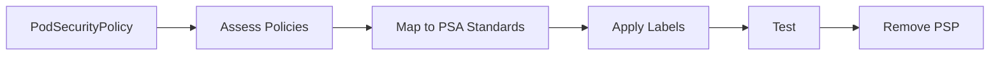

# Migration Guide: PodSecurityPolicy to Pod Security Admission

> **Category:** Security / Migration
> Step-by-step guide for migrating from PodSecurityPolicy to Pod Security Admission.

## Overview



## PSP vs PSA

| Feature | PodSecurityPolicy | Pod Security Admission |
|---------|-------------------|------------------------|
| **Status** | Deprecated (K8s 1.21) | GA (K8s 1.25+) |
| **Enforcement** | Webhook | Admission controller |
| **Complexity** | High | Low |
| **Modes** | Allow/Alert/Deny | Enforce/Audit/Warn |
| **Standards** | Custom policies | Privileged/Baseline/Restricted |

## Phase 1: Assess Existing PSPs

### List Existing PSPs

```bash
# List all PSPs
kubectl get psp

# List PSP bindings
kubectl get psp,rolebinding,clusterrolebinding | grep -E "(psp|PodSecurityPolicy)"
```

### Map PSP to PSA Standards

| PSP Access | PSA Standard | Description |
|------------|--------------|-------------|
| `privileged: true` | Privileged | Unrestricted access |
| `privileged: false` | Baseline | Prevents known privilege escalations |
| Restricted | Restricted | Heavily restricted policies |

## Phase 2: Create PSA Labels

### Apply Namespace Labels

```bash
# For Privileged namespaces
kubectl label namespace <ns> pod-security.kubernetes.io/enforce=privileged
kubectl label namespace <ns> pod-security.kubernetes.io/audit=privileged
kubectl label namespace <ns> pod-security.kubernetes.io/warn=privileged

# For Baseline namespaces
kubectl label namespace <ns> pod-security.kubernetes.io/enforce=baseline
kubectl label namespace <ns> pod-security.kubernetes.io/audit=baseline
kubectl label namespace <ns> pod-security.kubernetes.io/warn=baseline

# For Restricted namespaces
kubectl label namespace <ns> pod-security.kubernetes.io/enforce=restricted
kubectl label namespace <ns> pod-security.kubernetes.io/audit=restricted
kubectl label namespace <ns> pod-security.kubernetes.io/warn=restricted
```

### Apply Version Labels (Recommended)

```bash
# Add version label for each namespace
kubectl label namespace <ns> pod-security.kubernetes.io/version=v1.25
```

## Phase 3: Test Policies

### Test with Dry-Run

```bash
# Test pod creation in enforce mode
kubectl run test-pod --image=nginx --dry-run=server -n <ns>

# Test pod creation in warn mode
kubectl label namespace <ns> pod-security.kubernetes.io/warn=restricted --dry-run=server

# Check audit logs
kubectl logs -n kube-system -l component=kube-apiserver --tail=100
```

### Test Specific Scenarios

```bash
# Test privileged pod (should fail in baseline/restricted)
kubectl run privileged-pod --image=nginx --privileged --dry-run=server -n <ns>

# Test host network (should fail in baseline/restricted)
kubectl run host-network-pod --image=nginx --host-network --dry-run=server -n <ns>

# Test run as root (should fail in restricted)
kubectl run root-pod --image=nginx --dry-run=server -n <ns>
```

## Phase 4: Update Workloads

### Add Security Context

```yaml
# Before (PSP)
apiVersion: v1
kind: Pod
metadata:
  name: my-pod
spec:
  containers:
  - name: nginx
    image: nginx

# After (PSA - Restricted)
apiVersion: v1
kind: Pod
metadata:
  name: my-pod
  namespace: production
spec:
  securityContext:
    runAsNonRoot: true
    runAsUser: 1000
    runAsGroup: 1000
    fsGroup: 1000
    seccompProfile:
      type: RuntimeDefault
  containers:
  - name: nginx
    image: nginx
    securityContext:
      allowPrivilegeEscalation: false
      capabilities:
        drop:
        - ALL
```

### Update Deployments

```yaml
# Deployment with restricted security
apiVersion: apps/v1
kind: Deployment
metadata:
  name: my-app
  namespace: production
spec:
  replicas: 3
  selector:
    matchLabels:
      app: my-app
  template:
    metadata:
      labels:
        app: my-app
    spec:
      securityContext:
        runAsNonRoot: true
        runAsUser: 1000
        runAsGroup: 1000
        fsGroup: 1000
        seccompProfile:
          type: RuntimeDefault
      containers:
      - name: app
        image: my-app:latest
        securityContext:
          allowPrivilegeEscalation: false
          capabilities:
            drop:
            - ALL
        resources:
          limits:
            cpu: 500m
            memory: 256Mi
          requests:
            cpu: 250m
            memory: 128Mi
```

## Phase 5: Remove PSP

### Remove PSP Bindings

```bash
# Remove ClusterRoleBindings
kubectl delete clusterrolebinding <binding-name>

# Remove RoleBindings
kubectl delete rolebinding <binding-name> -n <namespace>

# Remove ClusterRoles
kubectl delete clusterrole <role-name>

# Remove Roles
kubectl delete role <role-name> -n <namespace>
```

### Remove PSP Resources

```bash
# Delete PSPs
kubectl delete psp <psp-name>

# Verify all PSPs are removed
kubectl get psp
```

### Remove PSP Admission Controller

```bash
# Edit kube-apiserver manifest
sudo vi /etc/kubernetes/manifests/kube-apiserver.yaml

# Remove --enable-admission-plugins=PodSecurityPolicy
# Or change to --disable-admission-plugins=PodSecurityPolicy

# Restart kubelet
sudo systemctl restart kubelet
```

## Phase 6: Validate

### Validation Checklist

| Check | Command |
|-------|---------|
| Pods running | `kubectl get pods -A` |
| PSA labels applied | `kubectl get ns --show-labels` |
| Audit logs working | `kubectl logs -n kube-system kube-apiserver-*` |
| No PSP errors | `kubectl get events --field-selector reason=FailedCreate` |

### Test Enforcement

```bash
# Test privileged pod in baseline namespace (should be blocked)
kubectl run test --image=nginx --privileged -n baseline-ns

# Test root pod in restricted namespace (should be blocked)
kubectl run test --image=nginx --dry-run=server -n restricted-ns

# Check audit logs
kubectl logs -n kube-system -l component=kube-apiserver | grep "forbidden"
```

## Common Issues

| Issue | Cause | Fix |
|-------|-------|-----|
| Pods failing admission | PSA labels too restrictive | Adjust namespace labels |
| Workload needs privileges | Running as root | Add security context |
| Missing seccomp profile | Not set in pod spec | Add seccompProfile |
| Audit logs not showing | Wrong mode | Use audit mode first |

## Best Practices

| Phase | Practice |
|-------|----------|
| Pre-migration | Audit all existing PSPs |
| Migration | Use warn mode before enforce |
| Testing | Test all workloads in dry-run |
| Rollback | Keep PSP for 1 week |

## Related

- [Pod Security Admission](pod-security-admission.md)
- [Pod Security Context](pod-security-context.md)
- [RBAC](rbac.md)
- [Security Hardening Guide](../docs/security-hardening-guide.md)
