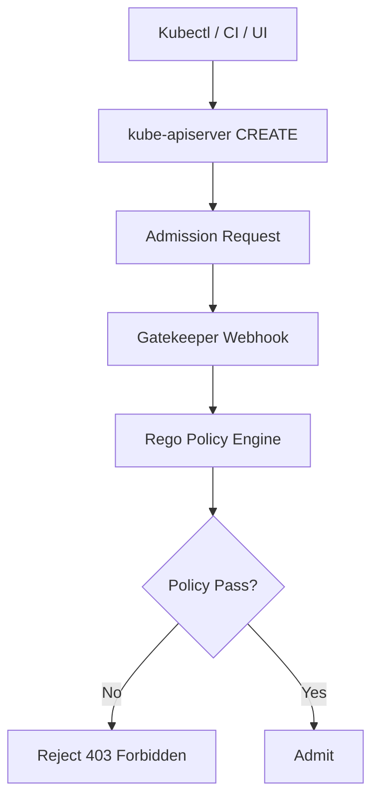

# OPA Gatekeeper

> **Category:** Security / Policy Engine

## What It Is

**Open Policy Agent (OPA) Gatekeeper** is a **validating admission controller** for Kubernetes that enforces policies written in **Rego** (a purpose-built policy language). Gatekeeper intercepts CREATE/UPDATE requests and rejects resources that violate your Rego policies.

Where Kyverno uses YAML, **Gatekeeper uses Rego** — more powerful for complex, multi-resource logic.

## Why It Exists

- **Centralized policy** in a single language (Rego) across cloud, CI, and Kubernetes
- **Rich, reusable constraints** (e.g., "containers must not run as root unless in kube-system")
- **Auditable** — all decisions are logged and traceable
- **Decoupled from the resource** — policies operate on a template + parameters

## Architecture



## Gatekeeper Concepts

| Resource | Purpose |
|----------|---------|
| `ConstraintTemplate` | Defines a **Rego policy** + parameters |
| `Constraint` | An **instance** of a ConstraintTemplate (with specific params) |
| `Audit` | Runs all Constraints against existing resources (cron-like) |

This split (template = logic, constraint = parameters) lets you reuse one policy across many configs.

## ConstraintTemplate

```yaml
apiVersion: templates.gatekeeper.sh/v1
kind: ConstraintTemplate
metadata:
  name: k8srequiredlabels
spec:
  crd:
    spec:
      names:
        kind: K8sRequiredLabels
      validation:
        openAPIV3Schema:
          type: object
          properties:
            labels:
              type: array
              items:
                type: string
  targets:
  - target: admission.k8s.gatekeeper.sh
    regos: |
      package k8srequiredlabels
      violation[{"msg": msg, "details": {}}] {
        missing := {label | input.review.object.metadata.labels[label] == ""}
        label := input.review.object.metadata.labels[_]
        count(missing) > 0
        msg := sprintf("You must specify labels: %v", [missing])
      }
```

## Constraint (an instance)

```yaml
apiVersion: constraints.gatekeeper.sh/v1beta1    # v1beta1 is common; v1 also supported
kind: K8sRequiredLabels
metadata:
  name: require-app-label
spec:
  labels:
  - app              # Parameter passed to the Rego policy
```

## How a Rego Rule Works

Gatekeeper's Rego evaluates `violation[{}]` rules. If it produces output, the request is rejected.

```rego
# package declaration
package k8sallowedimages

# violation is the list of violations — any item = reject
violation[{"msg": msg}] {
    image := input.review.object.spec.containers[_].image
    not allowed_image(image)
    msg := sprintf("Image <%v> is not allowed", [image])
}

# helper function
allowed_image(image) {
    startswith(image, "internal-registry/")
}
```

## Installing Gatekeeper

```bash
# Via Helm
helm repo add gatekeeper https://open-policy-agent.github.io/gatekeeper/charts
helm install gatekeeper gatekeeper/gatekeeper \
  --namespace gatekeeper-system --create-namespace \
  --set enableExternalData=true

# Verify
kubectl get pods -n gatekeeper-system
kubectl api-resources | grep constraints
```

## Common Constraint Examples

### Require a label
(Requires the `K8sRequiredLabels` ConstraintTemplate above)

```yaml
apiVersion: constraints.gatekeeper.sh/v1beta1
kind: K8sRequiredLabels
metadata:
  name: must-have-app-label
spec:
  labels:
  - app
```

### Restrict container images
```yaml
apiVersion: constraints.gatekeeper.sh/v1beta1
kind: K8sAllowedImages
metadata:
  name: allowed-images
spec:
  images:
  - "internal-registry/*"
  - "registry.k8s.io/*"
```

### No privileged containers
```yaml
# Using the built-in k8srestrictedconfig template
apiVersion: constraints.gatekeeper.sh/v1beta1
kind: K8sPSPAllowedUser
metadata:
  name: no-privileged
spec:
  # Block privileged pods
```

## Audit

Gatekeeper can **audit** existing resources (not just admission):

```bash
# Run an audit (returns violations in Constraint status)
kubectl get k8srequiredlabels.constraints.gatekeeper.sh -o yaml
# Status shows: violations: [...]

# View audit results
kubectl get k8sallowedimages.constraints.gatekeeper.sh must-have-app-label -o jsonpath='{.status.totalViolations}'
```

## Commands

```bash
kubectl get constrainttemplates
kubectl get constraint
kubectl describe k8srequiredlabels <name>    # includes status.violations
kubectl -n gatekeeper-system logs -l control-plane=controller-manager
```

## Common Issues

### Gatekeeper rejecting its own pods
```yaml
# Add a match.exclude for Gatekeeper's own namespace:
match:
  scope: Namespaced
  exclude:
  - namespaces: [gatekeeper-system, kube-system]
```

### `violation[]` not producing results
```bash
# Check: input.review.object is the correct object path
# Check: the constraint template compiled (kubectl describe constrainttemplate)
# Use: kubectl logs to see Rego evaluation errors
```

### Audit shows violations but admit does not (or vice-versa)
```
# Audit and admission can diverge. Audit evaluates all resources.
# Admission only evaluates the incoming request object.
```

## Best Practices

1. Start in **dry-run** mode (Gatekeeper `match: {scope: "Cluster"}\`, set `enforcement: dryrun` if supported) — audit before enforce
2. **Exclude kube-system / gatekeeper-system** from constraints
3. Write **small, specific policies** — one per best practice
4. Use **parameters** (in Constraint) to make templates reusable
5. Test Rego with the **Gatekeeper CLI** (`gatekeeper test`) or unit tests
6. Monitor **violation counts** and **webhook latency**
7. Keep Rego readable — add comments; Rego is hard to debug otherwise

## Rego Tips

```rego
# Iterate over containers
container := input.review.object.spec.containers[_]

# Check a field is set (exists)
count(container.securityContext) == 0

# Logical AND
violation[{"msg": msg}] {
    image := input.review.object.spec.containers[_].image
    not startswith(image, "internal-registry/")
    msg := sprintf("Image <%v> must be from internal registry", [image])
}

# Logical OR (multiple alternatives)
allowed(name) { name == "nginx" }
allowed(name) { name == "redis" }

# Negation
not allowed(image)    # true if "allowed(image)" fails
```

## Interview Questions

**Q: What's the difference between a ConstraintTemplate and a Constraint?**
A: A `ConstraintTemplate` defines the **policy logic (Rego)** + the parameter **schema**. A `Constraint` is an **instance** of that template with specific parameter values — like a class vs. an object.

**Q: How is OPA Gatekeeper different from Kyverno?**
A: Gatekeeper uses **Rego** (a full query language — more powerful/complex). Kyverno uses **Kubernetes-native YAML** (simpler, mutate/generate). Both are admission controllers.

**Q: What does `violation[{}]` mean in Rego?**
A: In Gatekeeper, a Rego rule named `violation` that emits a value (a set/map with `msg`) causes the admission to **reject** the resource. No violation = allowed.

**Q: What is Gatekeeper's audit capability?**
A: It **re-evaluates all resources** against its Constraints (not just new ones) — letting you find existing violations. Violations are recorded in each Constraint's `.status.violations`.

**Q: How do you prevent Gatekeeper from blocking its own pods?**
A: Use `match.exclude: {namespaces: ["gatekeeper-system", "kube-system"]}` in the Constraint, or use the `scope: Cluster` matcher to exclude those namespaces.

## Related Resources

- [Kyverno](kyverno.md)
- [Admission Controllers](admission-controllers.md)
- [Pod Security Admission](pod-security-admission.md)
- [Network Policies](../04-networking/network-policies.md)
