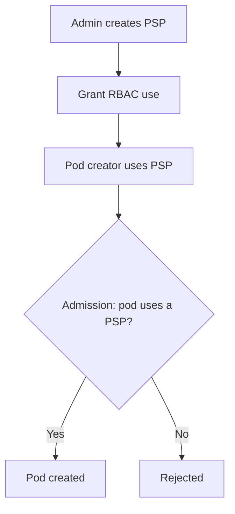

# PodSecurityPolicy (PSP)

> **Category:** Security / Admission (Legacy)
> **Status:** Deprecated and **removed in Kubernetes 1.25**. For modern clusters, use **Pod Security Admission (PSA)**.

## What It Is

**PodSecurityPolicy (PSP)** was a **built-in admission controller** that controlled **security-sensitive** aspects of a Pod's spec (privileged mode, host namespaces, hostPath, runAsNonRoot, capabilities, etc.) — by requiring Pods to use a PSP.

It was the **first built-in "pod security" mechanism**, before Pod Security Admission.

## Why It Was Removed

- PSP required a **two-step** setup: a `PodSecurityPolicy` object + RBAC (roles/bindings granting `use` on the PSP) — error-prone.
- PSP was **permissive-by-default** (a pod without a policy was rejected unless a PSP was bound) — teams often had to grant broad `privileged PSP` to get things working.
- PSP was **Pod-centric**, but policies applied at admission (not runtime) — hard to audit.
- It was **deprecated in 1.21** and **removed in 1.25**.

## PodSecurityPolicy API (Legacy Example)

```yaml
# A PSP
apiVersion: policy/v1beta1
kind: PodSecurityPolicy
metadata:
  name: restricted-psp
spec:
  privileged: false                      # Must not run privileged
  allowPrivilegeEscalation: false
  runAsUser:
    rule: MustRunAsNonRoot               # Must be non-root user
  runAsGroup:
    rule: MustRunAs                    # Must run as a specific group
    ranges:
    - min: 1000; max: 65000
  fsGroup:
    rule: MustRunAs
    ranges:
    - min: 2000; max: 65000
  seLinux:
    rule: RunAsAny
  supplementalGroups:
    rule: MustRunAs
    ranges:
    - min: 100; max: 65000
  volumes:
  - "configMap"
  - "secret"
  - "emptyDir"
  - "persistentVolumeClaim"
  hostPID: false
  hostIPC: false
  hostNetwork: false
  allowedHostPaths:                  # Restrict hostPath mounts
  - pathPrefix: "/etc"
    readOnly: true
  allowedCapabilities:               # Capabilities that can be added
  - "NET_BIND_SERVICE"
  # ... or: allowedCapabilities: [] (none, plus allowPrivilegeEscalation: false)
  requiredDropCapabilities: ["ALL"]   # Drop all caps by default
```

## RBAC is Required (the pain point)

For a pod to use a PSP, the **ServiceAccount** of the pod's creator must be granted `use` on the PSP:

```yaml
apiVersion: rbac.authorization.k8s.io/v1
kind: Role
metadata:
  name: use-restricted-psp
  namespace: default
rules:
- apiGroups: ["policy"]
  resources: ["podsecuritypolicies"]
  verbs: ["use"]              # The creator needs `use` on the PSP
  resourceNames: ["restricted-psp"]
---
apiVersion: rbac.authorization.k8s.io/v1
kind: RoleBinding
metadata:
  name: use-psp
  namespace: default
subjects:
- kind: Group
  name: "system:serviceaccounts:default"   # All SAs in the namespace
roleRef:
  kind: Role
  name: use-restricted-psp
  apiGroup: rbac.authorization.k8s.io
```

## The PSP Lifecycle Problem



If the creator cannot `use` any PSP, their pod is **rejected** — even if the pod is otherwise perfectly valid. This made PSP very easy to break.

## PSP vs Pod Security Admission (PSA)

| Feature | PSP (deprecated) | PSA (current) |
|---------|------------------|---------------|
| CRD object | `PodSecurityPolicy` | No object — namespace labels |
| RBAC | Required (use the policy) | No RBAC |
| Permissive default | A pod is blocked unless a PSP is bound | All allowed unless a label restricts |
| Levels | Custom (admin-defined) | 3 fixed: `privileged`, `baseline`, `restricted` |
| Removed in | 1.25 | Active |

## Migrating from PSP to PSA

1. Identify PSPs in use (audit logs + `kubectl get psp`)
2. Map each PSP to a PSA level (`privileged` / `baseline` / `restricted`)
3. Apply the equivalent label to the namespace:
   ```
   pod-security.kubernetes.io/enforce: baseline
   ```
4. Test workloads (expect failures on privileged/hostpath/legacy pods)
5. Remove the PSP + RBAC objects once nothing relies on them

## Example: PSP-equivalent with PSA

| PSP Setting | PSA Label Equivalent |
|-------------|-----------------------|
| `privileged: false` | `enforce: baseline` |
| `runAsNonRoot: true`, read-only root | `enforce: restricted` |
| `hostPID: false, hostIPC: false` | covered by `restricted` |

## Commands (Historical / for old clusters)

```bash
kubectl get podsecuritypolicy
kubectl describe podsecuritypolicy restricted-psp
kubectl delete podsecuritypolicy restricted-psp
kubectl auth can-i use podsecuritypolicies/restricted-psp --as=system:serviceaccount:default:my-sa
```

## Common Issues (Legacy)

### All pods rejected after enabling PSP
```bash
# No PSP was bound to the SA -> pods are blocked
# Fix: grant `use` on a PSP to the SA, OR disable the PSP admission plugin, OR migrate to PSA
```

### "PodSecurityPolicy: unable to validate"
```bash
kubectl auth can-i use podsecuritypolicies/<name> --as=system:serviceaccount:<ns>:<sa>
# If false, grant the RBAC `use` verb
```

### PSP blocks DaemonSets (CNI, kube-proxy)
```bash
# Add `use` on a permissive PSP for system namespaces:
# ClusterRoleBinding: system:serviceaccounts:kube-system -> use:psp:*
```

## Why PSA Is Simpler

With PSA, you set **one label** on a namespace:
```
pod-security.kubernetes.io/enforce=restricted
```
No PSP object, no RBAC binding. Pod creation is simply rejected if it violates the standard.

## Interview Questions

**Q: Was PodSecurityPolicy removed? When?**
A: Yes — **deprecated in 1.21**, **removed in 1.25**. Replaced by Pod Security Admission (PSA).

**Q: Why was PSP hard to operate?**
A: A Pod had to reference a PSP at admission, and the creator's ServiceAccount needed RBAC `use` on it. Missing the RBAC binding silently blocked all pods in a namespace.

**Q: What is the PSA equivalent of PSP?**
A: There is no PSP object anymore. Instead, a namespace label (`pod-security.kubernetes.io/enforce=restricted` etc.) activates the built-in `PodSecurity` admission controller against three standard levels (privileged, baseline, restricted).

**Q: How do you prevent privileged pods without PSP?**
A: Use Pod Security Admission: label the namespace `pod-security.kubernetes.io/enforce=baseline` (or `restricted`). The `PodSecurity` admission controller rejects privileged pods.

## Related Resources

- [Pod Security Admission](pod-security-admission.md)
- [Admission Controllers](admission-controllers.md)
- [RBAC](rbac.md)
- [Secrets](secrets.md)
- [Network Policies](../04-networking/network-policies.md)
