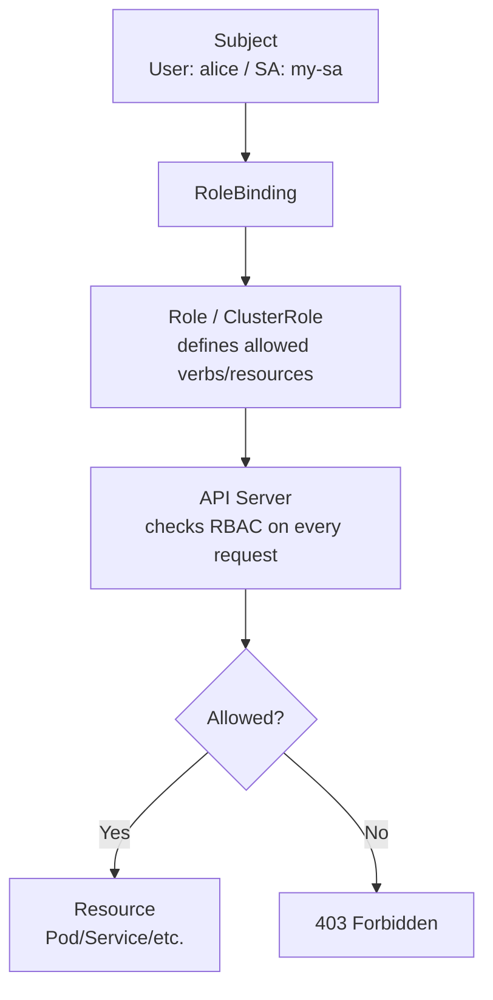

# RBAC (Role-Based Access Control)

> **Category:** Security / Authorization

## What It Is

**RBAC** is Kubernetes' **authorization layer** that controls **who (Users/Groups/Subjects) can do what** (verbs: get, list, create, delete) on which **resources** (pods, services, deployments, secrets).

You grant permissions by binding a **Subject** (user/service account) to a **Role** or **ClusterRole** using a **Binding** (`RoleBinding` / `ClusterRoleBinding`).

## Why It Exists

- **Default-deny by design** — nothing is allowed unless a ClusterRoleBinding grants it
- **Least-privilege** — grant minimal permissions per user/service
- **Auditable** — every API call checks RBAC

## Architecture



## The RBAC API Types

| Object | Scope | Purpose |
|--------|-------|---------|
| **Role** | Namespace | Grants permissions **within one namespace** |
| **ClusterRole** | Cluster-wide | Grants permissions across **all namespaces** (or cluster-scoped resources) |
| **RoleBinding** | Namespace | Grants a Role's permissions **within a namespace** |
| **ClusterRoleBinding** | Cluster | Grants a ClusterRole's permissions to a subject **cluster-wide** |

### Subjects (Who)

| Field | Example | Meaning |
|-------|---------|---------|
| `kind: User` | `name: "alice"` | An authenticated user |
| `kind: Group` | `name: "dev-team"` | A group of users |
| `kind: ServiceAccount` | `name: "my-sa"` | A service account (often used by apps) |

## Role (Namespace-scoped)

```yaml
apiVersion: rbac.authorization.k8s.io/v1
kind: Role
metadata:
  namespace: default          # ONLY this namespace
  name: pod-reader
rules:
- apiGroups: [""]            # Core API group ("" = default)
  resources: ["pods"]        # What resource type
  verbs: ["get", "list"]     # What operations
  resourceNames: ["my-pod"]  # Optional: scope to a specific pod name
- apiGroups: ["apps"]        # apps group (Deployments, etc.)
  resources: ["deployments"]
  verbs: ["get", "list", "watch"]
- apiGroups: [""]
  resources: ["pods/log"]     # Sub-resources (e.g., pod logs)
  verbs: ["get"]
```

### Rule Anatomy

Each rule in `rules:` has:

| Field | Description | Example |
|-------|-------------|---------|
| `apiGroups` | API group (`""` = core) | `["", "apps", "batch"]` |
| `resources` | Resource type | `["pods", "configmaps"]` |
| `verbs` | Operations | `["get", "list", "watch", "create", "delete", "patch", "update"]` |
| `resourceNames` | (Optional) specific named resource | `["my-pod"]` |
| `subresources` | (Optional) sub-resource like `status` | — |

## ClusterRole (Cluster-scoped)

Same structure but **applies cluster-wide** (or to cluster-scoped resources like `nodes`):

```yaml
apiVersion: rbac.authorization.k8s.io/v1
kind: ClusterRole
metadata:
  name: secret-reader
rules:
- apiGroups: [""]
  resources: ["secrets"]
  verbs: ["get", "list"]    # For all namespaces
```

You can `aggregate` ClusterRoles (`aggregationRule`) for modular RBAC.

## RoleBinding vs ClusterRoleBinding

A **RoleBinding** or **ClusterRoleBinding** links a subject to a Role/ClusterRole.

### RoleBinding (namespace-scoped, references a Role)

```yaml
apiVersion: rbac.authorization.k8s.io/v1
kind: RoleBinding
metadata:
  name: read-pods            # Within the namespace
  namespace: default
subjects:
- kind: User                 # User, Group, or ServiceAccount
  name: "alice"              # The subject's name
  apiGroup: rbac.authorization.k8s.io
roleRef:
  kind: Role                 # Role OR ClusterRole
  name: pod-reader
  apiGroup: rbac.authorization.k8s.io
```

### ClusterRoleBinding (cluster-scoped, references a ClusterRole)

```yaml
apiVersion: rbac.authorization.k8s.io/v1
kind: ClusterRoleBinding
metadata:
  name: read-secrets-global
subjects:
- kind: ServiceAccount
  name: monitoring-sa
  namespace: monitoring
roleRef:
  kind: ClusterRole      # Must be a ClusterRole for this binding
  name: secret-reader
  apiGroup: rbac.authorization.k8s.io
```

## A ClusterRole Can Be Bound Anywhere

Even if you reference a `ClusterRole` in a `RoleBinding`, the permissions are **limited to that namespace** — the ClusterRole is just a reusable bundle of rules.

```
ClusterRole "secret-reader" defined (read secrets anywhere)
│
├─ RoleBinding in ns=default, subject=dev-team  → only reads secrets in default
└─ RoleBinding in ns=prod, subject=prod-team    → only reads secrets in prod
```

## Commands

```bash
# List
kubectl get roles,clusterroles,rolebindings,clusterrolebindings
kubectl get clusterrolebindings   # Cluster-scoped

# Inspect
kubectl describe role <role-name> -n <ns>
kubectl describe clusterrole <name>
kubectl describe rolebinding <name> -n <ns>
kubectl describe clusterrolebinding <name>

# Create
kubectl apply -f role.yaml
kubectl apply -f rolebinding.yaml
kubectl create role pod-reader --verb=get,list --resource=pods
kubectl create rolebinding read-pods --role=pod-reader --user=alice -n default

# Test a user's permissions (as that user — requires token)
kubectl auth can-i get pods --as=alice -n default
kubectl auth can-i get pods --as=system:serviceaccount:monitoring:my-sa
kubectl auth can-i --list --namespace=default  # Shows ALL effective perms
```

## Common Operations

### Create a Role for a ServiceAccount
```bash
kubectl create role pod-reader --verb=get,list --resource=pods
kubectl create rolebinding read-pods \
  --role=pod-reader \
  --serviceaccount=default:my-app-sa \
  --namespace=default
```

### Grant cluster-wide access
```bash
kubectl create clusterrole secret-reader --verb=get,list --resource=secrets
kubectl create clusterrolebinding read-secrets-global \
  --clusterrole=secret-reader \
  --serviceaccount=monitoring:monitoring-sa
```

### Check what a User can do
```bash
kubectl auth can-i --list --namespace=default --as=alice          # user alice
kubectl auth can-i get pods --as=system:serviceaccount:dev:sa      # service account
```

## Common Issues

### `403 Forbidden` / `forbidden`
```bash
# Check effective permissions:
kubectl auth can-i <verb> <resource> --as=<user> -n <ns>
# Check bindings exist:
kubectl describe rolebinding <name> -n <ns>
kubectl describe clusterrolebinding <name>
```

### "cannot do X even as cluster-admin"
```bash
# Check: are they authenticated? Is the user the right name?
kubectl auth can-i --list --as=bob
# Check the TokenRequest / user mapping
```

### Subject in RoleBinding must specify namespace for ServiceAccounts
```yaml
subjects:
- kind: ServiceAccount
  name: my-sa
  namespace: my-namespace   # REQUIRED for ServiceAccounts in RoleBindings
```

### Too many cluster-admin bindings (security smell)
```bash
kubectl get clusterrolebinding -o=custom-columns=NAME:.metadata.name,SUBJECTS:.subjects
# Audit for broad access to human users
kubectl describe clusterrolebinding cluster-admin
```

## Impersonation (`--as`)

For testing or debugging:

```bash
kubectl get pods --as=alice
kubectl auth can-i delete pods --as=bob
kubectl auth can-i --list --as=system:serviceaccount:monitoring:sa
```

## Best Practices

1. **Principle of least privilege** — grant only what's needed for the role
2. **Never give broad users cluster-admin** directly — bind to a group
3. **Use groups** instead of individual users (easier to manage in groups like GitHub teams or LDAP)
4. **Name your roles clearly** — e.g., `pod-reader`, `secret-writer` (not `access`)
5. **Namespace-scoped access where possible** — use Roles + RoleBindings instead of ClusterRoles unless needed
6. **Separate Roles by function** — one for read, another for write
7. **Avoid wildcards** in `resources` or `verbs` (e.g. `*`, `["create", "set", "patch"]`) — they are too broad
8. **Regularly audit** bindings: `kubectl auth can-i --list`, `kubectl get clusterrolebindings`
9. **Use `kubectl auth can-i`** to test before granting
10. **Use `resourceNames`** to scope a Role to a specific object when possible (e.g., one ConfigMap/Pod)

## Interview Questions

**Q: What's the difference between a Role and a ClusterRole?**
A: A `Role` grants permissions **within a single namespace**. A `ClusterRole` grants permissions **cluster-wide** — or just defines reusable rules you can later bind per-namespace via a `RoleBinding`.

**Q: What grants actual permissions — Role or RoleBinding?**
A: **Neither alone**: A `Role`/`ClusterRole` defines **what is allowed**, but a `RoleBinding`/`ClusterRoleBinding` actually **grants it to a subject** by connecting the rules to a User/Group/ServiceAccount.

**Q: Is RBAC allow-by-default or deny?**
A: **Deny by default** — there are no implicit permissions. Every API call is checked against the bound Roles. If no binding grants it, the request is denied (403).

**Q: What is a Subject in a RoleBinding?**
A: A Subject is the "who" — a `User`, `Group`, or `ServiceAccount` being granted the role's permissions. For ServiceAccounts, the binding must specify a `namespace`.

**Q: How do you audit who has access to Secrets?**
A: `kubectl get clusterrolebindings` (which ClusterRoles grant secret access) and `kubectl auth can-i get secrets --as=<subject>`. Avoid `cluster-admin` — look for direct Secret permissions.

## Related Resources

- [Service Accounts](service-accounts.md)
- [Secrets](secrets.md)
- [Admission Controllers](admission-controllers.md)
- [Pod Security Admission](pod-security-admission.md)
EOF
echo "rbac.md written"