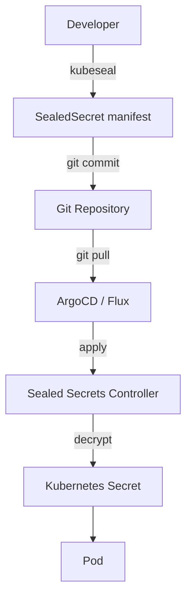

# Sealed Secrets

> **Category:** Security / Secrets Management

## What It Is

**Sealed Secrets** is a Kubernetes controller and tool for one-way encrypted Secrets. It lets you safely store encrypted Secrets in version control (Git) by encrypting them so only the cluster can decrypt them.

## Why It Exists

| Problem | Native Secrets | Sealed Secrets |
|---------|---------------|----------------|
| Git storage | Encoded (not encrypted) | Encrypted with cluster key |
| Version control | Can't commit | Safe to commit |
| Secret rotation | Manual | Controller handles |
| Multi-cluster | Copy secrets manually | Encrypt per cluster |

## Architecture



## Install

```bash
# Helm install
helm repo add sealed-secrets https://bitnami-labs.github.io/sealed-secrets
helm install sealed-secrets sealed-secrets/sealed-secrets -n kube-system

# Install kubeseal CLI
brew install kubeseal
```

## Usage

```yaml
# original-secret.yaml
apiVersion: v1
kind: Secret
metadata:
  name: db-password
  namespace: production
type: Opaque
data:
  password: cGFzc3dvcmQxMjM=  # base64
```

```bash
# Encrypt to SealedSecret
kubeseal --format yaml < original-secret.yaml > sealed-secret.yaml

# Apply SealedSecret
kubectl apply -f sealed-secret.yaml

# Controller creates Secret
kubectl get secret db-password -n production
```

## SealedSecret Manifest

```yaml
apiVersion: bitnami.com/v1alpha1
kind: SealedSecret
metadata:
  name: db-password
  namespace: production
spec:
  encryptedData:
    password: AgBy3i4OJSWK+PiTySYZZA9rO...
  template:
    metadata:
      name: db-password
      namespace: production
    type: Opaque
```

## Options

```bash
# Seal for specific namespace
kubeseal --namespace production --format yaml

# Seal for specific cluster
kubeseal --controller-name sealed-secrets --format yaml

# Seal with specific scope
kubeseal --scope cluster-wide --format yaml  # Cluster-wide
kubeseal --scope strict --format yaml         # Exact namespace/name
kubeseal --scope namespace-wide --format yaml # Any secret in namespace
```

## Rotation

```bash
# Rotate keys
kubectl delete secret -n kube-system -l sealedsecrets.bitnami.com/sealed-secrets-key

# Controller generates new key
# Re-encrypt all SealedSecrets
kubeseal --re-encrypt -f sealed-secret.yaml > new-sealed-secret.yaml
```

## Commands

```bash
# Check controller status
kubectl get pods -n kube-system -l app.kubernetes.io/name=sealed-secrets

# View SealedSecrets
kubectl get sealedsecrets -n production

# View decrypted Secret
kubectl get secret db-password -n production -o yaml

# View controller logs
kubectl logs -n kube-system -l app.kubernetes.io/name=sealed-secrets

# Check key rotation
kubectl get secret -n kube-system -l sealedsecrets.bitnami.com/sealed-secrets-key
```

## Best Practices

1. **Use scope: strict** — limit which namespace/name can decrypt
2. **Rotate keys regularly** — delete old keys to force rotation
3. **Store SealedSecrets in Git** — that's the main use case
4. **Use external-secrets for complex setups** — SealedSecrets is simpler but less flexible
5. **Monitor controller health** — it's a single point of decryption

## Common Issues

| Symptom | Cause | Fix |
|---------|-------|-----|
| Secret not created | Wrong namespace/name | Check scope and metadata |
| Decryption failed | Key rotated | Re-encrypt with current key |
| Controller not running | Missing CRD | Install SealedSecrets CRDs |
| Cannot seal | Wrong controller name | Check controller service name |

## Related

- [Secrets](../01-core-concepts/secrets.md)
- [External Secrets](external-secrets.md)
- [Secrets Management](../06-security/secrets.md)
- [GitOps](../11-ci-cd-gitops/argo-cd.md)
