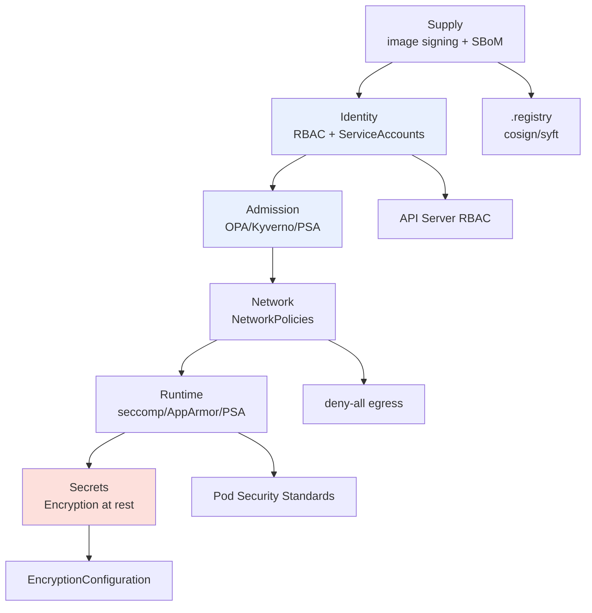

# Kubernetes Security — Defense in Depth

> **Category:** Security / Architecture

K8s security is a **layered** model — no single control stops a breach, so the layers must compose: from **image supply** → **identity/auth** → **admission** → **network** → **runtime/pod** → **secrets**. This doc is the overview; each layer links to its deep dive.



## Threat model at a glance

| Layer | Threat | Primary control |
|-------|--------|-----------------|
| Supply chain | malicious/transitive deps, tampered base images | image scanning, **cosign** signatures + SBoM, `TrustedTypes`/reproducible builds |
| Identity | stolen admin creds, privilege escalation | RBAC least privilege, `system:masters` only via SSO, bound `imagePullSecrets`, `--as` auditing |
| Admission | bad configs (hostPath, privileged, hostNetwork) | **Pod Security Admission** (`privileged`/`baseline`/`restricted`), OPA/Gatekeeper policies |
| Network | east-west lateral movement, egress to malware | `NetworkPolicy` deny-all + explicit allow, egress control, Service Mesh mTLS |
| Runtime | escape (CVE-2019-5736), root, kernel modules | drop all caps, `readOnlyRootFilesystem`, seccomp `RuntimeDefault`, no `hostPath`/`hostPID`/`hostNetwork` |
| Data | secrets in etcd, backups with plaintext | `EncryptionConfiguration` (KMS-backed), `secrets-store-csi-driver`, encrypt etcd snapshots |

## RBAC — least privilege quickly

```bash
kubectl auth can-i get pods --as=system:serviceaccount:dev:ci --namespace app
kubectl who-can create deployments.apps
kubectl describe secret <sa-token>   # bound token + exp
```
Rule: grant the **exact** verbs, `namespace`-scoped first; remove `system:masters` from apps; rotate SA tokens (`TokenRequest` API + short TTL).

## Pod Security (PSA) — replaces PSP

Deprecated PodSecurityPolicies were replaced with **admission-labels**:
```yaml
apiVersion: v1
kind: Namespace
metadata:
  labels:
    pod-security.kubernetes.io/enforce: restricted   # privileged pods rejected
    pod-security.kubernetes.io/enforce-version: latest
    pod-security.kubernetes.io/audit: baseline
```

## Network — deny-all default

```yaml
apiVersion: networking.k8s.io/v1
kind: NetworkPolicy
metadata: { name: deny-all }
spec:
  podSelector: {}            # every pod
  policyTypes: [Ingress, Egress]
---
apiVersion: networking.k8s.io/v1
kind: NetworkPolicy
metadata: { name: allow-same-namespace }
spec:
  podSelector: {}
  ingress: [{ from: [{ namespaceSelector: {} }] }]   # allow same-namespace only
```

## Secrets — encrypt at rest

`/etc/kubernetes/encryption/encryption-config.yaml`:
```yaml
apiVersion: apiserver.config.k8s.io/v1
kind: EncryptionConfiguration
resources:
- resources: [secrets]
  providers:
  - aescbc: { keys: [{ name: key1, secret: <32-byte-b64> }] }
  - identity: {}                            # fallback (plaintext)
```
Without this, an etcd snapshot = **all secrets in plaintext**. Rotate keys by adding a new `key2`, setting it first, restarting, then `kubeadm` re-encrypt.

## Interview Questions

**Q: What's the single most important default for cluster security posture?**
A: **Deny all network egress/ingress by default** with a catch-all `NetworkPolicy` — most breaches move laterally, and "default allow" means every Pod can talk to every other Pod (and the internet). After deny-all, add explicit allow rules per trust tier.

**Q: Why encrypt Secrets in etcd, and how do you test it's on?**
A: etcd snapshots otherwise contain plaintext secrets. Check `EncryptionConfiguration` on the API server; test by `kubectl get secret <s> -o=jsonpath={.data}` and confirming the raw etcd value differs (run `etcdctl get` against the key and the bytes should be ciphertext).

## Related Resources
- [Pod Security Context](pod-security-context.md)
- [RBAC](rbac.md)
- [Secrets](secrets.md)
- [Network Policies](../04-networking/network-policies.md)
- [Supply Chain: Cosign](../11-supply-chain/cosign.md)
- [Troubleshooting Encyclopedia](../14-troubleshooting/troubleshooting-encyclopedia.md)

