# ServiceAccount

> **Category:** Security / Identity

## What It Is

A **ServiceAccount** is a Kubernetes account for **workloads (Pods)**. Whereas a User is for humans, a **ServiceAccount is for applications** — it is how a Pod authenticates to the Kubernetes API.

Pods run **as** a service account (default: `default`). The API uses the SA's token (a JWT) to authenticate the Pod when it calls the API (e.g., `kubectl` inside a Pod, or the kubelet).

## Why It Exists

- Pods need to call the Kubernetes API (e.g., a controller managing CRDs)
- Pods need to authenticate **without** hardcoding user credentials
- A built-in identity for workloads — auditable, revocable

## Architecture

```mermaid
graph TD
    A[Pod] --> B[ServiceAccount<br/>default / my-sa]
    B --> C[API Token &#40;JWT&#41;<br/>mounted at /var/run/secrets/kubernetes.io/serviceaccount/token]
    C --> D[kubelet mounts the token<br/>as a file in the Pod]
    D --> E[Pod calls API<br/>&#40;curl https://kubernetes.default.svc&#41;]
    E --> F[API Server<br/>verifies JWT signature + scopes]
```



## Default ServiceAccount

Every Pod runs as a ServiceAccount — the default is called `default` in each namespace:

```yaml
apiVersion: v1
kind: ServiceAccount
metadata:
  name: default              # In the namespace
  namespace: default
```

When you create a Pod **without** specifying `serviceAccountName`, it uses the `default` SA.

## Create & Use a ServiceAccount

```bash
# Create a SA
kubectl create serviceaccount my-sa

# (Old way — auto-generates a token Secret)
# (Newer K8s — you create a token request explicitly)
```

```yaml
apiVersion: v1
kind: ServiceAccount
metadata:
  name: my-controller
  namespace: default
# Optionally, link a Role:
# ---
apiVersion: apps/v1
kind: Deployment
metadata:
  name: my-app
spec:
  template:
    spec:
      serviceAccountName: my-controller   # Pods run as this SA
      containers:
      - name: app
        image: my-app:latest
```

## Token Projection (Bound ServiceAccount Tokens)

Modern Kubernetes uses **bound** tokens (projected) — short-lived, scoped JWTs:

```yaml
# Request a token (kubectl)
kubectl create token my-sa
# Or via YAML: TokenRequest API
apiVersion: authentication.k8s.io/v1
kind: TokenRequest
metadata:
  name: my-sa
  namespace: default
spec:
  audiences: ["https://kubernetes.default.svc"]
  expirationSeconds: 3600
```

### Projected Volume (for Pods)

```yaml
apiVersion: v1
kind: Pod
spec:
  containers:
  - name: app
    image: myapp
    volumeMounts:
    - name: token
      mountPath: /var/tokens
      readOnly: true
  volumes:
  - name: token
    projected:
      sources:
      - serviceAccountToken:
          path: token             # The token name (file: /var/tokens/token)
          expirationSeconds: 3600
          audience: api-server
```

### Token vs Secret

| Token Type | Storage | Auto-rotation? | Audiences |
|------------|---------|----------------|-----------|
| **Legacy Secret** | Secret object (static) | No | N/A |
| **Bound/TokenRequest** | Projected (runtime) — NOT stored in a Secret | Yes (short-lived) | Scoped (aud) |

**Best practice:** Use `TokenRequest` / bound tokens — do NOT mount legacy `default-token` secrets.

## Mounting the SA Token into a Pod

If you need the token in a Pod:

```yaml
# 1. The default token is mounted here (legacy):
/var/run/secrets/kubernetes.io/serviceaccount/token

# 2. Better: project a scoped, short-lived token:
volumes:
- name: token
  projected:
    sources:
    - serviceAccountToken:
        path: token
        expirationSeconds: 3600
        audience: api-server
```

## ServiceAccount & RBAC

A ServiceAccount gains permissions **only through RBAC** — a Role/ClusterRole bound to it via RoleBinding/ClusterRoleBinding:

```yaml
# Give the SA read access to Pods:
apiVersion: rbac.authorization.k8s.io/v1
kind: Role
metadata:
  name: pod-reader
  namespace: default
rules:
- apiGroups: [""]
  resources: ["pods"]
  verbs: ["get", "list"]
---
apiVersion: rbac.authorization.k8s.io/v1
kind: RoleBinding
metadata:
  name: read-pods
  namespace: default
subjects:
- kind: ServiceAccount
  name: my-controller
  namespace: default
roleRef:
  kind: Role
  name: pod-reader
  apiGroup: rbac.authorization.k8s.io
```

## IAM with ServiceAccounts (Cloud)

You can map a ServiceAccount to a **cloud identity** so Pods can authenticate to cloud resources (AWS IAM Roles for Service Accounts — IRSA):

```yaml
apiVersion: v1
kind: ServiceAccount
metadata:
  name: my-sa
  annotations:
    eks.amazonaws.com/role-arn: arn:aws:iam::1234567890:role/my-role
```

The Pod then assumes the IAM role via **IRSA** (a projected, OIDC-signed token). No `AWS_SECRET_ACCESS_KEY` is needed.

## Commands

```bash
# List
kubectl get serviceaccount      # sa (alias)
kubectl get serviceaccounts -n <ns>

# Get token (K8s 1.24+) — does NOT create a Secret
kubectl create token <sa-name>

# Describe
kubectl describe serviceaccount my-sa

# Create
kubectl create serviceaccount my-sa

# Edit (add imagePullSecrets, annotations)
kubectl edit serviceaccount my-sa

# Add image pull secret (for pulling images from a private registry)
kubectl create secret docker-registry my-registry \
  --docker-server=<url> --docker-username=x --docker-password=y
kubectl patch serviceaccount my-sa -p '{"imagePullSecrets": [my-registry]}'
```

## Common Issues

### "service account not found"
```bash
# The SA doesn't exist in that namespace
# Pod spec.serviceAccountName doesn't match any existing SA
kubectl get sa <name> -n <namespace>
```

### Pods can't call the API — "Unauthorized"
```bash
# The SA has no RBAC permissions
# Check:
kubectl auth can-i get pods --as=system:serviceaccount:<ns>:<sa>
# Fix: create a Role + RoleBinding
```

### `default-token` secret missing (K8s 1.24+)
```bash
# K8s 1.24+ no longer auto-creates a token Secret for each SA.
# Use `kubectl create token <sa>` instead.
kubectl create token my-sa --duration=1h
```

### ServiceAccount can't pull private images
```bash
# The SA needs imagePullSecrets
kubectl get sa <name> -o yaml | grep imagePullSecrets
# Add the pull secret to the SA:
kubectl patch sa <name> -p '{"imagePullSecrets": [{"name": "my-registry"}]}'
```

### "cannot validate certificate for" when calling API
```bash
# In-cluster, use: https://kubernetes.default.svc (not a node IP)
# Or use the in-cluster config (Go client):
import "k8s.io/client-go/rest"
config, err := rest.InClusterConfig()   # Uses SA token + CA
```

## ServiceAccount & Security

### Bound tokens have a limited lifetime
```bash
kubectl create token my-sa --duration=15m
# Default max = 8760h (1 year); most clusters cap at 1-8h
# kubelet auto-refreshes tokens before expiry
```

### Limit the scope (audiences)
```bash
# Limit who the token is valid for (default is kubernetes.default.svc = the API server)
kubectl create token my-sa --audience=https://kubernetes.default.svc
```

### Disable legacy token secrets
```yaml
# In kube-apiserver flags or config:
featureGates:
  TokenRequestNoChange: true
  ServiceAccountTokenNoTokenRequest: false    # Default
# Disable legacy auto-token Secret creation via the API
```

## Best Practices

1. **Never run Pods as the `default` SA** — create a dedicated SA per app
2. **Apply least privilege** — bind only the Roles the SA needs
3. **Use bound tokens** (`TokenRequest`) instead of legacy `default-token` Secrets
4. **Set token expiry** (1 hour — short lived)
5. **Use imagePullSecrets** — give the SA permission to pull images (separate from API access)
6. **Scope to the namespace** — keep each SA's permissions to its own namespace unless multi-namespace is required
7. **Audit regularly** — `kubectl auth can-i --list --as=<sa>`
8. **Don't reuse SAs across unrelated apps**
9. **Set up IRSA / Workload Identity** for cloud access — don't store cloud credentials in Secrets
10. **Restrict token audiences** — limit to what the Pod actually needs to talk to

## How Pods Authenticate to the API

1. At Pod start, kubelet mounts a projected SA token at `/var/run/secrets/kubernetes.io/serviceaccount/token`
2. The Pod uses this JWT + the cluster CA (`/var/run/secrets/kubernetes.io/serviceaccount/ca.crt`)
3. The application/client configures its client library with these — e.g., for the Go client:
   ```go
   import "k8s.io/client-go/rest"
   cfg, err := rest.InClusterConfig()   // reads the mounted token + CA
   ```
4. The API server verifies the JWT signature (signed by the service account key), checks the SA still exists, and checks the scopes (audiences).
5. RBAC then gates each subsequent API call.

## Interview Questions

**Q: What's the difference between a User and a ServiceAccount?**
A: A **User** is a human (e.g., `alice`), managed externally (certs, LDAP, GitHub). A **ServiceAccount** is a built-in identity for **workloads/Pods** — a Pod authenticates to the control plane using the SA's (projected) token.

**Q: How does a Pod prove its identity to the API server?**
A: The kubelet mounts a **bound SA token** (a short-lived JWT) into the Pod at `/var/run/secrets/kubernetes.io/serviceaccount/token`. The Pod's client library presents it with the cluster CA to authenticate.

**Q: Should each pod use the `default` ServiceAccount?**
A: **No** — the `default` SA in many clusters has no (or overly broad) permissions. Create a dedicated SA per app, and grant it only the Role it needs.

**Q: What are the security risks of the legacy auto-token Secret?**
A: Each SA gets a `default-token-XXXXX` Secret holding its (static, long-lived, un-scoped) token. If an attacker steals it, they have persistent access. Use `TokenRequest` (bound, short-lived, scoped) instead.

**Q: How does a Pod's ServiceAccount get cloud credentials (IRSA)?**
A: Annotate the SA with the cloud IAM role ARN (e.g., AWS `eks.amazonaws.com/role-arn`). Kubernetes projects an OIDC token that the cloud provider exchanges for cloud credentials — the Pod never sees long-lived keys.

**Q: What is `imagePullSecrets` for?**
A: It authorizes the kubelet (acting for that SA/Pod) to pull images from private registries. It is separate from API RBAC — stored as a `docker-registry` Secret and attached to the SA.

## Related Resources

- [RBAC](rbac.md)
- [Secrets](secrets.md)
- [Admission Controllers](admission-controllers.md)
- [Pod Security Admission](pod-security-admission.md)