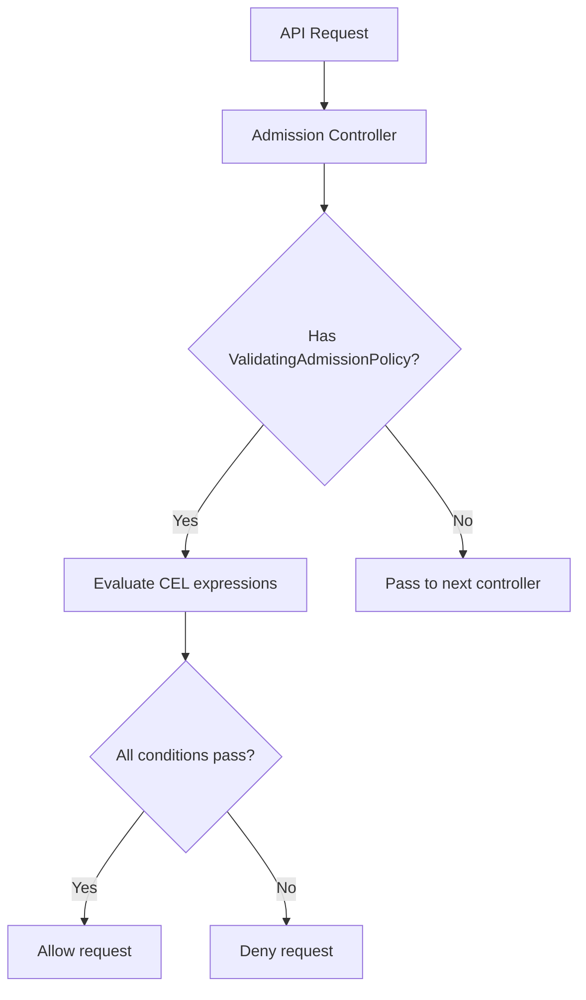

# ValidatingAdmissionPolicy

> **Category:** Security / Admission Control

## What It Is

**ValidatingAdmissionPolicy (VAP)** is a CEL-based admission control mechanism that validates requests without webhooks. GA since K8s 1.30, it provides a lightweight, declarative alternative to OPA Gatekeeper or Kyverno.

## Why It Exists

| Problem | Webhooks (OPA/Kyverno) | ValidatingAdmissionPolicy |
|---------|------------------------|---------------------------|
| Dependency | Requires running webhook server | No external dependency |
| Latency | Network hop to webhook | In-process CEL evaluation |
| Failure mode | Fail-open or fail-closed | Configurable per-policy |
| Complexity | Rego/Kyverno YAML | CEL expressions |
| Performance | Each request → webhook | Near-zero overhead |

## Architecture



## Example: Require Labels

```yaml
apiVersion: admissionregistration.k8s.io/v1
kind: ValidatingAdmissionPolicy
metadata:
  name: "require-team-label"
spec:
  failurePolicy: Fail
  matchConstraints:
    resourceRules:
    - apiGroups: [""]
      apiVersions: ["v1"]
      operations: ["CREATE", "UPDATE"]
      resources: ["pods"]
  validations:
  - expression: "has(object.metadata.labels) && has(object.metadata.labels.team)"
    message: "Pod must have a 'team' label"
```

## Example: Require Resource Limits

```yaml
apiVersion: admissionregistration.k8s.io/v1
kind: ValidatingAdmissionPolicy
metadata:
  name: "require-resource-limits"
spec:
  failurePolicy: Fail
  matchConstraints:
    resourceRules:
    - apiGroups: [""]
      apiVersions: ["v1"]
      operations: ["CREATE", "UPDATE"]
      resources: ["pods"]
  validations:
  - expression: "all(object.spec.containers, c, has(c.resources.limits.cpu) && has(c.resources.limits.memory))"
    message: "All containers must have CPU and memory limits"
```

## Example: Restrict Image Registries

```yaml
apiVersion: admissionregistration.k8s.io/v1
kind: ValidatingAdmissionPolicy
metadata:
  name: "restrict-image-registries"
spec:
  failurePolicy: Fail
  matchConstraints:
    resourceRules:
    - apiGroups: [""]
      apiVersions: ["v1"]
      operations: ["CREATE"]
      resources: ["pods"]
  validations:
  - expression: "all(object.spec.containers, c, c.image.startsWith('myregistry.com/') || c.image.startsWith('docker.io/library/'))"
    message: "Images must come from myregistry.com or docker.io/library"
```

## Example: Namespace-Scoped Policy

```yaml
apiVersion: admissionregistration.k8s.io/v1
kind: ValidatingAdmissionPolicyBinding
metadata:
  name: "require-team-label-binding"
spec:
  policyName: "require-team-label"
  matchResources:
    namespaceSelector:
      matchLabels:
        enforced: "true"
```

## Failure Policies

| Policy | Behavior | Use Case |
|--------|----------|----------|
| `Fail` | Deny request if policy fails | Security-critical policies |
| `Ignore` | Allow request if policy fails | Non-critical validation |

## CEL Expressions

Common CEL patterns for VAP:

```cel
# Check field exists
has(object.metadata.labels)

# Check all items in list
all(object.spec.containers, c, has(c.resources))

# Check any item in list
any(object.spec.containers, c, c.image.startsWith('dangerous/'))

# String operations
object.metadata.name.matches('^[a-z][a-z0-9-]*$')

# Numeric comparisons
object.spec.replicas <= 10

# List size
size(object.spec.containers) <= 5
```

## Commands

```bash
# List policies
kubectl get validatingadmissionpolicies

# Describe a policy
kubectl describe validatingadmissionpolicy require-team-label

# List bindings
kubectl get validatingadmissionpolicybindings

# Test policy (dry-run)
kubectl apply --dry-run=server -f pod.yaml
```

## Best Practices

1. **Start with dry-run** — use `--dry-run=server` before enforcing
2. **Use `Ignore` for testing** — switch to `Fail` after validation
3. **Scope policies** — use namespaceSelector to limit enforcement
4. **Keep CEL simple** — complex logic is harder to debug
5. **Monitor denials** — check API server audit logs for policy rejections

## Comparison: VAP vs OPA vs Kyverno

| Feature | ValidatingAdmissionPolicy | OPA Gatekeeper | Kyverno |
|---------|--------------------------|----------------|---------|
| Language | CEL | Rego | YAML/JSON |
| Dependency | None | OPA sidecar | Kyverno controller |
| Performance | In-process | Webhook | Webhook |
| Complexity | Low | High | Medium |
| Policy library | Community (small) | Large | Large |
| Mutating support | No | Yes | Yes |

## Related

- [Admission Controllers](admission-controllers.md)
- [OPA Gatekeeper](opa-gatekeeper.md)
- [Kyverno](kyverno.md)
- [RBAC](rbac.md)
