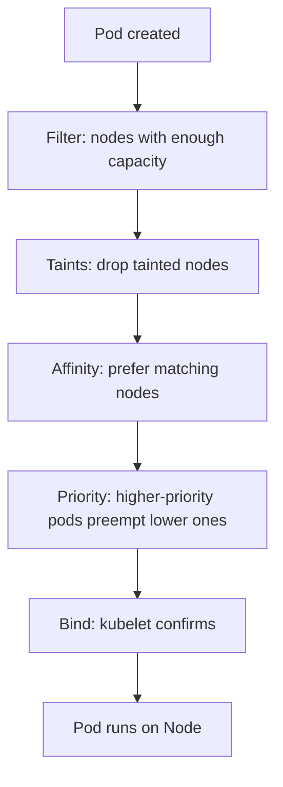

# 07. Scheduling & Autoscaling

> **Category:** Scheduling / Autoscaling

This category covers how Kubernetes **decides which node runs a Pod**, and how to **control that decision**, plus the **autoscaling** toolkit (HPA, VPA, KEDA, Cluster Autoscaler).

## Scheduling

| File | Topic |
|------|-------|
| [scheduling.md](scheduling.md) | How the scheduler decides placement |
| [taints-tolerations.md](taints-tolerations.md) | Keep pods off nodes (taints) / allow them (tolerations) |
| [node-affinity.md](node-affinity.md) | Bind pods to nodes by labels |
| [pod-affinity.md](pod-affinity.md) | Co-locate (or avoid) pods on the same topology |
| [resources.md](resources.md) | Requests & limits (what the scheduler needs) |
| [limit-ranges.md](limit-ranges.md) | Per-namespace defaults + caps |
| [resource-quotas.md](resource-quotas.md) | Per-namespace quotas |
| [priority-classes.md](priority-classes.md) | Let critical pods preempt others (in 03-workloads) |
| [topology-spread.md](topology-spread.md) | Even distribution across zones/hosts |

## Autoscaling (see `../03-workloads` for hpa/vpa/keda/cluster-autoscaler.md`)

| File | Topic |
|------|-------|
| [hpa.md](../03-workloads/hpa.md) | Horizontal Pod Autoscaler (replicas) |
| [vpa.md](../03-workloads/vpa.md) | Vertical Pod Autoscaler (resources) |
| [keda.md](../03-workloads/keda.md) | Event-driven autoscaling (to zero) |
| [cluster-autoscaler.md](../03-workloads/cluster-autoscaler.md) | Add/remove nodes |

## Scheduling Flow

## Key Questions

- **Why is my Pod Pending?** No node has enough CPU/memory — the scheduler's filter found no fit.
- **How do I pin a pod to a node?** `nodeSelector`, `nodeAffinity`, or `nodeName`.
- **How do I spread replicas?** `topologySpreadConstraints` or `podAntiAffinity`.
- **How do critical pods win the spot?** `priorityClassName` lets them preempt lower ones.
- **How does autoscaling interact?** HPA/VPA scale replicas/resources; Cluster Autoscaler provides nodes.

## Related Resources

- [Workloads](../03-workloads/README.md)
- [Cluster Operations](../08-cluster-operations/README.md)
- [kubectl Cheatsheet](../cheat-sheets/kubectl.md)
