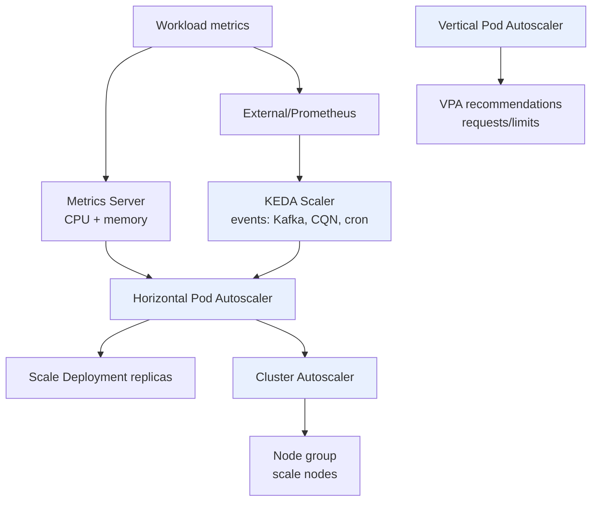

# HPA, VPA, KEDA & Cluster Autoscaler

> **Category:** Scheduling & Autoscaling

Kubernetes scales in two axes: **in-cluster (Pods)** via the Horizontal/Vertical Pod Autoscaler and KEDA, and **cluster (Nodes)** via the Cluster Autoscaler. They compose but have sharp edges — notably **VPA and HPA should not both target CPU/memory on the same Pods** (they fight).



## Horizontal Pod Autoscaler (HPA)

```yaml
apiVersion: autoscaling/v2
kind: HorizontalPodAutoscaler
metadata: { name: api }
spec:
  scaleTargetRef:
    apiVersion: apps/v1
    kind: Deployment
    name: api
  minReplicas: 2
  maxReplicas: 20
  metrics:
  - type: Resource
    resource: { name: cpu, target: { type: Utilization, averageUtilization: 60 } }
  - type: Pods
    pods: { metric: { name: requests_per_second }, target: { type: AverageValue, averageValue: "100" } }
  - type: External
    external: { metric: { name: sqs_messages_visible }, target: { type: Value, value: "1000" } }
```
- `autoscaling/v2` supports **Resource** (cpu/mem), **Pods** (custom per-pod), **External** (Prometheus/`external-metrics-api`), and **ContainerResource** metrics.
- Needs a metrics provider: **Metrics Server** (bundled CPU/memory) for `Resource`; a custom/external `-metrics-apiserver` for the rest.

## Vertical Pod Autoscaler (VPA)

VPA **rewrites Pod `requests/limits`** (after evicting and restarting the Pod). It has three modes:
- `Off` — recommendations only (`RecommendedPodResource` object).
- `Initial` — sets requests only on **create** (good with HPA for steady-state).
- `Auto` — evicts + restarts to enforce (cannot be used with HPA on the **same** metrics — they fight over replicas vs. size).

```bash
kubectl apply -f https://github.com/kubernetes/autoscaler/releases/latest/download/vertical-pod-autoscaler.yaml
```

## KEDA — event-driven autoscaling

Scales any scaled object (Deployment, StatefulSet, DAG, even to **zero**) on **external events** (queue depth, cron, Azure Service Bus, Kafka lag…). It writes a `ScaledObject` that KEDA's operator reconciles into an HPA-like control loop.

```yaml
apiVersion: keda.sh/v1alpha1
kind: ScaledObject
metadata: { name: queue-scaler }
spec:
  scaleTargetRef: { name: worker }     # Deployment
  minReplicaCount: 0
  maxReplicaCount: 10
  triggers:
  - type: azure-servicebus
    metadata:
      namespace: ...
      queueName: jobs
      connection: SERVICE_BUS_CONN
```

## Cluster Autoscaler (CA)

Runs in the **control plane** and scales the **node group** (ASG/VMSS/MIG) up/down based on scheduler pressure.
- `scale-down-utilization-threshold` (default 0.5): a node is a candidate only if it would be < 50% full after Pods move.
- `--balance-similar-node-groups`, `--expander=least-waste` / `random` / `pick-newest`.
- Must be paired with `resource.limits` — without requests, CA cannot pack nodes.

## Interview Questions

**Q: Why can't HPA and VPA both control CPU memory on the same Deployment?**
A: HPA scales the **number of replicas** based on average CPU; VPA changes the per-Pod **CPU request** (and evicts the Pod). They create a feedback loop — each change invalidates the other's signal, causing thrashing. Use HPA for CPU/memory, VPA (in `Initial` only) for steady requests; or let VPA own sizing and HPA own events (KEDA).

**Q: A Pod has no metrics and the HPA stays at minReplicas. Where do you look?**
A: `kubectl describe hpa`, then `kubectl get --raw /apis/metrics.k8s.io/v1beta1`. If Metrics Server is missing or the HPA can't read `cpu/averageUtilization`, scale stays at min. Verify `kube-system` metrics-server is running and the HPA's `behavior` `initialDelaySeconds`/cooldown isn't too aggressive.

**Q: What does Cluster Autoscaler need from workloads to pack nodes efficiently?**
A: Real **`requests`** (not limits) so the scheduler's bin-packing is accurate; without requests the CA sees "0" used and over-provisions, and scale-down can't identify empty nodes.

## Related Resources
- [Resource Management](resource-management.md)
- [Cluster Autoscaler](../03-workloads/cluster-autoscaler.md)
- [FinOps](../08-cluster-operations/finops.md)
- [Troubleshooting Encyclopedia](../14-troubleshooting/troubleshooting-encyclopedia.md)
