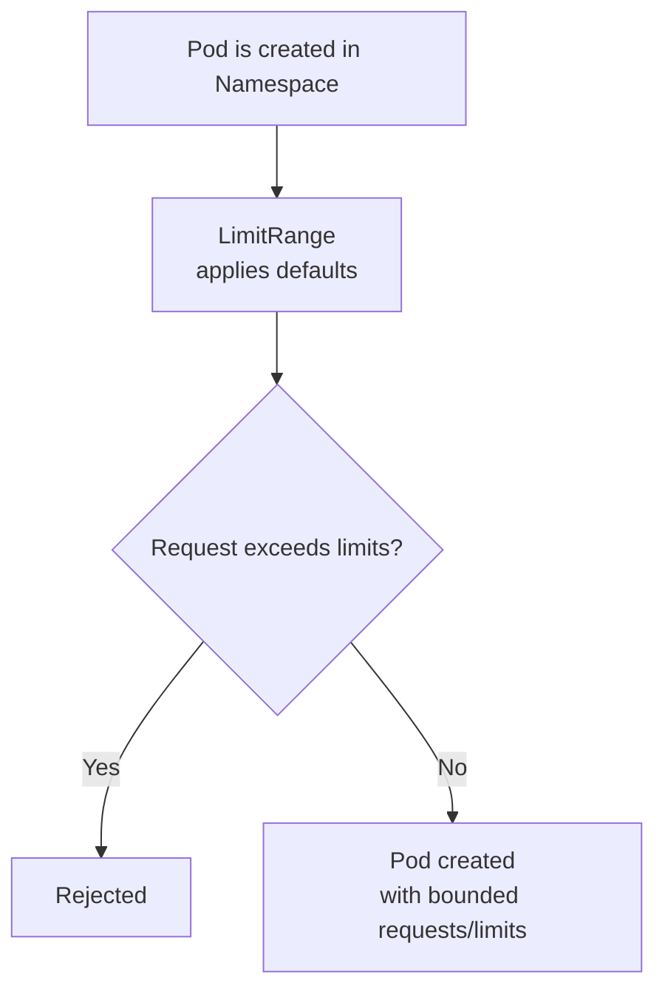

# Limit Ranges

> **Category:** Scheduling / Quotas

## What It Is

A **LimitRange** is a Kubernetes resource that sets **default, minimum, and maximum** values for **compute resources** (CPU/memory/ephemeral-storage) and **storage** within a **namespace**. It works with the `ResourceQuota` to enforce sane defaults.

## Why It Exists

Without a LimitRange:
- Pods with **no resource requests** slip into the namespace → they consume CPU/memory unpredictably and become **BestEffort** (evicted first)
- Pods request **absurdly large** resources (e.g., 32GB mem) and starve others
- No **default** resources are applied → developers must remember to set them every time

A LimitRange **enforces sane defaults** and prevents foot-guns.

## Architecture



## LimitRange API

```yaml
apiVersion: v1
kind: LimitRange
metadata:
  name: core-limit-range
  namespace: default
spec:
  limits:
  - type: Container
    default:                         # Applied if a Container omits `resources`
      cpu: "200m"
      memory: "256Mi"
    defaultRequest:                  # Applied if a Container omits `requests` only
      cpu: "100m"
      memory: "128Mi"
    max:                             # Cap — container requests/limits cannot exceed
      cpu: "2"
      memory: "2Gi"
    min:                             # Floor — container requests must meet this
      cpu: "50m"
      memory: "64Mi"
    maxLimitRequestRatio:            # limit / request ratio cap (controls burst)
      cpu: "20"
      memory: "2"
  - type: Pod
    max:
      requests:
        cpu: "4"
        memory: "4Gi"
      limits:
        cpu: "8"
        memory: "8Gi"
  - type: PersistentVolumeClaim
    default:                         # Default size if PVC omits `storage`
      storage: "1Gi"
    max:
      storage: "10Gi"
```

## LimitRange Types

A LimitRange can have multiple `limits` entries, each scoped to a type:

| Type | Governs | Scope |
|------|---------|-------|
| `Container` | Per-container requests/limits | Applied when a Pod is created |
| `Pod` | Sum of all container requests/limits in a Pod | Total Pod resource floor/ceiling |
| `PersistentVolumeClaim` | PVC storage requests | PVC size min/max/default |

## How Defaults Are Applied

When a Pod is created **without** explicit `resources`:
1. LimitRange with `type: Container` provides `default` and `defaultRequest`.
2. If `requests` is omitted, `defaultRequest` is used.
3. If `limits` is omitted, `default` is used.
4. If **both** are omitted, Kubernetes uses `default` for `requests` too (in recent versions).

This **upgrades a Pod from BestEffort** to at least **Burstable** QoS.

## maxLimitRequestRatio

This controls how much a Pod can "burst". It caps `limit/request`:

```yaml
- type: Container
  maxLimitRequestRatio:
    cpu: "20"              # limit <= 20 x request
    memory: "2"            # limit <= 2 x request
```

Without this, a Pod could set `request=10m, limit=8` (an 800x burst) — a "noisy neighbor".

## Commands

```bash
# Create / list
kubectl apply -f limitrange.yaml
kubectl get limitrange -n <ns>
kubectl describe limitrange -n <ns>     # See defaults + bounds

# Create from CLI
kubectl create limitrange limits \
  --default-limit=cpu=1,memory=512Mi \
  --max-limit=cpu=2,memory=2Gi \
  --min-limit=cpu=50m,memory=128Mi
```

## Common Issues

### Pods rejected: "exceeds limit range min"
```bash
kubectl describe pod <name>
# "Error creating: ... requests.cpu ... is less than minimum"
# Fix: raise the container's CPU request above the LimitRange min.
```

### Pod has no QoS (BestEffort) despite LimitRange
```yaml
# Check: the container DOES omit resources entirely
# Fix: remove `defaultRequest` from the LimitRange if it's not matching, OR confirm
# a default is actually applied: kubectl get pod -o jsonpath={.spec.containers[*].resources}
```

### "maxLimitRequestRatio exceeded"
```bash
# The Pod has request=100m, limit=4 (=40x, exceeds maxLimitRequestRatio.cpu=20)
# Fix: lower the limit or raise the request
```

### PVC rejected by LimitRange
```bash
# PVC size is below min or above max
kubectl describe pvc <name>
# Check: storage: 20Gi vs LimitRange pvc.min/max
```

## LimitRange vs ResourceQuota

| Object | Scope | Purpose |
|--------|-------|---------|
| `LimitRange` | Per-namespace, per-container | Defaults + **bounds** for a single container/pod |
| `ResourceQuota` | Per-namespace | **Totals** the namespace can use |

They work together: LimitRange sets defaults + per-container bounds; ResourceQuota enforces aggregate namespace usage.

## Interview Questions

**Q: What does a LimitRange do?**
A: It sets **default** resource requests/limits and enforces **min/max bounds** per-container (or per-Pod, per-PVC) in a namespace.

**Q: What's the difference between `default` and `defaultRequest`?**
A: `default` is the default **limit** (and limit is also used as the request if no request is given). `defaultRequest` is the default **request** when only the limit is omitted. Without these, pods default to 0 (unlimited) requests.

**Q: What is a `maxLimitRequestRatio`?**
A: The max allowed ratio of a container's **limit** to its **request** — preventing a pod from requesting tiny CPU but setting huge limits (which would allow it to burst too aggressively).

**Q: How do LimitRange and ResourceQuota interact?**
A: LimitRange sets per-container defaults/bounds; ResourceQuota enforces the namespace-wide totals. A Pod must satisfy both.

**Q: Why are LimitRanges useful for QoS?**
A: They guarantee that pods without explicit requests get a **default request**, so they're not classified as **BestEffort** (the lowest QoS tier), which would make them the first to be evicted under pressure.

## Related Resources

- [Resource Quotas](resource-quotas.md)
- [Resources](resources.md)
- [Priority Classes](priority-classes.md)
- [HPA](../03-workloads/hpa.md)
