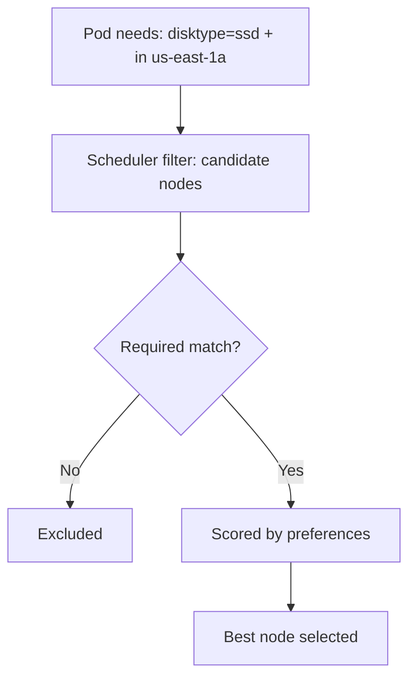

# Node Affinity & Anti-Affinity

> **Category:** Scheduling

## What It Is

**Affinity** in Kubernetes refers to scheduling rules that **attract or repel** pods to/from nodes (nodeAffinity) or other pods (podAffinity / podAnti-Affinity).

While `nodeSelector` is a simple AND of key=value, **nodeAffinity** adds richer operators (`In`, `NotIn`, `Exists`, `Gt`, `Lt`) and **soft preferences** (`preferredDuringScheduling...` vs `required`).

## Why It Exists

You want Pods to land on (or avoid) specific Nodes based on:
- Hardware labels (GPU, ARM, SSD)
- Region/zone (latency, compliance)
- Cost (spot vs on-demand nodes)
- Topology (for fault-tolerance)

`nodeSelector` is too rigid; affinity adds flexibility.

## Architecture



## Node Affinity API

There are two kinds of node affinity:

| Field | Type | Behavior |
|-------|------|----------|
| `requiredDuringSchedulingIgnoredDuringExecution` | Hard constraint | Pod **must** be on a matching node (or not scheduled) |
| `preferredDuringSchedulingIgnoredDuringExecution` | Soft preference | Pod is **preferred** on a matching node, but can land elsewhere |

```yaml
spec:
  affinity:
    nodeAffinity:
      requiredDuringSchedulingIgnoredDuringExecution:
        nodeSelectorTerms:
        - matchExpressions:
          - key: "disktype"
            operator: "In"
            values: ["ssd"]
          - key: "topology.kubernetes.io/zone"
            operator: "In"
            values: ["us-east-1a"]
      preferredDuringSchedulingIgnoredDuringExecution:
      - weight: 80          # 0-100; higher is more preferred
        preference:
          matchExpressions:
          - key: "kubernetes.io/hostname"
            operator: "In"
            values: ["preferred-host"]
```

### Operators

| Operator | Usage |
|----------|-------|
| `In` | value is one of `values` |
| `NotIn` | value is not one of `values` |
| `Exists` | key is present (value can be anything — omit `values`) |
| `DoesNotExist` | key is absent |
| `Gt` / `Lt` | numeric greater/less than (node labels must be numeric) |

## nodeSelector (simpler predecessor)

```yaml
spec:
  template:
    spec:
      nodeSelector:
        disktype: ssd         # Simple AND of key=value (In semantics)
```

`nodeSelector` is equivalent to a single `In` term in required nodeAffinity — but nodeAffinity can express `NotIn`, `Exists`, soft preferences, and OR-ing multiple terms.

## How `required` is evaluated

```yaml
requiredDuringSchedulingIgnoredDuringExecution:
  nodeSelectorTerms:          # A list — Pod must match at least ONE term (logical OR)
  - matchExpressions:
    - key: "arch"
      operator: "In"
      values: ["amd64"]
  - matchExpressions:
    - key: "arch"
      operator: "In"
      values: ["arm64"]      # Match amd64 OR arm64
```

Each `nodeSelectorTerms` is **OR**-ed; each `matchExpressions` within a term is **AND**-ed.

## Node Affinity vs NodeSelector

| Feature | nodeSelector | nodeAffinity (required) |
|---------|--------------|--------------------------|
| Operators | only `=`/`In` | `In`, `NotIn`, `Exists`, `Gt`, `Lt` |
| OR logic | No | Yes (multiple terms) |
| Soft preference | No | Yes (preferred) |
| Negation | No | Yes (`NotIn`, `DoesNotExist`) |

## Commands

```bash
# List nodes by label
kubectl get nodes --show-labels
kubectl get nodes -l kubernetes.io/arch=amd64
kubectl get nodes -l disktype=ssd

# Add a label
kubectl label nodes <node> disktype=ssd
kubectl label node <node> topology.kubernetes.io/zone=us-east-1a

# Remove a label
kubectl label node <node> disktype-    # Trailing dash = remove

# Describe (see labels + taints)
kubectl describe node <name>
```

## Common Issues

### Pod stuck `Pending` — affinity can't be satisfied
```bash
kubectl describe pod <name>
# Events: "0/5 nodes are available: 1 node(s) didn't match node selector."
# Fix: fix the affinity labels, OR relax to preferred
```

### Pod scheduled but never runs
```bash
# nodeAffinity is IgnoredDuringExecution
# If the node's labels change after scheduling (node loses the label), the Pod keeps running
# (until it is evicted or restarted). Re-apply or use `preferred` + `nodeAntiAffinity`.
```

### `preferred` not working (pod lands on non-preferred node)
```bash
# preferred = soft — it is only used if multiple nodes fit equally.
# If only one node fits the `required`, the preference has no effect.
```

### Node labels drift / get removed
```bash
# Use cloud auto-labels (topology.kubernetes.io/zone/region) which are stable.
# Don't rely on ephemeral custom labels for required scheduling.
```

### `Gt` / `Lt` not matching
```yaml
# The node label value must be numeric for Gt/Lt:
requiredDuringSchedulingIgnoredDuringExecution:
  nodeSelectorTerms:
  - matchExpressions:
    - key: cores
      operator: Gt
      values: ["4"]    # node label: cores=8
```

## Examples

### Target a GPU node
```yaml
spec:
  containers:
  - name: ml
    resources:
      limits:
        nvidia.com/gpu: 1
  affinity:
    nodeAffinity:
      requiredDuringSchedulingIgnoredDuringExecution:
        nodeSelectorTerms:
        - matchExpressions:
          - key: nvidia.com/gpu
            operator: Exists
```

### Spread across zones (fault-tolerance via required)
```yaml
affinity:
  nodeAffinity:
    requiredDuringSchedulingIgnoredDuringExecution:
      nodeSelectorTerms:
      - matchExpressions:
        - key: topology.kubernetes.io/zone
          operator: In
          values: ["us-east-1a", "us-east-1b"]
```

### Prefer but don't require SSD
```yaml
affinity:
  nodeAffinity:
    preferredDuringSchedulingIgnoredDuringExecution:
    - weight: 100
      preference:
        matchExpressions:
        - key: disktype
          operator: In
          values: ["ssd"]
```

## nodeAffinity vs Taints/Tolerations

| Mechanism | Node marks | Pod declares | Attracts? |
|-----------|------------|--------------|-----------|
| nodeAffinity | (no) | Pod selector | Yes (must/may land on matching node) |
| Taint/Toleration | Node `taint` | Pod `toleration` | No (eligible, not preferred) |

Often used together: taint + toleration (dedicate GPU node) + nodeAffinity (the ML pod specifically goes there).

## Interview Questions

**Q: What's the difference between nodeAffinity `required` and `preferred`?**
A: `required` is a hard constraint — the Pod will only land on matching nodes. `preferred` is best-effort — the scheduler prefers matching nodes but will land elsewhere if necessary.

**Q: How is nodeAffinity different from nodeSelector?**
A: nodeSelector is a simple AND of `key=value`. NodeAffinity supports richer operators (`NotIn`, `Exists`, `Gt`, `Lt`), OR-ing multiple terms, and **soft preferences**.

**Q: What's the difference between nodeAffinity and a Toleration?**
A: NodeAffinity is on the Pod and **attracts** it to a matching Node. A Toleration lets a Pod tolerate a **Taint** (which repels) — it's "eligible" but not "preferred".

**Q: What does `In` vs `Exists` do?**
A: `In` checks if a label's value is among a list. `Exists` only checks that the label key is **present** (ignores the value) — useful for "any GPU node" (key exists).

**Q: If a node loses its label after a Pod is scheduled there, what happens?**
A: Nothing immediately — nodeAffinity is only enforced **at scheduling time**. The running Pod keeps running on the node (IgnoredDuringExecution) until it's restarted or evicted.

## Related Resources

- [Taints & Tolerations](taints-tolerations.md)
- [Pod Affinity](pod-affinity.md)
- [Resources](resources.md)
- [Priority Classes](priority-classes.md)
