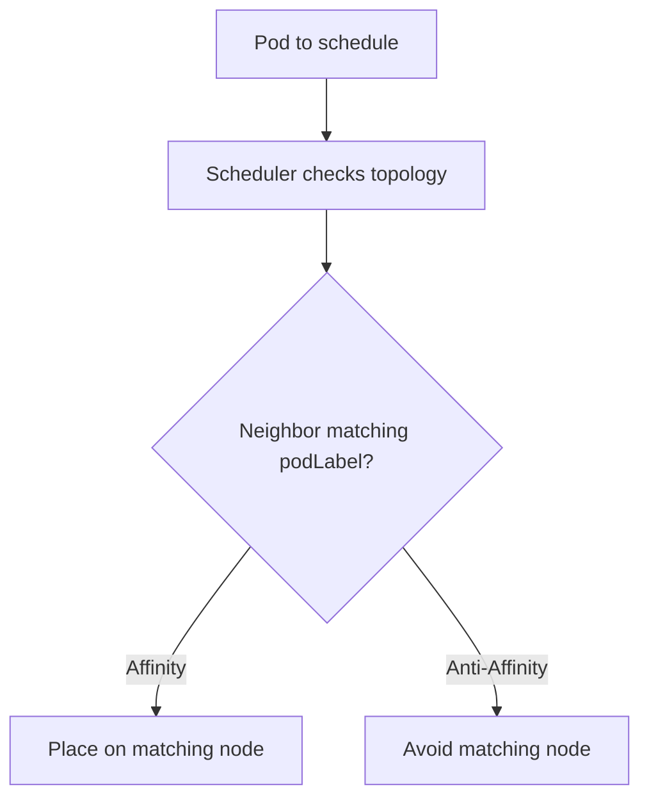

# Pod Affinity & Anti-Affinity

> **Category:** Scheduling

## What It Is

**Pod Affinity** and **Anti-Affinity** are scheduling rules that tell the scheduler to place a Pod **near** (or **away from**) other Pods — based on labels or namespaces, and **within a topology (e.g., node, zone)**.

- **Pod Affinity**: "Schedule me on a node that already has a Pod matching X."
- **Pod Anti-Affinity**: "Do not schedule me on a node that has a Pod matching X."

This gives you **co-location** (for latency) or **spreading** (for fault-tolerance), beyond what node Affinity offers.

## Why It Exists

- **Co-location**: Place a frontend and its backend cache on the same node for low latency
- **High availability**: Use **Anti-Affinity** to spread replicas across nodes/zones so a node or zone failure doesn't kill them all
- **Shared resources**: Co-locate Pods that share a node-local volume

## Architecture



## Pod Affinity API

```yaml
spec:
  affinity:
    podAffinity:                     # Co-locate
      requiredDuringSchedulingIgnoredDuringExecution:
      - topologyKey: "kubernetes.io/hostname"   # Node = "I must be on a node with X"
        labelSelector:
          matchExpressions:
          - key: "app"
            operator: In
            values: ["backend"]
      preferredDuringSchedulingIgnoredDuringExecution:
      - weight: 80
        podAffinityTerm:
          topologyKey: "kubernetes.io/hostname"
          labelSelector:
            matchExpressions:
            - key: "app"
              operator: In
              values: ["cache"]
    podAntiAffinity:                 # Spread out
      requiredDuringSchedulingIgnoredDuringExecution:
      - topologyKey: "kubernetes.io/hostname"
        labelSelector:
          matchExpressions:
          - key: "app"
            operator: In
            values: ["myapp"]
      preferredDuringSchedulingIgnoredDuringExecution:
      - weight: 100
        podAffinityTerm:
          topologyKey: "topology.kubernetes.io/zone"
          labelSelector:
            matchLabels:
              app: "myapp"
```

### Hard vs Soft

| Field | Type | Behavior |
|-------|------|----------|
| `requiredDuringSchedulingIgnoredDuringExecution` | Hard constraint | Pod **must/must-not** co-locate — may fail to schedule |
| `preferredDuringSchedulingIgnoredDuringExecution` | Soft preference | Try to co-locate, but allow fallback |

## Topology Keys

The `topologyKey` defines **the domain** for the affinity/anti-affinity rule (the "grouping"):

| `topologyKey` | Meaning |
|---------------|---------|
| `kubernetes.io/hostname` | Group by **node** |
| `topology.kubernetes.io/zone` | Group by **zone** |
| `topology.kubernetes.io/region` | Group by **region** |
| `kubernetes.io/os` | Group by **OS** |
| (empty string `""`) | Same as any key — all nodes in one domain |

### Required anti-affinity + topologyKey = max spread
```yaml
podAntiAffinity:
  requiredDuringSchedulingIgnoredDuringExecution:
  - topologyKey: "kubernetes.io/hostname"
    labelSelector:
      matchLabels:
        app: myapp
```
This forces every `app: myapp` Pod onto a **separate node**.

## How Pod Anti-Affinity Evaluates

For **required anti-affinity**:
1. The scheduler checks the `topologyKey` (e.g., hostname) of candidate nodes.
2. For each candidate node, it checks all nodes in the **same topology domain** (same hostname / zone).
3. If any of those nodes **already has a pod matching** the `labelSelector`, the candidate node is **excluded**.
4. Only nodes with **no matching pods** (in the domain) are eligible.

This is why "spread replicas across zones" uses `topologyKey: topology.kubernetes.io/zone`.

## Common Use Cases

### 1. High Availability — spread replicas across nodes
```yaml
podAntiAffinity:
  requiredDuringSchedulingIgnoredDuringExecution:
  - labelSelector:
      matchExpressions:
      - key: app
        operator: In
        values: ["myapp"]
    topologyKey: kubernetes.io/hostname
# → Every myapp Pod goes to a different node (if nodes are available).
```

### 2. Low Latency — co-locate app + cache
```yaml
podAffinity:
  requiredDuringSchedulingIgnoredDuringExecution:
  - labelSelector:
      matchExpressions:
      - key: app
        operator: In
        values: ["cache"]
    topologyKey: kubernetes.io/hostname
# → App Pod only runs on a node that already has (or will have) a cache Pod.
```

### 3. Best-effort spread across zones
```yaml
podAntiAffinity:
  preferredDuringSchedulingIgnoredDuringExecution:
  - weight: 100
    podAffinityTerm:
      topologyKey: topology.kubernetes.io/zone
      labelSelector:
        matchLabels:
          app: myapp
# → Scheduler PREFERS putting me in a zone without myapp pods.
```

## Common Issues

### Pods stuck `Pending` (Anti-Affinity conflict)
```bash
kubectl describe pod <name>
# "0/x nodes are available: x Nodes didn't match pod anti-affinity rules."
# Cause: the anti-affinity rule can't be satisfied (e.g., 5 replicas, but only 3 nodes)
# Fix: lower the replica count, add nodes, or make it `preferred` (soft)
```

### Anti-Affinity not spreading as expected
```bash
# Check: the labels on the target pods match your labelSelector exactly.
kubectl get pods -l app=myapp -o wide
# Check: the topologyKey matches your spread scope (hostname vs zone).
```

### Affinity makes scheduling very slow (N^2 problem)
```yaml
# Anti-Affinity with labelSelector matching ALL of your pods
# causes the scheduler to check every Pod — O(N) per scheduling decision.
# This is fine for small clusters; consider spreading via StatefulSets + a Service for large ones.
# Mitigation: use labels carefully, use preferred (soft) where possible.
```

### "IgnoredDuringExecution" — rule not enforced after scheduling
```
# Like nodeAffinity, pod (anti-)affinity is only checked at SCHEDULING time.
# Once a Pod lands on a node, topology changes (a node joining/leaving the domain)
# do NOT trigger rescheduling. The Pod stays. (To move it, delete and reschedule.)
```

## Pod Anti-Affinity is "preferred" by default? No.

- `podAntiAffinity.required...` = must not share → hard
- `podAntiAffinity.preferred...` = prefer not to share → soft

Both are commonly used; pick based on tolerance for scheduling failure.

## Affinity vs Taints/Tolerations vs NodeAffinity

| Mechanism | On Pod? | Attracts? | Repels? |
|-----------|---------|-----------|---------|
| PodAffinity | Yes | Yes ("near other pods") | No |
| PodAnti-Affinity | Yes | No | Yes ("away from those pods") |
| NodeAffinity | Yes | Yes (to nodes) | No |
| Toleration | Yes | Eligible (not preferred) | Only "no longer blocked" |

## Commands

```bash
kubectl get pod <name> -o wide     # See where it landed
kubectl describe pod <name>        # See Affinity rules in the spec
kubectl get nodes -l <label>
kubectl get nodes --show-labels    # Inspect topology labels
```

## Interview Questions

**Q: What is Pod Anti-Affinity?**
A: A scheduling rule that says "do NOT schedule me on a node (or zone/region) that already runs a Pod matching this label." It's used to **spread** replicas for fault-tolerance.

**Q: How do you spread replicas across zones?**
A: Use `podAntiAffinity` with `topologyKey: topology.kubernetes.io/zone` and a `labelSelector` matching your own Pods. This makes the scheduler avoid putting two replicas in the same zone.

**Q: What's the difference between `required` and `preferred` PodAnti-Affinity?**
A: `required` is a hard constraint — if not satisfied, the Pod won't be scheduled (can block). `preferred` is soft — the scheduler tries it, but will schedule anyway if no node fits (no blocking).

**Q: Why would a Pod with Anti-Affinity be stuck Pending?**
A: Its required anti-affinity rule can't be satisfied — e.g., 5 replicas with a required node-anti-affinity but only 3 nodes. Reduce replicas, add nodes, or soften to `preferred`.

**Q: Is pod (anti-)affinity enforced after scheduling?**
A: **No** — `...IgnoredDuringExecution` means it is **ignored after** the Pod is placed. If the node topology changes later (labels change), the rule isn't re-evaluated (the Pod stays).

**Q: What is the `topologyKey`?**
A: The axis of the spread. `kubernetes.io/hostname` = per-node. `topology.kubernetes.io/zone` = per-AZ. `topology.kubernetes.io/region` = per-region. It defines what "colocated" means for the rule.

## Related Resources

- [Node Affinity](node-affinity.md)
- [Taints & Tolerations](taints-tolerations.md)
- [Resources](resources.md)
- [Priority Classes](priority-classes.md)
- [StatefulSet](pod-affinity.md) — for ordered, stable identity
