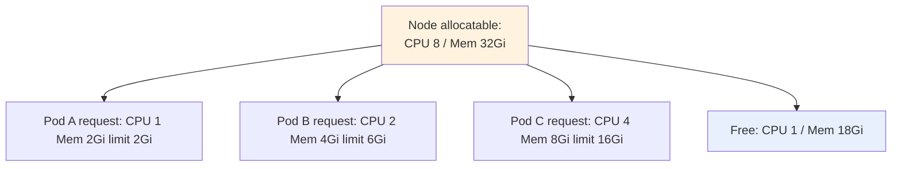

# Resource Requests, Limits & QoS

> **Category:** Scheduling & Autoscaling / Fundamentals

Every container declares **requests** (reserved/scheduler-guaranteed) and **limits** (enforced ceiling). The gap between the two is K8s' **overcommit**: you can schedule more `limit` than the node has RAM/CPU, but Pods that exceed a request get **throttled** (CPU) or **killed** (memory). This is how "noisy neighbors" and OOM kills happen.



## Requests vs Limits

| Resource | `request` (guaranteed) | `limit` (ceiling) | What breaks if set wrong |
|----------|------------------------|-------------------|--------------------------|
| **CPU** | scheduler reserved time; **throttling** at this + CFS quota | hard cap (CPU shares) | CPU `limit` far below usage → **throttle** (high latency); no limit → one Pod can starve siblings |
| **Memory** | scheduler hard guarantee (OOM kill starts here) | hard cap; exceeding → **OOM kill** | too-low request → killed at low real usage (noisy-neighbor protection too tight); too-low limit → OOMKilled by app |

## QoS classes (the eviction ladder)

The kubelet assigns exactly one of:
- **Guaranteed** — `requests == limits` for every resource (last to be OOM-killed).
- **Burstable** — `requests < limits` somewhere, and not all equal (killed by memory pressure before Guaranteed).
- **BestEffort** — no requests or limits (first to be OOM-killed / evicted).

Eviction (memory): BestEffort → Burstable → Guaranteed. CPU is *never* evicted, only throttled.

## LimitRange — namespace defaults

```yaml
apiVersion: v1
kind: LimitRange
metadata: { name: defaults }
spec:
  limits:
  - type: Container
    default:         # applied to a container with none
      memory: 128Mi
      cpu: 200m
    defaultRequest:
      memory: 64Mi
      cpu: 100m
    max: { memory: 512Mi }
    min: { memory: 32Mi }
```

## ResourceQuota — namespace budgets

```yaml
apiVersion: v1
kind: ResourceQuota
metadata: { name: compute }
spec:
  hard:
    requests.cpu: "10"
    requests.memory: 20Gi
    limits.cpu: "20"
    limits.memory: 40Gi
    requests.storage: 100Gi
    count/persistentvolumeclaims: "10"
```

## CPU throttling anti-pattern

A hard CPU `limit` can throttle your app to poor latency **while you still pay for the request**. If CPU is spiky, either remove the limit (with a higher request) or right-size with a real limit. Watch `container_cpu_cfs_throttled_seconds_total`.

## Interview Questions

**Q: What is Quality of Service and why does it matter under memory pressure?**
A: QoS is the eviction priority class the kubelet computes: **Guaranteed** (requests==limits) is evicted **last**, **Burstable** next, **BestEffort** first. So if you give every app `BestEffort`, the OS OOM killer picks randomly under memory pressure — QoS makes that deterministic.

**Q: A Pod is OOMKilled but uses far below its limit. Why?**
A: Because the kill happens against the **request** (the hard reservation), not the limit, when the node is under memory pressure — or a neighbor pushed the node into pressure. Set `requests == limits` (Guaranteed) to fix the floor.

**Q: When should you set a CPU limit?**
A: Almost never for latency-sensitive apps (limits cause throttling). Set generous CPU `requests`; use `limits` only to protect against a genuinely noisy neighbor, and always pair with VPA recommendations / load-test evidence.

## Related Resources
- [HPA / VPA](hpa-vpa.md)
- [FinOps](../08-cluster-operations/finops.md)
- [Pods](../03-workloads/pods.md)
- [Troubleshooting Encyclopedia](../14-troubleshooting/troubleshooting-encyclopedia.md)
