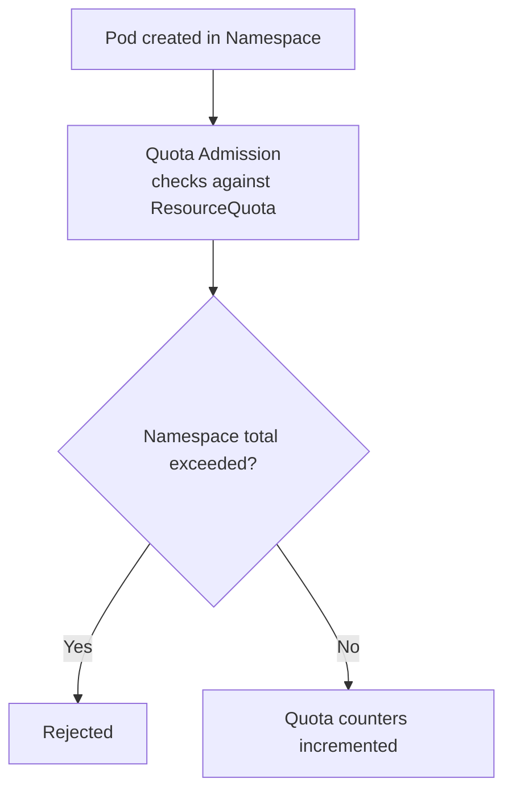

# Resource Quotas

> **Category:** Scheduling / Governance

## What It Is

A **ResourceQuota** is a Kubernetes object that limits the **total aggregate consumption** (of CPU, memory, storage, object counts) for **all resources in a namespace**. It enforces "this namespace can't exceed N total cores, M total GB RAM, 100 Pods."

## Why It Exists

- **Prevent a noisy/rogue team** from consuming the entire cluster (e.g., spinning up 1000 Pods)
- **Allocate cluster capacity fairly** across teams/namespaces
- **Cost control** — cap how many expensive resources (GPU, large PVCs) a namespace can request

## Architecture



## ResourceQuota API

```yaml
apiVersion: v1
kind: ResourceQuota
metadata:
  name: compute-resources
  namespace: default
spec:
  hard:
    requests.cpu: "10"      # Total CPU requested across all Pods in the namespace
    requests.memory: "20Gi"
    limits.cpu: "20"
    limits.memory: "40Gi"
    requests.storage: "100Gi"   # Total PVC storage requested
    persistentvolumeclaims: "20" # Max PVC objects
    pods: "100"             # Total Pods (including Failed ones)
    requests.storage: "200Gi"
    count/deployments.apps: "10"
    count/statefulsets.apps: "5"
    count/services: "50"
    count/secrets: "100"
    count/configmaps: "100"
    requests.sockets: "4"   # GPU/socket requests
```

## Quota Scope

You can scope a ResourceQuota to only apply to certain Pod phases/conditions:

| Scope | Meaning |
|-------|---------|
| `Terminating` | Only count Pods that have a `spec.activeDeadlineSeconds` |
| `NotTerminating` | Only count Pods without a `spec.activeDeadlineSeconds` |
| `BestEffort` | Only count Pods with no requests/limits |
| `NotBestEffort` | Only count Pods with requests (Guaranteed / Burstable) |

```yaml
spec:
  hard: { pods: "50" }
  scopes: [NotTerminating]   # Only count non-batch Pods
```

This lets you give **burstable workloads** a quota and **batch jobs** a separate one.

## Object Quotas

ResourceQuota can count **named object types** using `count/<resource>.<group>`:

```yaml
spec:
  hard:
    count/pods: "50"                 # Max 50 pods
    count/services: "10"
    count/configmaps: "50"
    count/secrets: "50"
    count/deployments.apps: "10"     # Max 10 Deployments
    count/jobs.batch: "20"
    count/cronjobs.batch: "5"
    count/replicasets.apps: "20"
```

## Storage Quotas

```yaml
spec:
  hard:
    requests.storage: "500Gi"       # Total PVC requests
    requests.storage: "100Gi"       # (per PV class, using selector)
    count/persistentvolumeclaims: "20"
```

Scoped to a StorageClass:
```yaml
spec:
  hard:
    requests.storage: "100Gi"
  scopeSelector:
    matchExpressions:
    - name: "storageclass"
      operator: In
      values: ["fast-ssd"]
```

## How Quotas Are Checked

- On Pod **creation/update/deletion**, the quota admission controller recomputes the namespace's totals.
- If the **sum** of requests (including the new Pod) exceeds `requests.X`, the Pod is rejected.
- If the **sum** of limits exceeds `limits.X`, the Pod is rejected.
- PVC requests are counted against `requests.storage` and `count/persistentvolumeclaims`.

## Commands

```bash
# Create / list
kubectl apply -f quota.yaml
kubectl get quota
kubectl get resourcequota -n <ns>

# Describe (see current usage vs hard limits)
kubectl describe quota
# Shows: Name | Hard | Used | ---
# e.g.   requests.cpu | 10 | 7 |

# Create from CLI
kubectl create quota compute-resources --hard=requests.cpu=10,limits.cpu=20,pods=100

# Check usage by Pod
kubectl get pods -n <ns> -o jsonpath='{range .items[*]}{.metadata.name}{"\t"}{.spec.containers[*].resources}{"\n"}{end}'
```

## Common Issues

### "exceeded quota" on Pod creation
```bash
kubectl describe quota -n <ns>
# "Used: pods=100, Hard: pods=100" — at the limit
# Fix: delete unused Pods, or raise the quota (if you have admin access)
```

### Quota not applying to a resource
```bash
# Make sure the resource name matches exactly:
# requests.cpu, limits.memory, count/pods, requests.storage
kubectl describe quota <name> -n <ns>
# Check: is the quota for the right scope? (Terminating / NotBestEffort)
```

### Pod rejected but "quota has room"
```bash
# Check ALL relevant quotas:
kubectl get quota -n <ns> -o yaml
# A Pod's requests count against: requests.cpu + requests.memory + count/pods
# Plus any StorageClass-scoped quota (if the Pod uses a PVC).
```

### Stale quota counters
```bash
# If counters are stale (after many deletes):
kubectl delete pod <name>    # Triggers a recompute
# Quota is eventually consistent (checked at admission)
```

### "requests.cpu is in the quota" but the Pod has no requests
```bash
# Without requests, the Pod is counted under a "0" request (or under BestEffort scope).
# Add requests to your Pod, or ensure the LimitRange has defaultRequest.
# (KEDA scale-to-zero pods, or Pods using VPA, may show as 0 request initially.)
```

## Best Practices

1. **Always request resources** (or have a LimitRange with `defaultRequest`) — so quota counters move correctly
2. **Set `requests < limits`** — so you can oversell CPU safely
3. **Use scopes** — separate burstable (NotTerminating) from batch (Terminating) resources
4. **Account for system overhead** — reserve CPU for node overhead (~5-10%)
5. **Set object quotas too** — cap `count/pods`, `count/services` to avoid unbounded growth (labels-as-a-service DoS)
6. **Use StorageClass-scoped quotas** for tiered storage limits
7. **Monitor `Used` vs `Hard`** — alert when close to limit
8. **Plan headroom** — keep `requests` quota below total node capacity
9. **Document per-team quotas** — make ownership clear
10. **Re-compute on deletes** — quota is rechecked on Pod deletion, but stale data can hide temporarily

## Quota vs LimitRange vs Priority

| Object | Scope | Purpose |
|--------|-------|---------|
| `LimitRange` | Per-namespace, per-container | Defaults + bounds for a single container |
| `ResourceQuota` | Per-namespace | Totals the namespace can consume |
| `PriorityClass` | Per-pod | Preemption — critical pods win resources |

They all work together: LimitRange gives defaults, Quota caps totals, Priority resolves contention.

## Commands Cheat Sheet

```bash
kubectl apply -f quota.yaml
kubectl get quota -n <ns>
kubectl describe quota -n <ns>
kubectl create quota my-quota --hard=pods=50,requests.cpu=10,limits.cpu=20
kubectl delete quota <name> -n <ns>
```

## Interview Questions

**Q: What does a ResourceQuota limit?**
A: The **aggregate usage** in a namespace — sum of CPU/memory/storage requests & limits, number of Pods/Services/PVCs/etc. (not per-Pod).

**Q: What is a scope in ResourceQuota?**
A: `Terminating`, `NotTerminating`, `BestEffort`, `NotBestEffort` — they limit which Pods are counted toward the quota. E.g., a `Terminating` quota only covers batch Jobs (short-lived Pods).

**Q: What happens when a Pod exceeds the quota?**
A: The Pod is **rejected** at admission (`pods "" is forbidden: ... exceeded quota`). It never starts.

**Q: How does ResourceQuota interact with emptyDir / no requests?**
A: Pods with no `requests` are counted as `0` toward `requests.cpu`/`requests.memory`. Use a `LimitRange` with `defaultRequest` to ensure every Pod gets a default so the quota is meaningful.

**Q: How do you track quota usage?**
A: `kubectl describe quota <name>` shows `Hard` vs `Used` (current usage). The usage is recomputed at every Pod add/delete.

**Q: Can you limit the number of objects (not just CPU/memory)?**
A: Yes — `count/pods`, `count/services`, `count/configmaps`, `count/secrets`, `count/deployments.apps`, etc.

## Related Resources

- [Limit Ranges](limit-ranges.md)
- [Resources](resources.md)
- [Namespace](../01-core-concepts/namespaces.md)
