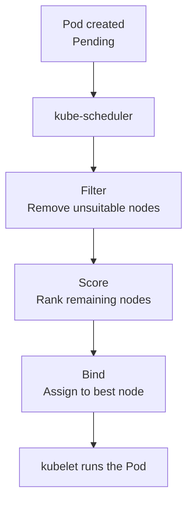
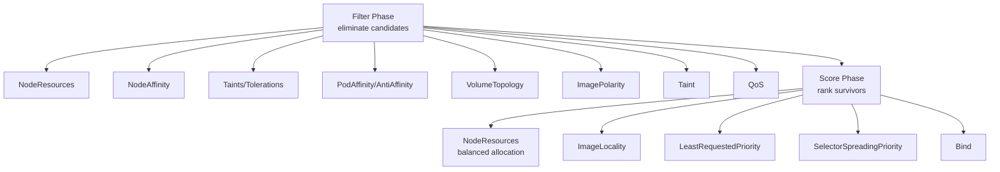

# Kubernetes Scheduling

> **Category:** Scheduling

## What It Is

**Scheduling** is the process of assigning a Pod to a Node. The **kube-scheduler** is the control-plane component that decides placement, based on **resource needs, constraints, and policies**.

## Why It Exists

When you run a Pod, Kubernetes must decide: *which node can run this pod?* It looks at CPU/memory availability, taints/tolerations, node labels (affinity), and inter-pod rules — to pack Pods densely while respecting constraints.

## Architecture



The scheduler runs in two phases:
1. **Filtering** — remove candidate Nodes that can't satisfy the Pod's needs
2. **Scoring** — rank the remaining Nodes and pick the best

## Scheduling Requirements (what the Pod says it needs)

A Pod declares constraints that the scheduler enforces:
- **Resource requests** (CPU/memory) — the Node must have free capacity
- **Node selectors / node affinity** — must land on a Node with matching labels
- **Taints & tolerations** — must tolerate the Node's taints (or be repelled)
- **Inter-pod affinity/anti-affinity** — co-locate or spread relative to other Pods
- **Topology spread** — even distribution across zones/hosts
- **Volume topology** — PVCs from a zone-constrained StorageClass

## The Scheduling Phases (in order)



### Filter phase (default plugins)

| Plugin | Checks |
|--------|--------|
| `NodeResources` | Does the Node have the requested CPU/memory? |
| `NodeUnschedulable` | Is the Node cordoned / not-Ready? |
| `NodeAffinity` | Does the Node match the required node affinity? |
| `NodePorts` | If using a NodePort, are the host ports free? |
| `TaintsTolerations` | Does the Pod tolerate all of the Node's taints? |
| `PodTopology` (`PodTopology` / `Resources`) | Topology (zone/host) constraints |
| `PodAffinity` | Does any Node satisfy the PodAffinity/anti-affinity rules? |

If **all** filter plugins **pass** for a Node, it's a candidate.

### Score phase (default plugins)

| Plugin | Preference |
|--------|------------|
| `NodeResourcesBalancedAllocation` | Keep usage even across nodes |
| `NodeResourcesLeastAllocated` | Prefer less-loaded nodes |
| `ImageLocality` | Prefer nodes that already have the image |
| `SelectorSpread` | Spread Pods of a ReplicaSet across Nodes/zones |

## How to Read a `Pending` Pod

```bash
kubectl get pod <name>
# STATUS: Pending

kubectl describe pod <name>
# Events section: "0/5 nodes are available:
#   5 Insufficient cpu."    → no node has enough CPU
# OR: "node(s) had taints the pod didn't tolerate..."
# OR: "node(s) didn't satisfy pod topology spread..."
# OR: "node(s) didn't match node affinity..."
```

## Manual vs Automatic Scheduling

By default, the scheduler assigns Node automatically. If a Pod sets `nodeName` directly, that pod **skips** the scheduler entirely (the API server just assigns that node):

```yaml
spec:
  nodeName: node-2    # Explicit placement — bypasses the scheduler
```

This is rare — usually you want the scheduler (so you get filtering/scoring/taints).

## Scheduler Configuration (K8s 1.14+ — the "Scheduler Framework")

```yaml
apiVersion: kubescheduler.config.k8s.io/v1
kind: KubeSchedulerConfiguration
profiles:
- schedulerName: default-scheduler
  plugins:
    filter:
      enabled:
      - name: NodeResources       # default plugins are pre-enabled
      - name: TaintsTolerations
    score:
      enabled:
      - name: NodeResourcesLeastAllocated
      disabled: []                # plugins to disable
```

You can write **custom scheduler** plugins (e.g., add a `Drainer` filter, or extend scoring) via the [Scheduler Framework](https://github.com/kubernetes-sigs/scheduler-plugins).

## Commands

```bash
# Check the scheduler is running
kubectl get pods -n kube-system -l component=kube-scheduler

# Watch a Pending Pod's reasons
kubectl describe pod <name> | grep -A 10 Events

# Check Node capacity vs allocated
kubectl describe node <name>            # Capacity and Allocatable
kubectl top nodes                       # Current usage

# See what the scheduler would do (dry-run)
kubectl scheduler --dry-run=client -f pod.yaml   # (experimental)

# Add/remove a label (for affinity)
kubectl label nodes <node> disktype=ssd
kubectl label nodes <node> disktype-

# Cordon / drain nodes
kubectl cordon <node>         # mark unschedulable
kubectl drain <node>          # cordon + evict
kubectl uncordon <node>
```

## Common Issues

### Pod stuck `Pending` — "Insufficient cpu"
```bash
kubectl describe pod <name>
# "0/N nodes are available: N Insufficient cpu."
# Fix: lower the Pod's resource requests, or add nodes (Cluster Autoscaler),
# or reduce other Pods' requests.
```

### Pod stuck `Pending` — "node(s) had taints that the pod didn't tolerate"
```bash
# Taints (e.g. node.kubernetes.io/not-ready, master taint) blocked the pod.
# Fix: add a matching toleration, or untaint the node.
kubectl describe node <node> | grep Taints -A5
```

### "didn't match node affinity"
```bash
# The required nodeAffinity has no matching nodes.
kubectl get nodes -l <label>   # Are any nodes labeled?
# Fix: fix the affinity or the node labels.
```

### "didn't satisfy pod topology spread"
```bash
# topologySpreadConstraints can't be satisfied (e.g., maxSkew too aggressive).
# Fix: relax the constraints or add more nodes.
```

### Scheduling too slow in large clusters
```bash
# Many pending pods with tight anti-affinity create O(N^2) scheduling checks.
# Use topologySpreadConstraints (more efficient) or reduce affinity scope.
```

## Scheduling Performance

- The scheduler caches Node "NodeInfo" and Pod states — good for thousands of Nodes/Pods.
- **Default cache**: 30s expiry (can tune `--leader-elect-renew-deadline`).
- For heavy filtering, consider **scheduler-per-namespace** (custom scheduler names) to reduce fan-out.
- Pod-level (anti-)affinity is expensive — it scans every Pod in the cluster.

## Interview Questions

**Q: What are the two phases of Kubernetes scheduling?**
A: **Filtering** (remove Nodes that can't meet the Pod's needs) and **scoring** (rank the surviving Nodes and pick the best). Then the scheduler **binds** the Pod.

**Q: What can cause a Pod to be stuck Pending?**
A: (1) Not enough CPU/memory on any Node (`Insufficient`), (2) taints the Pod doesn't tolerate, (3) node affinity doesn't match any Node, (4) inter-pod anti-affinity can't be satisfied, (5) PVC topology constraints, (6) the Node is cordoned (`Unschedulable`).

**Q: What's the difference between nodeSelector, nodeAffinity, and nodeName?**
A: `nodeSelector` is a simple `key=value` AND. `nodeAffinity` adds operators (`In`, `Exists`, `NotIn`) + hard/soft preferences. `nodeName` is a **direct override** (assigns to that exact Node, skipping the scheduler).

**Q: What's the difference between podAffinity and podAnti-Affinity?**
A: `affinity` attracts (co-locate with similar pods). `anti-affinity` repels (spread away from similar pods). Anti-affinity is most-used for high availability.

**Q: How does resource request affect scheduling?**
A: The scheduler ensures the sum of all containers' **requests** on a Node stays within its **allocatable** capacity. Limits alone are NOT used for scheduling (only at runtime).

**Q: What's the scheduler's framework (1.14+)?**
A: A plugin architecture — `queue`, `filter`, `score`, `bind`, `reserve` phases — you can write **custom plugin** to inject logic (e.g., a custom filter for GPU allocation).

## Related Resources

- [Taints & Tolerations](taints-tolerations.md)
- [Node Affinity](node-affinity.md)
- [Pod Affinity](pod-affinity.md)
- [Resources](resources.md)
- [Priority Classes](priority-classes.md)
- [Cluster Autoscaler](../03-workloads/cluster-autoscaler.md)
- [HPA](../03-workloads/hpa.md)
