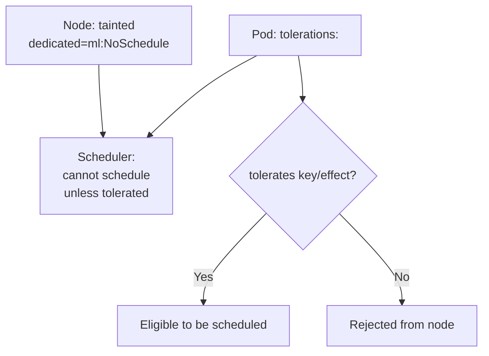

# Taints & Tolerations

> **Category:** Scheduling

## What It Is

- A **Taint** is a **node-level marker** — "this node is tainted; pods generally cannot be scheduled here unless they tolerate it." A taint has a `key`, `value`, and `effect`.
- A **Toleration** is a **pod-level declaration** — "I can tolerate this taint." It allows (but does not prefer) the pod to be placed on a tainted node.

Taints and tolerations **repel/attract** — they work together so you can **dedicate nodes** to certain pods (e.g., dedicated GPU nodes for ML workloads).

## Why It Exists

- **Dedicated nodes** — keep general workloads off GPU/expensive nodes
- **Node isolation** — `NoSchedule` keeps new pods off a node (e.g., for maintenance)
- **Cordoning** — draining a node for decommission uses an `unschedulable` taint
- **Spot/preemptible** — run fault-tolerant pods on cheap spot nodes
- **Dedicated tenants** — reserve a node set for a team

## Architecture



## Taint API

Taints are set on a Node (via `node.taints` in the kubelet config, or manually via `kubectl`):

```yaml
# On the Node object
spec:
  taints:
  - key: "dedicated"
    value: "ml"
    effect: "NoSchedule"       # NoSchedule | PreferNoSchedule | NoExecute
  - key: "node.kubernetes.io/unreachable"
    effect: "NoExecute"
    timeAdded: "2024-...-..."
```

## Taint Effects

| Effect | Behavior |
|--------|----------|
| `NoSchedule` | **Do not** schedule new pods that tolerate it |
| `PreferNoSchedule` | **Prefer not** to schedule (best-effort; a soft rule) |
| `NoExecute` | **Do not** schedule AND **evict** already-running pods if they can't tolerate it |

### NoSchedule vs NoExecute

- `NoSchedule` only affects **new** scheduling decisions.
- `NoExecute` also **evicts** currently running pods on the node that don't tolerate it (or evicts with a delay via `tolerationSeconds`).

#### Toleration with a timeout

```yaml
tolerations:
- key: "node.kubernetes.io/unreachable"
  operator: "Exists"           # Matches any value
  effect: "NoExecute"
  tolerationSeconds: 30       # Stay 30s, then evict
```

## Toleration API

```yaml
# In a Pod / Deployment / DaemonSet spec
spec:
  template:
    spec:
      tolerations:
      - key: "dedicated"
        operator: "Equal"        # Equal (match key+value+) or Exists (match key only)
        value: "ml"
        effect: "NoSchedule"
        tolerationSeconds: 3600  # (NoExecute only) how long to stay after taint added
      - key: "node.kubernetes.io/not-ready"
        operator: "Exists"
        effect: "NoExecute"
        tolerationSeconds: 5
```

### `operator`: Equal vs Exists

| Operator | Matching | Use case |
|----------|----------|----------|
| `Equal` (default) | Matches `key`, `value`, and `effect` | Specific taint |
| `Exists` | Matches `key` (and `effect`); `value` must be omitted | Any taint with that key (e.g., cloud-provider taints) |

## Built-in Node Taints

| Taint | Reason | Default Effect |
|-------|--------|----------------|
| `node.kubernetes.io/not-ready` | Node failed its readiness check (kubelet down) | `NoExecute` |
| `node.kubernetes.io/unreachable` | Node is unreachable (kubelet can't be reached) | `NoExecute` |
| `node.kubernetes.io/not-ready` | Node became unreachable during the network partition | NoSchedule? |
| `node.kubernetes.io/unschedulable` | `kubectl cordon` — node cordoned | NoSchedule |
| `node.kubernetes.io/disk-pressure` | Disk pressure | `NoSchedule` |
| `node.kubernetes.io/memory-pressure` | Memory pressure | `NoSchedule` |
| `node.kubernetes.io/pid-pressure` | PID pressure | `NoSchedule` |
| `node-role.kubernetes.io/master` | Control plane node (kubeadm) | `NoSchedule` |
| `node.kubernetes.io/network-unavailable` | CNI not configured | NoSchedule (briefly) |

These are added by the system (kubelet, controller-manager). Most controllers (DaemonSet) **automatically tolerate** the `node.*` health taints.

## Commands

```bash
# View a node's taints
kubectl get node <node-name> -o jsonpath='{.spec.taints}'

# Add a taint
kubectl taint nodes <node-name> dedicated=ml:NoSchedule

# Add a "cordoned" no-schedule taint
kubectl cordon <node-name>            # Shortcut for: kubectl taint node <n> node.kubernetes.io/unschedulable:NoSchedule
kubectl uncordon <node-name>          # Remove the taint

# Remove a taint
kubectl untaint node <node-name> dedicated     # key only
kubectl untaint node <node-name> dedicated=ml:NoSchedule  # full spec

# Create a pod that tolerates a taint
kubectl run debug --image=nginx --overrides='{spec: {tolerations: [{key: dedicated, operator: Equal, value: ml, effect: NoSchedule}]}}'

kubectl describe node <n>   # Taints shown under "Taints:"
kubectl get nodes -l dedicated=ml  # List tainted nodes
```

## Use Cases

### 1. Dedicated node (e.g., GPU nodes)
```bash
# Taint the GPU node
kubectl taint node node-gpu dedicated=gpu:NoSchedule
# Only pods tolerating this can land there:
```
```yaml
tolerations:
- key: dedicated
  operator: Equal
  value: gpu
  effect: NoSchedule
```

### 2. DaemonSet with node affinity (the modern pattern)
Sometimes you use tolerations + nodeAffinity:
```yaml
spec:
  template:
    spec:
      tolerations:
      - key: node-role.kubernetes.io/master
        operator: Exists
        effect: NoSchedule
      affinity:
        nodeAffinity:
          requiredDuringSchedulingIgnoredDuringExecution:
            nodeSelectorTerms:
            - matchExpressions:
              - key: node-role.kubernetes.io/master
                operator: Exists
```

### 3. Spot/preemptible (tolerate + handle churn)
```yaml
tolerations:
- key: "node.kubernetes.io/not-ready"
  operator: Exists
  effect: "NoExecute"
  tolerationSeconds: 30    # Give 30s to finish when node dies
```

## DaemonSet & Taints

DaemonSet Pods automatically get **tolerations for `node.*:NoExecute`** and for `node-role.kubernetes.io/master:NoSchedule` — so they can run on control-plane nodes. (That's why `kube-proxy` and `CoreDNS` can run on masters.)

You can add your own tolerations explicitly for custom taints.

## Taints vs Tolerations vs Affinities

| Mechanism | Effect | Direction |
|-----------|--------|-----------|
| **Taint** (on Node) | Repels pods (no toleration = rejected) | Node → Pod |
| **Toleration** (on Pod) | Allows the Pod onto the Node (but doesn't force it) | Pod accepts node |
| **NodeAffinity** (on Pod) | Attracts the Pod to a node (preference/requirement) | Pod → Node |

A pod may be **eligible** (toleration) to land on a tainted node but **preferred** elsewhere — use both together.

## Common Issues

### Pods won't schedule — "node(s) had taints"
```bash
kubectl describe pod <name>
# Events: "node(s) had taints that the pod didn't tolerate"
# Fix: add a matching toleration, OR remove the taint (untaint), OR don't taint
```

### Pod tolerates the taint but lands on the "wrong" node
```bash
# Toleration = "may schedule". To make it "must", add nodeAffinity:
tolerations:
- key: dedicated
  operator: Equal
  value: ml
  effect: NoSchedule
affinity:
  nodeAffinity:
    requiredDuringSchedulingIgnoredDuringExecution:
      nodeSelectorTerms:
      - matchExpressions:
        - key: dedicated
          operator: In
          values: ["ml"]
```

### `kubectl cordon` makes the node unschedulable, but pods don't move
```bash
# `cordon` only adds a NoSchedule taint — running pods stay.
# To evict: `kubectl drain` (cordon + evict)
kubectl drain <node-name> --ignore-daemonsets
```

### DaemonSet can't schedule on master
```bash
# DaemonSet auto-tolerates the master taint. If it can't:
# Check: the default tolerations are present (auto-added by DaemonSet controller).
```

## Commands Cheat Sheet

```bash
kubectl get node <name> -o jsonpath='{.spec.taints}'
kubectl taint nodes <name> <key>=<value>:<effect>
kubectl cordon <node>           # add unschedulable taint
kubectl uncordon <node>
kubectl drain <node> --ignore-daemonsets --delete-local-data
kubectl describe node <name> | grep -i taint
```

## Interview Questions

**Q: What's the difference between a Taint and a Toleration?**
A: A **taint** is a mark on a Node ("repel"). A **toleration** is on a Pod ("I can bear this"). The scheduler excludes pods from a node if they lack a matching toleration.

**Q: What's the difference between `NoSchedule` and `NoExecute`?**
A: `NoSchedule` stops **new** pods from landing on a tainted node (it does not touch existing pods). `NoExecute` also **evicts** already-running pods that don't tolerate it (with an optional `tolerationSeconds` delay).

**Q: Does a toleration *attract* a pod to the node it tolerates?**
A: No — a toleration only means "eligible". The pod can still land elsewhere. To *prefer* a node, combine with nodeAffinity; the scheduler still considers resources.

**Q: How does `kubectl cordon` relate to taints?**
A: `cordon` is a shortcut that adds the `node.kubernetes.io/unschedulable:NoSchedule` taint to a node. `drain` = `cordon` + evict pods. `uncordon` removes the taint.

**Q: What taints does a DaemonSet auto-tolerate?**
A: The `node.*:NoExecute` taints (for node-not-ready / unreachable) and `node-role.kubernetes.io/master:NoSchedule`. That is why DaemonSets can run on control-plane nodes.

**Q: How do you dedicate a node to a team?**
A: Taint the node (`key=value:NoSchedule`) and add a matching toleration (often + an `nodeAffinity`) only to that team's workloads. Other pods will not be scheduled there.

## Related Resources

- [Node Affinity](node-affinity.md)
- [Pod Affinity](pod-affinity.md)
- [Resources](resources.md)
- [Priority Classes](priority-classes.md)
- [Cluster Autoscaler](../03-workloads/cluster-autoscaler.md)
