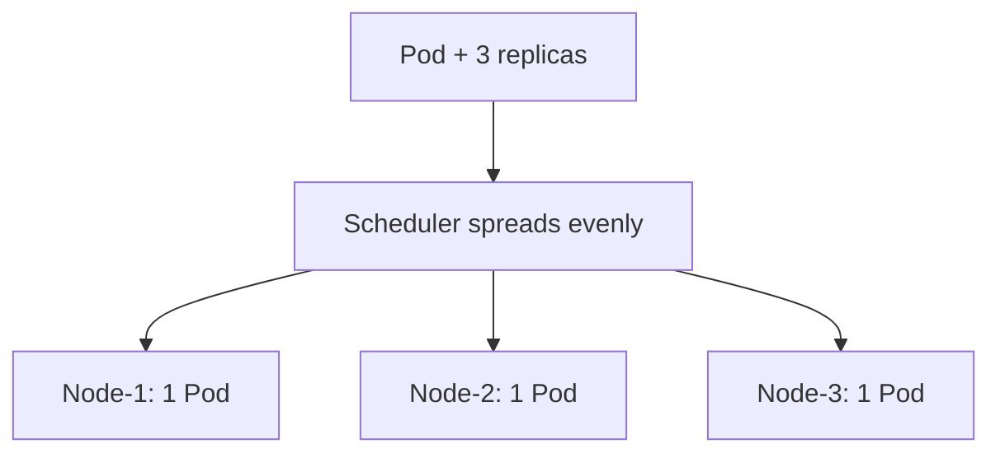

# Topology Spread Constraints

> **Category:** Scheduling

## What It Is

**Topology Spread Constraints** let the scheduler **evenly distribute** Pods across a "topology domain" (a node, an availability zone, a region, etc.). Unlike `podAntiAffinity` (which can cause O(N²) scheduling cost), topology spread is **efficient and built-in**.

It is the **recommended** way to spread Pods for high availability.

## Why It Exists

- **Pod anti-affinity** is powerful but expensive (each Pod checks all others) and can block scheduling ("0/N nodes").
- You often just want a **simple even spread** — "2 Pods per zone, 1 per node" — for fault tolerance.
- **topologySpread** does this efficiently and predictably.

## Architecture



## Topology Spread API

```yaml
spec:
  topologySpreadConstraints:
  - maxSkew: 1                          # Max difference between the most-loaded and least-loaded domain
    topologyKey: topology.kubernetes.io/zone   # The domain to spread across
    whenUnsatisfiable: ScheduleAnyway   # ScheduleAnyway | DoNotSchedule
    labelSelector:                      # Select the Pods to spread (your own replicas)
      matchLabels:
        app: myapp
    minDomains: 2                     # Min number of Domains to spread to (K8s 1.24+)
    nodeAffinityPolicy: Ignore          # Honor nodeAffinity when spreading (K8s 1.27+)
    matchLabelKeys:                    # (K8s 1.26+) dynamically select Pods by label
    - service          # Spread among Pods with the same `service` label value
```

### Fields Explained

| Field | Purpose | Default |
|-------|---------|---------|
| `maxSkew` | Max difference in Pod count between any two domains | (required) |
| `topologyKey` | The domain to spread across (e.g. `kubernetes.io/hostname`) | (required) |
| `whenUnsatisfiable` | `DoNotSchedule` (reject) or `ScheduleAnyway` (still schedule) | `DoNotSchedule` |
| `labelSelector` | Which Pods to count/spread | (required) |
| `minDomains` | Minimum non-empty domains (1.24+) | — |
| `matchLabelKeys` | Extra label selector keys to group by (1.26+) | — |

### `topologyKey` examples

| Value | Spreads across |
|-------|----------------|
| `kubernetes.io/hostname` | Nodes (one pod per host) |
| `topology.kubernetes.io/zone` | Zones (fault domains) |
| `topology.kubernetes.io/region` | Regions |
| `""` (empty) | All nodes in one domain (no spread) |

## How maxSkew Works

```yaml
replicas: 6
topologySpreadConstraints:
- maxSkew: 1
  topologyKey: kubernetes.io/hostname
  whenUnsatisfiable: DoNotSchedule
  labelSelector: {matchLabels: {app: myapp}}
```

If there are **3 nodes**, and `maxSkew=1`:
- Ideal distribution: **2, 2, 2** (difference = 0 ≤ 1 ✓)
- Allowed: **3, 2, 1** (difference = 2 > 1 ✗ — rejected)
- Allowed: **2, 2, 2** or **3, 2, 2** (diff = 1 ✓)

The scheduler picks the least-loaded node each time a Pod is added.

## whenUnsatisfiable

| Value | Behavior |
|-------|----------|
| `DoNotSchedule` (default) | **Reject** the Pod if the constraint can't be satisfied (hard rule) |
| `ScheduleAnyway` | Try to satisfy, but **schedule anyway** if it can't (soft rule) |

**Use `ScheduleAnyway`** for non-strict spreading — avoids stuck Pods during node churn.

## Example: Spread Across Zones (HA)

```yaml
spec:
  replicas: 9
  template:
    spec:
      topologySpreadConstraints:
      - maxSkew: 1
        topologyKey: topology.kubernetes.io/zone
        whenUnsatisfiable: ScheduleAnyway
        labelSelector:
          matchLabels:
            app: frontend
```

Spreads the 9 Pods evenly across zones.

## Example: One Pod per Node

```yaml
topologySpreadConstraints:
- maxSkew: 1
  topologyKey: kubernetes.io/hostname
  whenUnsatisfiable: DoNotSchedule
  labelSelector:
    matchLabels:
      app: frontend
```

Ensures no two Pods share a Node (if possible).

## Example: minDomains

```yaml
topologySpreadConstraints:
- maxSkew: 1
  topologyKey: topology.kubernetes.io/zone
  whenUnsatisfiable: DoNotSchedule
  minDomains: 3         # Require at least 3 different zones to be used
  labelSelector:
    matchLabels:
      app: myapp
```

## Comparison: topologySpread vs podAntiAffinity

| Feature | topologySpread | podAntiAffinity |
|---------|----------------|-----------------|
| Spreads across | Any topology (zone, node) | Any (label-based) |
| Performance | Fast (counts per domain) | Slower (O(N) scan per Pod) |
| Hard/soft | `DoNotSchedule` / `ScheduleAnyway` | `required` / `preferred` |
| Use case | "Evenly spread across AZs" | "Don't co-locate specific pods" |
| Conflicts | Won't fight with anti-affinity | Can deadlock if over-constrained |

**Rule of thumb:** Use `topologySpread` for **distribution across zones/nodes**. Use **podAntiAffinity** for **co-location avoidance of a specific other Pod**.

## Common Issues

### "didn't satisfy pod's topology spread"
```bash
kubectl describe pod <name>
# Pods stuck: maxSkew can't be satisfied (e.g., 4 pods, 2 nodes, maxSkew: 1 -> impossible 3/1 split)
# Fix: raise maxSkew or lower replica count, or use ScheduleAnyway.
```

### Spread too aggressive (Pods pending)
```bash
# DoNotSchedule blocks placement if the constraint can't be met.
# Use ScheduleAnyway if spreading is a preference, not a hard requirement.
```

### Spread ignores Node affinity
```yaml
# nodeAffinity and topologySpread are independent.
# Use nodeAffinityPolicy: Honor (1.27+) if you want spread to respect
# a Pod's nodeAffinity when computing domains.
```

## Commands

```bash
kubectl get pod <name> -o wide          # See which node / zone it landed on
kubectl describe pod <name>             # See topologySpreadConstraints
kubectl describe rs <rs-name>           # ReplicaSet that owns the pods
kubectl get nodes -L topology.kubernetes.io/zone  # List nodes per zone
kubectl get pods -o=custom-columns=NAME:.metadata.name,ZONE:... # map
```

## Interview Questions

**Q: What is `topologySpreadConstraints` used for?**
A: To spread Pods evenly across a topology domain (node / zone / region). It's the efficient, built-in way to do HA spreading ("N Pods per AZ").

**Q: What does `maxSkew` mean?**
A: The **maximum difference** in Pod count between the most-packed and least-packed topology domain. `maxSkew: 1` means "no domain should have 2+ more pods than another".

**Q: What's the difference between `DoNotSchedule` and `ScheduleAnyway`?**
A: `DoNotSchedule` is a **hard** rule — if the spread can't be satisfied, the Pod stays Pending. `ScheduleAnyway` is a **soft** rule — the scheduler considers it when scoring, but will schedule anyway if needed.

**Q: When would you use `topologySpread` vs `podAntiAffinity`?**
A: Use `topologySpread` for **even distribution across zones/nodes** (efficient, declarative). Use `podAntiAffinity` when you need to avoid co-locating with a **specific set of labeled Pods**.

**Q: What is the `topologyKey`?**
A: The dimension along which to spread. `kubernetes.io/hostname` = across Nodes. `topology.kubernetes.io/zone` = across AZs. The scheduler balances the Pod counts across each distinct value of that key.

## Related Resources

- [Pod Affinity](pod-affinity.md)
- [Node Affinity](node-affinity.md)
- [Taints & Tolerations](taints-tolerations.md)
- [Resources](resources.md)
- [Deployment](../03-workloads/deployments.md)
