# Backup & Disaster Recovery

> **Category:** Cluster Operations / Reliability

A Kubernetes cluster is **stateless compute sitting on stateful data** — so DR is really: (1) **protect etcd** (the control plane state), (2) **protect PVs** (the app data), and (3) **keep your manifests** (GitOps is your DR plan). Lose etcd + have no etcd backup, and your whole cluster is gone; lose only the nodes, and you can rebuild from Git + a fresh etcd restore.

```mermaid
graph TD
    CP[Control plane state] --> ET[etcd snapshot<br/>`etcdctl snapshot save`]
    W[Workloads &amp; data] --> PV[PV snapshots<br/>CSI / Velero]
    M[Manifests<br/>state] --> GIT[Git &#40;GitOps&#41;]
    GIT --> Restore1[Restore cluster]
    ET --> Restore1
    PV --> Restore2[Restore volumes<br/>Velero / CSI Restore]
    style ET fill:#fde0dc
    style PV fill:#e6f4ea
    style GIT fill:#e8f0fe
```



## 1. etcd — the control plane backup

etcd is the **single source of truth**. For a **kubeadm** cluster:
```bash
# snapshot (run from a control-plane node):
ETCDCTL_API=3 etcdctl --endpoints=https://127.0.0.1:2379 \
  --cacert=/etc/kubernetes/pki/etcd/ca.crt \
  --cert=/etc/kubernetes/pki/etcd/server.crt \
  --key=/etc/kubernetes/pki/etcd/server.key \
  snapshot save /var/lib/etcd/snapshot.db
# restore (disaster, new cluster — wipes current state):
ETCDCTL_API=3 etcdctl snapshot restore /var/lib/etcd/snapshot.db \
  --data-dir /var/lib/etcd-from-backup
```
Schedule this with a cron + off-cluster object storage (`aws s3 cp`). Alert on `etcd_mvcc_db_total_size_in_bytes`.

## 2. Pod data — PV snapshots (Velero)

Velero backs up Kubernetes **API objects** (PVCs, Deployments, CRDs) + optionally **volume data** (via a cloud CSI snapshot plugin) into an object bucket.

```bash
velero install --provider aws --plugins velero/velero-plugin-for-aws:v1.9 --bucket backups
velero schedule backup daily-2am --schedule "0 2 * * *" --ttl 720h
# restore:
velero restore create --from-backup daily-2am-...
```
Velero's secret-store integration also backs up **Secrets/Secrets-Encryption** if you use `--snapshot-volumes` + `--features=EnableCSI`.

## 3. ConfigMaps / Secrets — encrypt at rest

- Enable **EncryptionConfiguration** (`EncryptionConfig`) so Secrets are encrypted in etcd (AES-CBC orKMS-backed). Without it, a raw etcd backup contains **plaintext** secrets.
- Back up the KMS key (or HSM) separately; without it, you cannot decrypt restored Secrets.

## DR runbook (cluster death)

1. **New control plane** (`kind`/kubeadm `kubeadm init` with the same Kubernetes version).
2. **Restore etcd** from the latest snapshot (this rebuilds all namespaces, PVCs, certs state).
3. **Workers re-join** with `kubeadm join` (they don't need data if PVs are managed).
4. **Restore PVs** from CSI/Velero snapshots into the recreated PVCs.
5. **Re-apply GitOps** (the cluster state should now match the repo).

## DR testing cadence

- **Weekly**: `etcd snapshot save` + verify `snapshot status`.
- **Quarterly**: full restore into a throwaway cluster — this is the only thing that proves your backup works.
- For **managed** providers (EKS/GKE), the control plane is provider-managed, so your backup reduces to Velero + IAM/encryption keys. For **kubeadm/on-prem**, you own etcd.

## Interview Questions

**Q: What's the difference between losing a node and losing etcd, and which is worse?**
A: Losing a **node** is fine — the kubelet/scheduler reschedules. Losing **etcd** means you've lost the record of which Pods/Deployments/PVCs exist — the cluster forgets its desired state. etcd loss is a true disaster; node loss is an everyday HA event. That's why etcd snapshots (and a restore test) are non-negotiable.

**Q: How does Velero fit with a GitOps workflow in DR?**
A: GitOps (cluster *manifests*) + Velero (cluster *state* + *volume snapshots*). In DR you first **restore etcd/Velero** to get objects + PVs back, then **sync GitOps** to reconcile any drift and ensure the recovered cluster matches the repo. Don't rely on Velero alone for drift — rely on GitOps for the source of truth.

## Related Resources
- [Disaster Cases](../14-troubleshooting/disaster-cases.md)
- [Disaster Cases (DC-1 etcd)](../14-troubleshooting/disaster-cases.md)
- [FinOps](finops.md)
- [Managed K8s](../09-cloud-integrations/eks.md)
- [etcd](../02-architecture/etcd.md)
