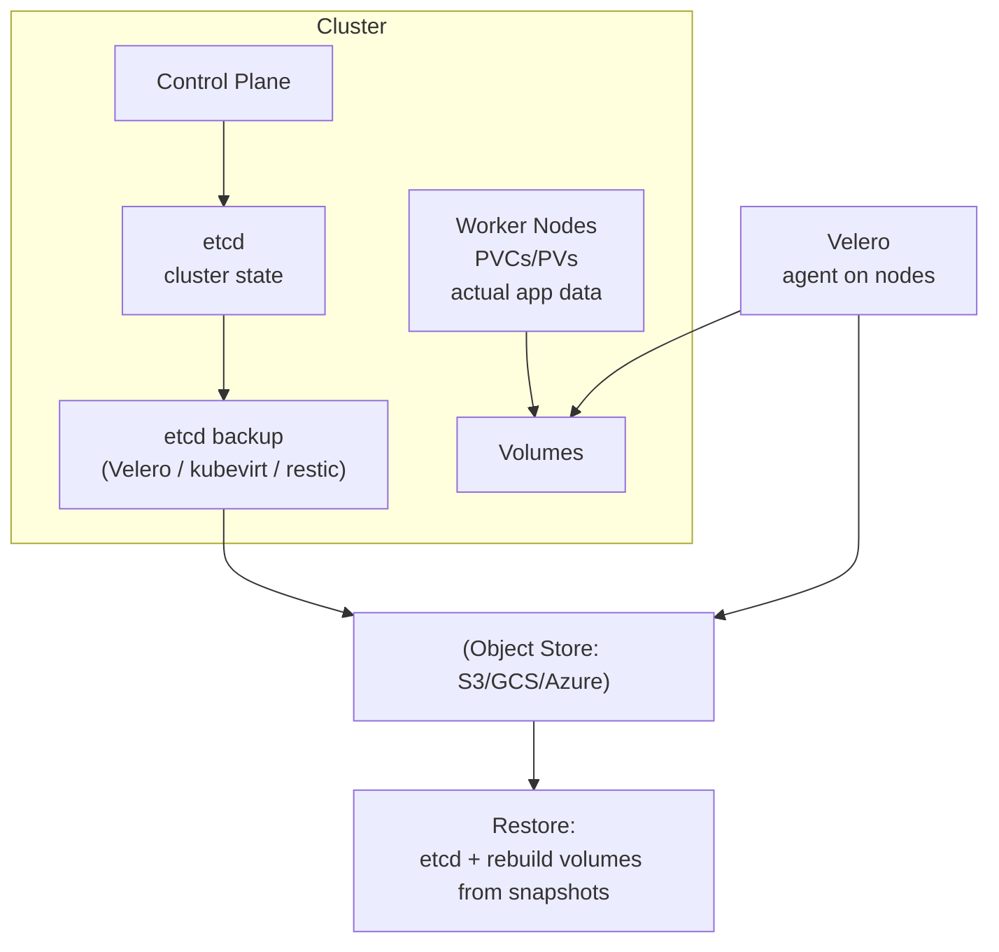

# Backup & DR (etcd + Velero)

> **Category:** Cluster Operations / Disaster Recovery

## What It Is

**Backup & restore** for Kubernetes covers two layers:
1. **etcd** — the cluster's *state store** (all objects, Secrets, configs, RBAC, CRDs). Lose this and you lose the cluster definition.
2. **Workload data** — the actual application data (databases, user uploads) living in **PVCs / PV-backed volumes**. The control plane has no knowledge of these.

**etcd backup** = recover the *cluster*. **Volume/PVC backup** = recover the *data*.

## Why It Exists

- **Human error**: `kubectl delete ns prod` accidentally
- **Corrupted etcd**: operator mistake, bad upgrade, disk corruption
- **Disaster**: region-wide AZ loss
- **Migration**: move apps between clusters or cloud providers

You need **both** the control-plane state (etcd) AND the application data (PVs) to restore end-to-end.

## Architecture



## 1. etcd Backup (the control plane state)

The etcd data is what defines the cluster — Deployments, Services, ConfigMaps, Secrets, RBAC.

### etcd snapshot (built-in CLI)

```bash
# Get the snapshot (run on a control-plane node)
ETCDCTL_API=3 etcdctl \
  --endpoints=https://127.0.0.1:2379 \
  --cacert=/etc/kubernetes/pki/etcd/ca.crt \
  --cert=/etc/kubernetes/pki/etcd/peer.crt \
  --key=/etc/kubernetes/pki/etcd/peer.key \
  snapshot save /tmp/etcd-snapshot.db

# Verify the snapshot
ETCDCTL_API=3 etcdctl \
  --endpoints=https://127.0.0.1:2379 --cacert=... --cert=... --key=... \
  snapshot status /tmp/etcd-snapshot.db

# Move it off-node
scp /tmp/etcd-snapshot.db s3://my-bucket/backups/etcd-$(date +%F).db
```

### Restoring etcd

Restoration **overwrites** the running etcd (disruptive — requires a maintenance window):

```bash
# Stop the API server, then restore on a control-plane node
ETCDCTL_API=3 etcdctl \
  --data-dir=/var/lib/etcd \
  snapshot restore /tmp/etcd-snapshot.db

# Restart the control plane (kubelet restarts static pods)
sudo systemctl restart kubelet
```

**Note**: `kubeadm`-based HA clusters can restore on a single member without full downtime; single-master clusters need a restart.

## 2. Application Data (PVCs / Volumes)

etcd knows that a PVC "exists" and binds a PV, but the actual bytes live on a disk/EBS volume/NFS. To back these up:

### CSI Volume Snapshots

```yaml
apiVersion: snapshot.storage.k8s.io/v1
kind: VolumeSnapshot
metadata:
  name: my-snapshot
spec:
  volumeSnapshotClassName: csi-ebs-snapclass
  source:
    persistentVolumeClaimName: my-pvc
```

- The CSI driver creates a **cloud snapshot** (e.g., AWS EBS snapshot).
- Restore by creating a new PVC with `dataSourceRef` → the VolumeSnapshot.

### File-level backup (Velero + restic)

For application-consistent backups (e.g., a Postgres dump), you need to **freeze the FS** and copy files inside the container — tools like `restic` (integrated in Velero) do this.

## Velero (the standard)

**Velero** (formerly Heptio Ark) is the de-facto backup/restore tool for Kubernetes. It backs up **both** the control-plane objects (etcd-like) and the volume data (via CSI snapshots / restic):

| Velero component | Role |
|------------------|------|
| **velero server** | Runs in the cluster; schedules + triggers backups |
| **velero CLI** | Talks to the API to create/restore backups |
| **Object store plugin** | S3 / GCS / Azure for backup storage |
| **Volume snapshot plugin** | CSI driver snapshots (or restic for file-level) |

### Installing + configuring
```bash
# Install (choose the provider plugin)
velero install \
  --provider aws \
  --plugins velero/velero-plugin-for-aws:v1.9.0 \
  --bucket my-bucket \
  --secret-file ./credentials-aws \
  --use-volume-snapshots=true \
  --features=EnableCSI

# Verify
kubectl -n velero get pods
velero get backups
```

### Take a backup
```bash
velero backup create my-backup \
  --include-namespaces=prod,staging \
  --snapshot-volumes=true            # CSI snapshots of all PVCs
# Optionally: wait for completion
velero wait backup my-backup --timeout 1h
velero describe backup my-backup   # Status + contents
```

### Restore
```bash
# Restore into the SAME cluster:
velero restore create --from-backup my-backup
velero restore logs <restore-name>

# Restore into a DIFFERENT cluster (migration):
velero restore create --from-backup my-backup \
  --namespace-mappings src:dest \
  --include-namespaces=prod
```

## Velero CRDs

| CRD | Purpose |
|-----|---------|
| `Backup` | A request to back up objects + snapshots |
| `Restore` | A request to restore from a Backup |
| `Schedule` | A cron-like schedule for backups |
| `BackupRepository` | (restic) Where file-level backups are stored |
| `PodVolumeBackup` / `PodVolumeRestore` | (restic) The file-level backup of a container's volume |

### Scheduled backups
```yaml
apiVersion: velero.io/v1
kind: Schedule
metadata:
  name: daily-backup
  namespace: velero
spec:
  schedule: "0 1 * * *"        # Cron: daily at 01:00
  template:
    metadata:
      name: daily-backup
    spec:
      includedNamespaces:
      - prod
      snapshotVolumes: true
      ttl: "168h"             # 7 days
```

## Backup Policies & Scope

```bash
# Back up specific namespaces
velero backup create my-backup --include-namespaces=prod,db

# Exclude specific resources
velero backup create my-backup --include-namespaces='*' --exclude-resources=secrets,events

# Label-selected backup
velero backup create my-backup --include-resources=pods,services --selector app=frontend

# TTL (auto-delete the backup data after N)
velero backup create my-backup --ttl 720h   # 30 days
```

## Velero & CSI / File-level

- **CSI snapshot plugin**: `velero backup ... --snapshot-volumes=true` — calls the CSI driver's `CreateSnapshot`. Fast, cloud-native.
- **Restic integration**: For file-system-consistent backups (not whole-disk) — `velero volume` ... or the `velero-plugin-for-aws` restic sidecar. Set `volumeSnapshots: false` + `--use-restic`.

## Common Issues

### Backup failing — "unable to get objectstores"
```bash
kubectl -n velero logs deploy/velero
# Check: credentials / bucket access / plugin version mismatch
velero describe backup <name>     # See the error under Errors / Warnings
```

### Restore fails — "conflict"/"already exists"
```bash
# A resource with the same name already exists (e.g., the PVC).
# Restore options: --skip-unavailable-resources, or --exclude-resources, or delete first.
velero restore create --from-backup my-backup --exclude-resources=persistentvolumeclaims
```

### Volume snapshot not found / failed
```bash
velero describe backup <name> | grep -i volume
# Check: does the CSI driver support snapshotting in this zone?
# Check: the PVCs have a StorageClass that supports snapshots
kubectl get volumesnapshot -n <ns>
kubectl describe volumesnapshot <name>
```

### Backup took too long / ran out of time
```yaml
spec:
  ttl: "0"      # Don't expire
  # Or split by namespace / app into smaller backups
```

### Restored Pods stuck "Pending"
```bash
# The PVCs weren't restored to the same zone (AZ-bound disk)
# Fix: restore into the same zone/StorageClass, or use restic (file-level) snapshots.
velero restore logs <name>
kubectl describe pvc <name> -n <ns>
```

## etcd Backup Strategy

| Item | Recommendation |
|------|----------------|
| Frequency | Every 30 min to 2 hrs for prod (kubeadm: cron + etcdctl) |
| Retention | 7-30 days |
| Storage | Encrypted object store / S3 / offsite |
| Test restores | Monthly (restore onto a **drain/test cluster**) |
| Automation | cron + alert on failure |

```bash
# Minimal cronjob (kubeadm):
cat > /etc/cron.d/etcd-backup <<'EOF'
*/15 * * * * root ETCDCTL_API=3 etcdctl \
  --endpoints=https://127.0.0.1:2379 \
  --cacert=/etc/kubernetes/pki/etcd/ca.crt \
  --cert=/etc/kubernetes/pki/etcd/peer.crt \
  --key=/etc/kubernetes/pki/etcd/peer.key \
  snapshot save /var/backups/etcd-snapshot.db \
  && aws s3 cp /var/backups/etcd-snapshot.db s3://bucket/$(date +%F-%H%M).db
```

## Disaster Recovery Steps (Plan)

1. **Detect** the outage (control plane down / data lost).
2. **Decide**: in-place restore (fix etcd) vs. rebuild from scratch.
3. **Restore etcd** from the snapshot (single-master: restore + restart).
4. **Restore PVCs** (re-apply VolumeSnapshots / Velero restore).
5. **Re-validate** workloads (pods start, Services resolve, ingress routes).
6. **Document + test** this playbook (quarterly DR drills).

## Interview Questions

**Q: What do you back up to recover a Kubernetes cluster?**
A: **Two things**: (1) **etcd** (the control-plane state — objects, RBAC, configs), and (2) **PersistentVolumes / PVCs** (the application data), usually via CSI snapshots + Velero.

**Q: What is Velero?**
A: The de-facto backup/restore tool — it snapshots cluster objects (to object storage) **and** volume data (via CSI snapshots or restic), and can restore into the same or a different cluster.

**Q: How do you back up etcd itself?**
A: Via `etcdctl snapshot save`, run on each control-plane node (cron + store offsite). Restore with `etcdctl snapshot restore` + restart the API server.

**Q: What's the difference between a CSI VolumeSnapshot and a full cluster backup?**
A: A VolumeSnapshot is a **single disk snapshot** (application data layer), done by the CSI driver. Velero is a **full cluster backup** (objects + snapshots) — a VolumeSnapshot is one piece it orchestrates.

**Q: How do you do a disaster-recovery restore?**
A: Restore etcd first (cluster state) then restore PVCs/Services/etc. (the objects and the data). With Velero: `velero restore create --from-backup`.

**Q: Why not just back up the Pods (YAML)?**
A: Pod YAML is in etcd (Velero/etcd backup covers it). But Pods alone are ephemeral — you also need the **Secrets, ConfigMaps, Services, PVCs, and the actual volume data**; a YAML-only dump loses the data on the disks.

## Related Resources

- [Volume Snapshots](../05-storage/volume-snapshots.md)
- [etcd](../02-architecture/etcd.md)
- [Kubelet](kubelet.md)
- [kubectl Cheatsheet](../cheat-sheets/kubectl.md)