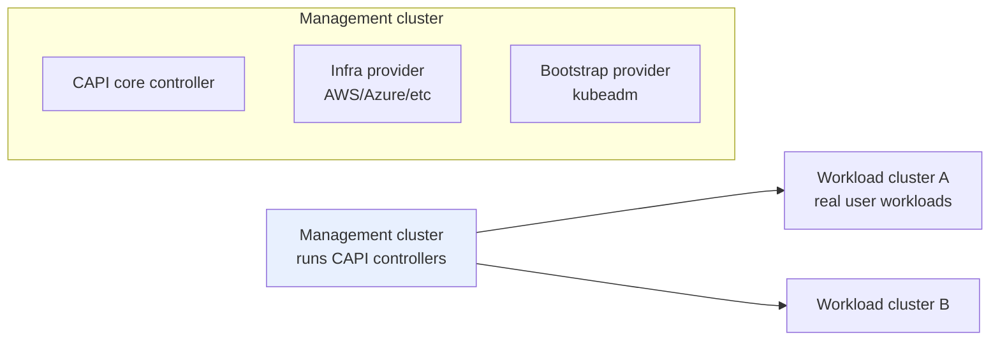
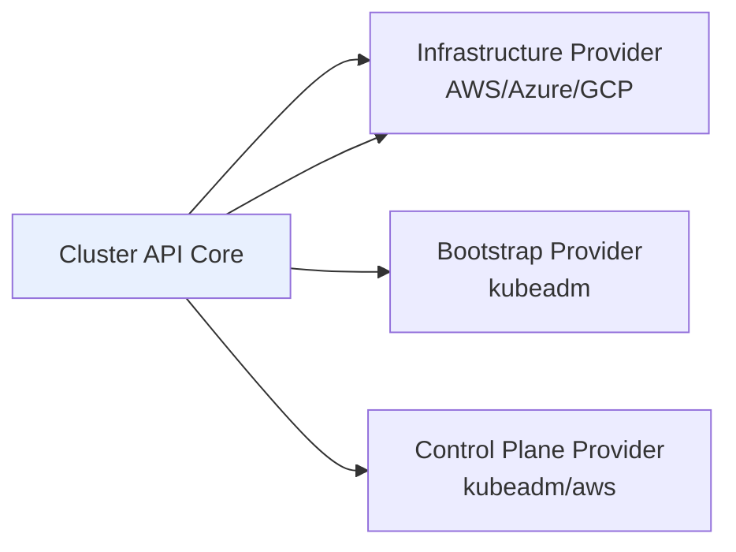

# Cluster API — Declarative Cluster Lifecycle

> **Category:** Cluster Operations / Platform

**Cluster API (CAPI)** is a Kubernetes sub-project that manages the **creation, upgrade, and teardown of Kubernetes clusters themselves** using the same declarative, controller pattern Kubernetes uses for Pods. Instead of `eksctl create cluster`, you `kubectl apply` a `Cluster` object and controllers reconcile the infrastructure for you — across AWS, Azure, GCP, vSphere, bare metal, etc.

## How It Fits


There are two planes:
- **Management cluster** — runs the CAPI controllers (and optionally hosts a GitOps stack like Argo CD). One management cluster can manage **many** workload clusters.
- **Workload (target) clusters** — the real clusters users/deploy teams run workloads on. CAPI provisions, upgrades, and deletes them.

## The CAPI Resource Model

| Resource | Role |
|----------|------|
| `Cluster` | The cluster itself (control plane + infra refs). |
| `MachineDeployment` / `MachineSet` / `Machine` | Like `Deployment`/`ReplicaSet`/`Pod` — but for **VMs/nodes**, not containers. |
| `KubeadmControlPlane` (or `AWSManagedControlPlane`) | The control-plane definition (version, replicas, upgrades). |
| `*MachineInfrastructure` (e.g. `AWSMachineTemplate`) | What VM/image the Machine becomes. |
| `*MachineBootstrapConfig` (e.g. `KubeadmConfig`) | How the node joins (kubeadm init/join data). |

### Minimal AWS example

```yaml
apiVersion: cluster.x-k8s.io/v1beta1
kind: Cluster
metadata: { name: prod }
spec:
  infrastructureRef:
    apiVersion: infrastructure.cluster.x-k8s.io/v1beta1
    kind: AWSCluster
    name: prod
  controlPlaneRef:
    kind: AWSManagedControlPlane
    name: prod-cp
---
apiVersion: cluster.x-k8s.io/v1beta1
kind: MachineDeployment
metadata: { name: prod-md }
spec:
  clusterName: prod
  replicas: 3
  template:
    spec:
      bootstrap:
        ref:
          kind: KubeadmConfigTemplate
          name: prod-md-bs
      infrastructureRef:
        kind: AWSMachineTemplate
        name: prod-md
```

## Components (the provider model)


1. **Core (cluster-api)** — reconciles `Cluster`, `Machine*`, owns the lifecycle state machine.
2. **Bootstrap provider** (CABPK / kubeadm) — generates `kubeadm join` data, writes bootstrap Secrets.
3. **Infrastructure provider** (CAPA/CAPZ/CAPG/...) — creates the cloud VMs, VPC, security groups.
4. **Control-plane provider** — reconciles the control-plane Machines / `etcd`/API server state.

## Day-2 Ops: Upgrade & Scale

- **Scale nodes**: change `MachineDeployment.spec.replicas` → CAPI provisions/deprovisions VMs.
- **Upgrade K8s**: bump `KubeadmControlPlane.spec.version` and each `MachineDeployment.template`... → rolling update of control plane **and** nodes.
- **Drain & replace**: `machinedeployment.kubernetes.x-k8s.io/replace` annotation force-recreates a Machine.

```bash
clusterctl init                          # install providers into a `kind` management cluster
clusterctl generate cluster prod -i aws > capi-aws.yaml
kubectl apply -f capi-aws.yaml
kubectl get clusters
clusterctl describe cluster prod         # topology view
capi kill prod                           # delete a cluster
```

## When to Use It (and not)

Use CAPI when you manage **many clusters** (multi-tenant, per-team, per-region, edge). For a handful of clusters, `eksctl`/`gcloud`/`az aks` is simpler — CAPI is platform-engineering glue.

## Common Issues

| Symptom | Cause | Fix |
|---------|-------|-----|
| `Cluster` stuck `Pending` / `NoExecutableEnvironmentGenerator` | bootstrap data secret empty / wrong provider version | `kubectl describe cluster`, check the bootstrap provider logs |
| Nodes not joining | bootstrap Secret missing kubeconfig / IAM wrong | `kubectl -n capi-... logs`, verify `infrastructureRef` + credentials |
| Upgrade stuck | control-plane vs machine-deployments on different K8s minor | keep them at the SAME minor version; CAPI will not upgrade control plane ahead of workers |

## Interview Questions

**Q: What is the difference between a management cluster and a workload cluster in Cluster API?**
A: The **management cluster** runs the CAPI controllers and is an ordinary Kubernetes cluster (often `kind`-provisioned) whose only job is to provision and reconcile **workload clusters**. Workload clusters are the real clusters users run apps on. A single management cluster can own hundreds of workload clusters — this is the multi-cluster control plane.

**Q: How is a Machine like a Pod?**
A: A `MachineDeployment` is to a VM (`Machine`) exactly as a `Deployment` is to a `Pod`: `MachineDeployment` → `MachineSet` → `Machine` (a Node). You scale/replace/upgrade Machines the same declarative way — but they produce whole nodes, not containers.

## Related Resources
- [Upgrades](upgrades.md)
- [Kubernetes Architecture](../02-architecture/architecture.md)
- [Security](../06-security/README.md)
- [GitOps](../15-advanced-patterns/gitops.md)
