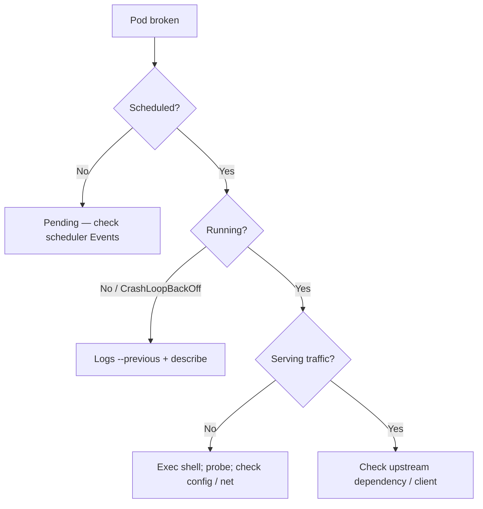

# Debugging Kubernetes

> **Category:** Cluster Operations / Troubleshooting

## What It Is

**Debugging Kubernetes** is a methodical workflow: gather state (`kubectl describe`, `kubectl logs`), form a hypothesis, validate it (with a probe or test Pod), and resolve. The hard part isn't the syntax — it's **narrowing down** which layer (Pod, Node, Network, API) is misbehaving.

## Why It Exists

Pods go into `CrashLoopBackOff`, `ImagePullBackOff`, `Pending`, or get stuck `ContainerCreating` — you need a repeatable method to find the root cause.

## The Debugging Mantra: "Four Questions"

For any broken Pod, ask:
1. **Is the Pod scheduled?** → `kubectl get pod -o wide` (Node column) — is it `Pending` or `Running`?
2. **If Pending, why?** → `kubectl describe pod <name>` (Events: scheduling / resources / taints / affinity)
3. **If Crashing, why?** → `kubectl logs <name>` / `kubectl logs <name> --previous`
4. **If Running but broken, why?** → `kubectl exec -it <pod> -- sh`, check ports, config, network

## Architecture



## Essential Commands

```bash
# See everything at a glance
kubectl get pod,svc,deploy -n <ns>
kubectl get pod <name> -o wide           # Which node? Pod IP?

# Deep dive
kubectl describe pod <name>             # Events, QoS, node, volumes, conditions
kubectl logs <name>                     # Logs (one container)
kubectl logs <name> -c <container>      # Specific container
kubectl logs <name> --previous          # Logs of the previous (crashed) container
kubectl logs -f <name>                  # Stream live

# Inspect the running Pod
kubectl exec -it <name> -- sh           # Get a shell (if sh exists)
kubectl exec <name> -- ls -la /         # Filesystem
kubectl exec <name> -- env              # Env vars (see config issues)
kubectl exec <name> -- netstat -tlnp    # (if net-tools present) listening ports

# Events (cluster-wide for the namespace)
kubectl get events --sort-by='.metadata.creationTimestamp'
kubectl get events -n kube-system | grep <pod-name>

# Cluster-wide
kubectl describe node <node>            # Node capacity, conditions, taints
kubectl top nodes / pods                # Live resource usage
```

## Debugging by State

### 1. `Pending`
The scheduler could not place it.

```bash
kubectl describe pod <name>
# Events say: "0/N nodes are available: N Insufficient cpu."
# Or: "node(s) had taints the pod didn't tolerate"
# Or: "didn't match node affinity"
# Fix 1: lower resource requests
# Fix 2: add tolerations or remove taints
# Fix 3: fix node affinity labels
# Fix 4: check PVC topology (WaitForFirstConsumer needs the right zone)
```

### 2. `ContainerCreating`
Pods are being set up (image pull, volume mount, CNI).

```bash
kubectl describe pod <name>
# Events: "Failed" / "BackOff" / "MountVolume" / "network is unreachable"
kubectl -n kube-system logs -l k8s-app=cilium      # CNI plugin
kubectl describe pv <pv-name>                     # Check the volume
```

### 3. `ImagePullBackOff` / `ErrImagePull`
Bad image reference or auth.

```bash
kubectl describe pod <name>
# Events: "Failed to pull image" / "rpc error: code = Unknown"
# Fix: correct name/tag, add imagePullSecrets
# Test pullability:
kubectl run probe --image=<your-image> -- sleep 3600
kubectl attach probe -it
```

### 4. `CrashLoopBackOff`
The container starts then crashes (loop).

```bash
kubectl describe pod <name>       # State: terminated, exit code, reason
kubectl logs <name> --previous    # Logs of the CRASHED container
kubectl get pod <name> -o jsonpath '{range .status.containerStatuses[*]}{.name}{"\t"}{.lastState}{"\n"}{end}'
# Look: state.terminated.reason, state.terminated.exitCode, finished/ startedAt timestamps
```

Common reasons:
- Exit code 1 → app error (check `--previous` logs)
- Exit code 137 (128+9 = SIGKILL) → OOMKilled (low memory limit)
- Exit code 137 + no OOM in events → `OOMKilled` or `kill` during eviction

### 5. OOMKilled (a sub-case of CrashLoopBackOff)
```bash
kubectl describe pod <name> | grep -A5 "State:"
# State: Terminated, Reason: OOMKilled
# Fix: raise memory limit (and/or request), check app memory leaks
kubectl top pod <name>              # (if running briefly) to see usage
```

### 6. Running but unhealthy / not serving traffic
```bash
kubectl exec -it <pod> -- sh
# (inside)
curl localhost:<port>/health
cat /proc/1/cmdline
netstat -tlnp   # Is the port listening?
env               # Are secrets/config mounted?
ls -la /etc/secrets   # Secret volume mounted?
```

## Readiness vs Liveness (the trap)

A Pod can be `Running` but have **0 ready endpoints** — the readiness probe is failing, so the Service isn't routing to it, but the container itself is alive.

```bash
kubectl get endpoints <service>
# <none> or fewer than expected → readiness failing
kubectl describe pod <name> | grep -i readiness
```

## Debugging with an Ephemeral Container

Add a debug container to a **running** Pod (no restart):

```bash
kubectl debug <pod-name> -it --image=busybox --target=<container-name> -- sh
# (shares the PID/network namespaces with the target container)
ps aux        # see all processes, including the app
cat /proc/1/root/healthz   # inspect the app's own fs
netstat -tlnp  # (shared network) see the app's listeners
```

### Node debugging (host access)
```bash
kubectl debug node/<node-name> -it --image=busybox -- chroot /host
# /host is the node's root filesystem
ls /host/var/log/pods
crictl ps -a            # (if crictl is installed) containers on the node
```

## Debugging Network

### Pod can't reach a Service
```bash
kubectl exec -it <pod> -- nslookup <service>
kubectl exec -it <pod> -- curl -v http://<service>:<port>/
# Then: is the Service routing?
kubectl get endpoints <service>
# If empty -> Service selector doesn't match the Pod's labels
```

### DNS broken
```bash
kubectl exec -it <pod> -- cat /etc/resolv.conf
# Must point to the CoreDNS Service IP (10.x)
kubectl -n kube-system get pods -l k8s-app=kube-dns
kubectl -n kube-system logs -l k8s-app=kube-dns
```

### Pod can't reach the internet
```bash
kubectl exec -it <pod> -- curl -v https://example.com
# If fails -> CNI not configured, or the node's NAT/iptables are broken.
# Check: the CNI plugin is healthy; iptables rules on the node.
iptables -t nat -L     # (via node debug / SSH)
```

## Debugging Storage

```bash
kubectl describe pod <name>
# Look for "MountVolume.SetUp failed"
kubectl get pvc <name>
kubectl get pv <pv-name>
kubectl describe pv <pv-name>
# Check: status.phase (Bound?), the PVC it's bound to
kubectl -n kube-system logs -l app=ebs-csi-controller  # (or your CSI driver)
```

### `mountVolume` errors
Common causes:
- PVC never Bound → PVC stuck Pending
- CSI driver unhealthy
- Volume already attached elsewhere

## Debugging RBAC

```bash
kubectl auth can-i get pods --as=<user-or-sa>
kubectl auth can-i --list --as=<user-or-sa>
# If the user gets a Forbidden error when doing something:
kubectl get clusterrolebindings
kubectl describe rolebinding -n <ns> <name>
```

## Commands Cheat Sheet

```bash
kubectl get pod <name> -o wide
kubectl describe pod <name>
kubectl logs <name> [-c <container>] [--previous] [-f]
kubectl exec -it <name> -- sh
kubectl get events --sort-by=.metadata.creationTimestamp
kubectl describe node <node>
kubectl top nodes; kubectl top pod <name>
kubectl debug <pod> -c <new> --image=busybox --target=<main> -it -- sh
kubectl debug node/<node> --image=busybox -- chroot /host
kubectl auth can-i <verb> <resource> --as=system:serviceaccount:<ns>:<sa>
```

## Common Pitfalls

1. **`kubectl exec` fails** — the Pod is running but has **no shell** (distroless image). Use `kubectl debug` + an ephemeral container instead.
2. **`--previous` returns "no container"** — the Pod has not actually restarted (the current container is running).
3. **Logs show nothing** — the sidecar (sidecar with logs) — check the right container, or the app is buffering output (add `stdbuf -oL` / `PYTHONUNBUFFERED=1`).
4. **"Pending" with no events** — usually a **namespace deletion stuck** (check `kubectl get ns` for `Terminating`).
5. **RBAC errors look like app errors** — `Forbidden` while listing resources might be the **controller's** ServiceAccount permissions, not the app.
6. **`ImagePullBackOff` on a private registry** — missing `imagePullSecrets` on the SA.
7. **Pods not getting traffic after scaling** — readiness probes failing, endpoints empty.

## Interview Questions

**Q: What's the first thing you check when a Pod is stuck Pending?**
A: `kubectl describe pod <name>` — the Events section will say "Insufficient cpu" or "node(s) had taints that the pod didn't tolerate" or "didn't match node affinity".

**Q: How do you debug a CrashLoopBackOff?**
A: 1) `kubectl describe` (exit code, reason), 2) `kubectl logs -–previous` (crashed container's logs), 3) check exit code (137 = OOM kill, 1 = app error, 125/126/127 = image/cmd issues).

**Q: How do I debug an app with no shell (distroless)?**
A: Use `kubectl debug <pod> --image=busybox --target=<container>` — injects an ephemeral container into the same namespaces.

**Q: What's the difference between liveness and readiness probes?**
A: `liveness` failure → container is **restarted**. `readiness` failure → container is **removed from Service endpoints** (no traffic) but **kept running**.

**Q: A Pod is Running but getting no traffic — what do you check?**
A: `kubectl get endpoints <svc>` — if empty, the Service selector doesn't match the Pod's labels, or readiness is failing.

**Q: What does exit code 137 mean?**
A: The container was killed (137 = 128 + 9 = SIGKILL). Most likely causes: OOM kill, or the node is under memory pressure (kubelet OOM evicts the cgroup).

## Related Resources

- [Kubelet](kubelet.md)
- [kubectl Cheatsheet](../cheat-sheets/kubectl.md)
- [Monitoring](../13-observability/prometheus.md)
- [Resource Quotas](../07-scheduling-autoscaling/resource-quotas.md)
- [Pods](../03-workloads/pods.md)
