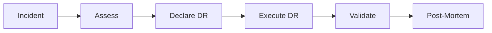

# Disaster Recovery Runbook

> **Category:** Operations / Runbooks
> Step-by-step runbook for Kubernetes disaster recovery.

## Overview



## DR Scenarios

| Scenario | Severity | RTO | RPO |
|----------|----------|-----|-----|
| Single node failure | Low | 5 min | 0 |
| Control plane failure | High | 30 min | 5 min |
| etcd failure | Critical | 1 hour | 5 min |
| AZ failure | Critical | 2 hours | 1 hour |
| Region failure | Critical | 4 hours | 1 hour |

## DR Checklist

| Check | Action |
|-------|--------|
| Incident detected | Monitoring alerts |
| Severity assessed | Impact to workloads |
| DR declared | Stakeholders notified |
| DR executed | Recovery procedures |
| Validation | Health checks passed |
| Post-mortem | Root cause analysis |

## Phase 1: Incident Detection

### Monitoring Alerts

```bash
# Check cluster health
kubectl get nodes
kubectl get pods -A --field-selector=status.phase!=Running

# Check etcd health
kubectl -n kube-system get pods -l component=etcd
kubectl -n kube-system logs -l component=etcd --tail=100

# Check control plane
kubectl -n kube-system get pods -l component=kube-apiserver
kubectl -n kube-system logs -l component=kube-apiserver --tail=100
```

### Health Checks

```bash
# Check API server
kubectl cluster-info

# Check DNS
kubectl run test --image=busybox --rm -it -- nslookup kubernetes.default

# Check storage
kubectl get pv,pvc
```

## Phase 2: Assess Impact

### Impact Assessment

| Impact | Description | Action |
|--------|-------------|--------|
| **No impact** | Single pod failure | Restart pod |
| **Low impact** | Single node failure | Reschedule pods |
| **Medium impact** | Multiple node failure | Scale up nodes |
| **High impact** | Control plane failure | Restore control plane |
| **Critical** | etcd failure | Restore from backup |

### Workload Assessment

```bash
# Check critical workloads
kubectl get deployments -A | grep -E "(RUNNING|PENDING)"
kubectl get statefulsets -A | grep -E "(RUNNING|PENDING)"

# Check PDBs
kubectl get pdb -A

# Check node health
kubectl get nodes -o wide
```

## Phase 3: Execute DR

### Scenario 1: Single Node Failure

```bash
# Check node status
kubectl get node <node-name>

# If node is NotReady, cordon and drain
kubectl cordon <node-name>
kubectl drain <node-name> --ignore-daemonsets --delete-emptydir-data

# If using cloud provider, terminate and replace
aws ec2 terminate-instances --instance-ids <instance-id>
# Wait for new node to join cluster

# Uncordon new node
kubectl uncordon <new-node-name>
```

### Scenario 2: Control Plane Failure

```bash
# Check control plane pods
kubectl -n kube-system get pods

# If API server is down, SSH to master
ssh master-node

# Restart kubelet
sudo systemctl restart kubelet

# Check etcd
sudo crictl ps | grep etcd
sudo crictl logs <etcd-container-id>

# If etcd is down, restore from backup
ETCDCTL_API=3 etcdctl snapshot restore /backup/etcd-<date>.db \
  --data-dir=/var/lib/etcd-restored

# Restart etcd
sudo systemctl restart etcd
```

### Scenario 3: etcd Failure

```bash
# Stop API server
sudo systemctl stop kube-apiserver

# Backup current etcd data
sudo mv /var/lib/etcd /var/lib/etcd-bak

# Restore from backup
ETCDCTL_API=3 etcdctl snapshot restore /backup/etcd-<date>.db \
  --data-dir=/var/lib/etcd

# Start API server
sudo systemctl start kube-apiserver

# Verify
kubectl get nodes
kubectl get pods -A
```

### Scenario 4: AZ Failure

```bash
# Check node status
kubectl get nodes -l topology.kubernetes.io/zone=<failed-az>

# Cordon failed AZ nodes
for node in $(kubectl get nodes -l topology.kubernetes.io/zone=<failed-az> -o name); do
  kubectl cordon $node
  kubectl drain $node --ignore-daemonsets --delete-emptydir-data
done

# Scale up healthy AZ
kubectl scale deployment <deployment> --replicas=<desired>

# Update PDBs if needed
kubectl patch pdb <pdb-name> -p '{"spec":{"maxUnavailable":1}}'
```

### Scenario 5: Region Failure

```bash
# Switch to DR region
# Option 1: Update DNS
aws route53 change-resource-record-sets --hosted-zone-id Z123 --change-batch '{
  "Changes": [{
    "Action": "UPSERT",
    "ResourceRecordSet": {
      "Name": "app.example.com",
      "Type": "CNAME",
      "TTL": 60,
      "ResourceRecords": [{"Value": "dr.example.com"}]
    }
  }]
}'

# Option 2: Update Ingress
kubectl annotate ingress my-ingress external-dns.alpha.kubernetes.io/hostname=dr.example.com

# Verify
kubectl get ingress
curl -s http://app.example.com/health
```

## Phase 4: Validate

### Validation Checklist

| Check | Command |
|-------|---------|
| Nodes ready | `kubectl get nodes` |
| Pods running | `kubectl get pods -A` |
| Services working | `kubectl get svc -A` |
| Ingress working | `kubectl get ingress -A` |
| DNS working | `kubectl run test --image=busybox --rm -it -- nslookup kubernetes.default` |
| Storage bound | `kubectl get pv,pvc` |
| Logs flowing | `kubectl logs -f <pod>` |

### Health Checks

```bash
# Run health checks
kubectl run healthcheck --rm -it --image=busybox -- wget -qO- http://<service>/health

# Check metrics
kubectl top pods -A
kubectl top nodes

# Check alerts
kubectl get events --sort-by='.lastTimestamp' | tail -20
```

## Phase 5: Post-Mortem

### Post-Mortem Template

```markdown
# Incident Report

## Summary
- **Date:** <date>
- **Duration:** <duration>
- **Impact:** <impact>
- **Root Cause:** <cause>

## Timeline
- <time>: Incident detected
- <time>: DR declared
- <time>: DR executed
- <time>: Validation complete

## What went well
- <item>

## What went wrong
- <item>

## Action items
- [ ] <action item>
```

### Lessons Learned

| Question | Answer |
|----------|--------|
| What caused the incident? | |
| How was it detected? | |
| How long did recovery take? | |
| What can be improved? | |

## DR Testing

### Regular DR Tests

| Test | Frequency | Duration |
|------|-----------|----------|
| Backup verification | Daily | 5 min |
| Restore test | Weekly | 30 min |
| Full DR drill | Monthly | 4 hours |
| Region failover | Quarterly | 8 hours |

### DR Test Script

```bash
#!/bin/bash
# DR Test Script

echo "=== DR Test Started ==="

# Backup verification
echo "Verifying backup..."
ETCDCTL_API=3 etcdctl snapshot status /backup/etcd-latest.db --write-out=table

# Restore test
echo "Testing restore..."
sudo systemctl stop kube-apiserver
sudo mv /var/lib/etcd /var/lib/etcd-test
ETCDCTL_API=3 etcdctl snapshot restore /backup/etcd-latest.db --data-dir=/var/lib/etcd
sudo systemctl start kube-apiserver

# Verify
echo "Verifying cluster..."
kubectl get nodes
kubectl get pods -A

# Cleanup
echo "Cleaning up..."
sudo systemctl stop kube-apiserver
sudo rm -rf /var/lib/etcd
sudo mv /var/lib/etcd-test /var/lib/etcd
sudo systemctl start kube-apiserver

echo "=== DR Test Complete ==="
```

## DR Best Practices

| Practice | Description |
|----------|-------------|
| **Regular backups** | Automate etcd backups every 6 hours |
| **Test restores** | Weekly restore tests to verify backups |
| **Multi-AZ** | Deploy control plane across multiple AZs |
| **Documentation** | Keep runbooks up to date |
| **Training** | Regular DR drills with team |

## Common Issues

| Issue | Cause | Fix |
|-------|-------|-----|
| Backup corrupted | Disk full | Monitor disk usage |
| Restore failed | Version mismatch | Use same version backup |
| DNS not updating | TTL too high | Lower TTL before DR |
| Services not ready | Health checks failing | Fix health check endpoints |

## Related

- [Backup & Restore](backup-restore.md)
- [Cluster Upgrade Playbook](cluster-upgrade-playbook.md)
- [Troubleshooting Guide](../14-troubleshooting/troubleshooting-patterns.md)
- [Incident Case Studies](../14-troubleshooting/incidents/)
