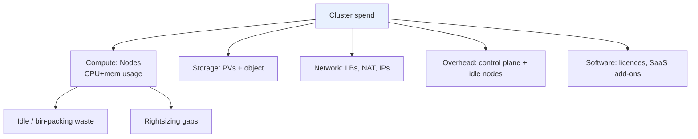

# FinOps — Kubernetes Cost Management

> **Category:** Cluster Operations / Cost

**FinOps** on Kubernetes is the practice of allocating and optimizing the cost of running clusters and workloads: compute (CPU/mem), storage, networking (IPs/LoadBalancers), and **cluster overhead** (control plane, idle nodes). Unlike a single VM with an hourly tag, a cluster has many cost sources — so you need **allocation** (who pays for what) **before** optimization (saving money without breaking prod).

## The 5 cost buckets in a cluster



| Bucket | What to measure | Tooling |
|--------|-----------------|---------|
| **Compute** (biggest, ~60-70%) | node CPU/mem **request** vs **usage**; `container_cpu_usage_seconds_total` + `requests` | `kube-state-metrics`, KubeCost, CloudWatch/CUR |
| **Idle nodes** | nodes that exist but run almost no workload (over-provisioned ASGs) | Cluster-autoscaler `expendable`/scale-down, Spot |
| **Storage** | PV GiB-months, snapshots, object storage egress | CSI metrics, S3/COS usage |
| **Network/LBs** | per-Service LB (AWS ELB $), NAT-GW hourly, egress | cloud provider billing, KubeCost network cost |
| **Overhead** | managed control-plane hourly charge (EKS/GKE/AKS), add-on licences | provider pricing, licence scans |

## Allocation: map spend to a team / namespace

```yaml
apiVersion: v1
kind: Namespace
metadata:
  name: team-a
  labels:
    kubernetes.io/metadata.name: team-a
    cost-team: "platform"          # custom label → FinOps reports slice by this
    environment: prod
```
Rule: **every namespace** carries cost-allocation labels (team, product, environment). Then KubeCost/Kubecost, CloudHealth, or the cloud-native **`cost-exporter`** joins Prometheus usage + cloud-billing to report "team-a spent $X last month."

## Optimization levers (in order)

1. **Kill idle clusters** (the #1 waste: dev/QA clusters 24×7).
2. **Right-size** — shrink `requests` to actual usage (not "max ever"), drop unused limits. Avoid hard CPU `limits` (they throttle).
3. **Spot / preemptible** for stateless workloads (`nodeAffinity` + `tolerations`; handle `SIGTERM`/preemption). Karpenter/Cluster-autoscaler diversify.
4. **Right-node** — pick an `m5.xlarge` over `m5.24xlarge` for most teams; right-size the node type (not just the pod).
5. **Pod Autoscaling** — HPA/VPA so you don't over-provision headroom (`--horizontal-pod-autoscaler`.
6. **Network** — one `LoadBalancer` per cluster, or Gateway API + shared IPs; avoid `NodePort`-to-internet; delete orphan ELBs.

## CPU limits are an anti-pattern (FinOps note)

A hard CPU limit can throttle your SLOs while you pay for the **request** — you paid for headroom you can't use. Prefer **requests = expected**, **no limit** (or a high limit as OOM protection), and let VPA/HPA right-size.

## Tool choices

| Tool | Type | Best for |
|------|------|----------|
| **KubeCost / Kubecost** | OSS + enterprise | allocation + idle + recommendations |
| **CloudHealth / Turbonomic / Harness CCM** | commercial | multi-cloud + reserved-instance planning |
| **AWS CUR / GCP Billing Export → BigQuery** | native | when you already live in one cloud |
| **`resource-scissors` / Goldilocks** | OSS | right-sizing recommendations |
| **Cluster-autoscaler + Karpenter** | infra | scaling nodes (incl. Spot) |
| **`cost-exporter` (kube-cost)** | OSS | push per-namespace cost into Prometheus |

## Common Issues

| Symptom | Cause | Fix |
|---------|-------|-----|
| "usage ≈ request × 100%" everywhere | everyone pads requests to avoid throttling | run VPA/Goldilocks recommendations; monitor actual `container_cpu_usage` |
| cost report shows `$0` for a namespace | no namespace labels / no allocation query | enforce label policies; map labels → cost teams |
| idle nodes still billed | ASG min-size > workload, no scale-down | enable cluster-autoscaler `scale-down-utilization-threshold` |
| spot killing prod pods | spot interruption not handled | add graceful `terminationGracePeriodSeconds`, `preStop`, and a Spot-drain handler |

## Interview Questions

**Q: What's the difference between allocation and optimization in K8s cost management?**
A: **Allocation** answers "which team/product owns this spend" (namespace + label-based cost attribution, so you bill back). **Optimization** is reducing the spend without harming SLOs (right-sizing, spot, autoscaling, killing idle clusters). You must measure allocation *before* you can optimize responsibly — otherwise you're just turning down random dials.

**Q: Why are hard CPU `limits` considered an anti-pattern in FinOps?**
A: They throttle your app to the limit even when the node has spare CPU, while you still **pay for the request** you set. The fix is requests=expected usage + no/limited limits, then let HPA/VPA right-size.

**Q: How do you measure "idle" in a cluster and the three most common wastes?**
A: Idle = nodes whose CPU/mem **usage is a small fraction of their requests** (use `kube_node_status_allocatable` vs `container_cpu_usage_seconds_total`). The three biggest wastes: (1) **idle dev/test clusters running 24×7**, (2) **over-padded CPU requests** (everyone reserves 2× "just in case"), and (3) **orphaned LoadBalancers/Storage** left behind when Services are deleted.

## Related Resources
- [Cluster Autoscaling](../03-workloads/cluster-autoscaler.md)
- [HPA & VPA](../07-scheduling-autoscaling/hpa-vpa.md)
- [Resource Requests/Limits](../07-scheduling-autoscaling/resource-management.md)
- [Kubernetes Architecture](../02-architecture/architecture.md)
