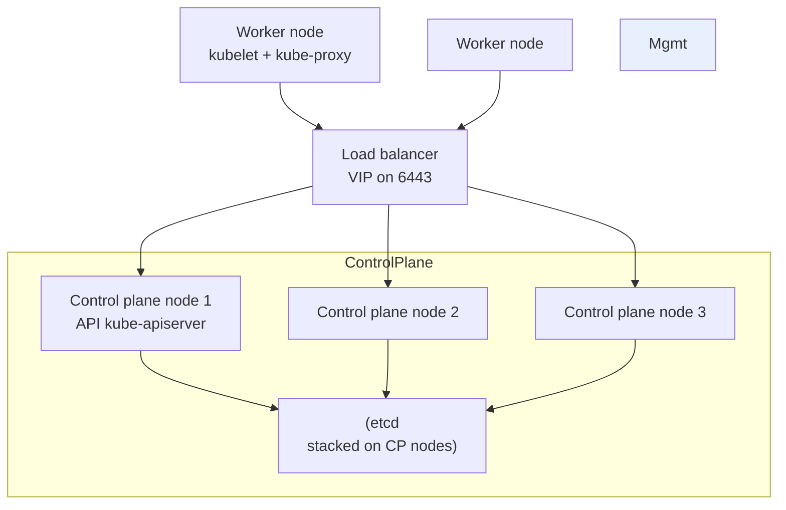

# kubeadm — Bootstrapping a Kubernetes Cluster

> **Category:** Cluster Operations / Bootstrap

**`kubeadm`** is the Kubernetes project's official installer and bootstrap tool. It generates the cluster certificates, the static-pod manifests, the `admin.conf` kubeconfig, and the join tokens — i.e. it gets a "vanilla" Kubernetes up and running. It pairs with the `kubelet` (which must be running on every node) and `kubectl` as the standard "k8s trio." kubeadm is great for **learning, labs, and the base of platform tooling** (kind uses it, Cluster API's `CABPK` uses it) — but for production you usually want a managed provider or Cluster API.



## The phases of `kubeadm init`

`kubeadm init` runs in ordered phases (visible with `--v=1`). It writes everything under `/etc/kubernetes/`:

1. **certs** — generates a local CA + per-component certs (apiserver, kubelet, front-proxy, etcd).
2. **kubeconfig** — `admin.conf` for kubectl, plus the kubelet/kube-controller-manager/kube-scheduler configs.
3. **control-plane** — writes the static-pod manifests (`kube-apiserver`, `kube-controller-manager`, `kube-scheduler`, `etcd`) into `/etc/kubernetes/manifests/` so kubelet runs them.
4. **etcd** — creates the etcd data dir (local, single-node by default; for HA, `Stacked etcd` across the 3 CP nodes).
5. **addon** — installs CoreDNS + kube-proxy (as DaemonSets) — **the step that blocks until a CNI is applied.**

## `kubeadm join` (workers + extra control-plane)

```bash
# worker join (runs on the worker, as root):
kubeadm join <control-plane-ip>:6443 \
  --token <token> \
  --discovery-token-ca-cert-hash sha256:<hash>

# additional control-plane node (HA, shares etcd):
kubeadm join <control-plane-ip>:6443 \
  --token <token> \
  --discovery-token-ca-cert-hash sha256:<hash> \
  --control-plane \
  --certificate-key <key>      # from: kubeadm init phase upload-certs --upload-certs
```
The `--discovery-token-ca-cert-hash` prevents a MITM at join time (you verify the cluster CA). The `--certificate-key` is the encrypted envelope for the etcd certs — it is one-time and shown only at `init`.

## HA control plane (stacked etcd)

```yaml
# kubeadm-config.yaml
apiVersion: kubeadm.k8s.io/v1beta4
kind: ClusterConfiguration
kubernetesVersion: v1.30.0
controlPlaneEndpoint: "k8s-lb.example.com:6443"   # a TCP LB/VIP in front of the 3 CPs
etcd:
  local:
    dataDir: /var/lib/etcd
networking:
  serviceSubnet: 10.96.0.0/12
  podSubnet: 10.244.0.0/16
  dnsDomain: cluster.local
apiServer:
  certSANs: [k8s-lb.example.com]
---
apiVersion: kubeadm.k8s.io/v1beta4
kind: InitConfiguration
localTokens:
- token: { ... }   # or let kubeadm generate
nodeRegistration:
  kubeletExtraArgs:
    node-labels: "ingress-ready=true"
```
Then: `kubeadm init --config kubeadm-config.yaml` on the first CP; `kubeadm join --control-plane ...` on the other two.

## Certificates & renewal

- `kubeadm certs check-expiration` — list expiry of every cert.
- `kubeadm certs renew all` — renews; you must then **rotate** the static pods (they reload from manifests).
- The `kubelet-config` and `controller-manager`/`scheduler` kubeconfigs are also certs — `renew` covers the apiserver-side certs; kubelet certs rotate automatically if `--rotate-certificates=true`.

## Upgrading

```bash
kubeadm upgrade apply v1.31.0     # control-plane
kubectl drain <node>              # then, per worker:
apt-get install kubelet-1.31      # upgrade the kubelet binary
systemctl restart kubelet
kubectl uncordon <node>
```
(Cluster API users skip this — the operator does it.)

## Common Issues

| Symptom | Cause | Fix |
|---------|-------|-----|
| `kube-apiserver` keeps crashing | a 3rd CP joined with the wrong CA / cert mismatch | `kubeadm init phase certs` then re-apply the static pod; ensure all CPs share `/etc/kubernetes/pki` |
| CoreDNS stuck `Pending` | no CNI installed | `kubectl apply -f https://.../calico.yaml` (or your CNI) |
| join fails `x509: certificate signed by unknown authority` | `--discovery-token-ca-cert-hash` wrong/expired | re-copy the hash from the first CP (`openssl x509 -pubkey ... \| openssl sha256 -hex`) |
| ports blocked | firewall missing 6443/10250 (and 2379-2380 for etcd) | open them; 2379-2380 only needed if external etcd |
| tokens expired | default TTL is 1 day (`--token-ttl`) | generate a new token or use `bootstrap token create` |

## Interview Questions

**Q: When would you use `kubeadm` vs a managed provider or Cluster API?**
A: `kubeadm` for learning, labs, and as the bootstrap engine that kind/CABPK build on. A managed provider (EKS/GKE) when you want zero control-plane ops. **Cluster API** when you run many clusters in production and want declarative, GitOps-driven lifecycle — CAPI still calls `kubeadm`-equivalent phases under the hood.

**Q: What is `--control-plane` + `--certificate-key` at `join` time, and why are both needed for an HA control plane?**
A: `--control-plane` tells kubeadm this join creates another apiserver/etcd member. The `--certificate-key` is the **one-time key** encrypting the etcd peer certs that `init` uploaded — it's required so the new member can decrypt those certs and join the etcd cluster. Both are required for a stacked-etcd HA control plane.

**Q: Why does CoreDNS stay `Pending` right after `kubeadm init`?**
A: Because no CNI is installed yet (kubeadm deliberately doesn't ship one). Pods can't get IPs until you apply a CNI manifest — CoreDNS then runs fine. It's expected, not broken.

## Related Resources
- [Upgrades](upgrades.md)
- [Kubernetes Architecture](../02-architecture/architecture.md)
- [Container Runtimes](../02-architecture/container-runtimes.md)
- [CNI Plugins](../04-networking/cni-plugins.md)
