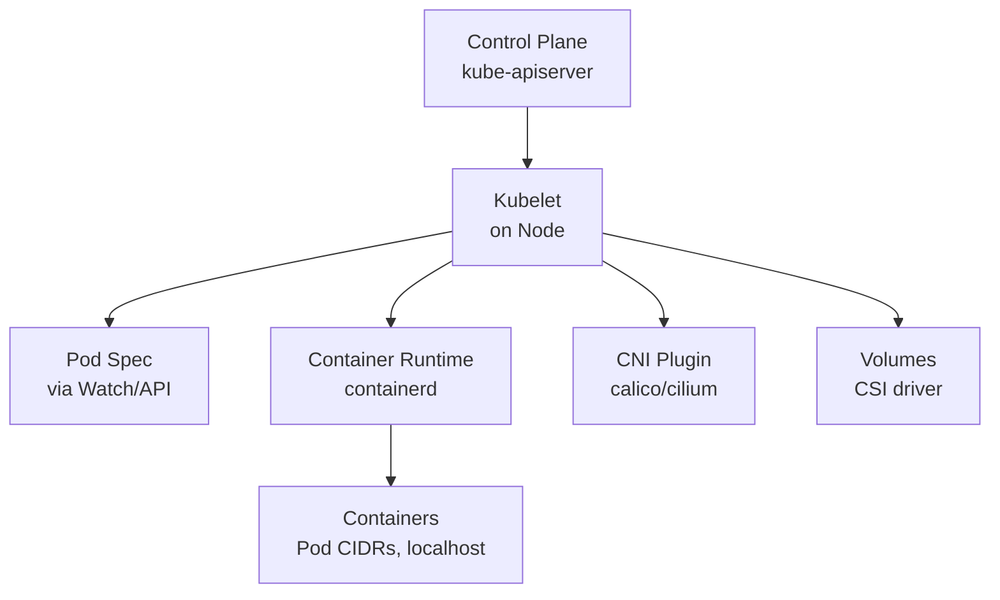
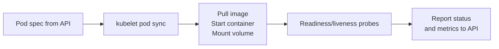

# Kubelet

> **Category:** Cluster Operations / Node

## What It Is

The **kubelet** is the **node-level agent** that runs on every worker node (and every control-plane node in HA). It is the **single source of truth** for what's actually running on a node — it tells the API server the node's capacity, health, and Pod status; and executes Pod specs it receives.

The kubelet is a **standalone binary** (Go) communicating with the kube-apiserver over **mTLS**.

## Why It Exists

Docker/containerd runs containers — the kubelet orchestrates them on the node for Kubernetes:
- Receives a Pod spec (from the API) and **makes it happen** on the node
- Pulls images, sets up storage, configures **Networking (via CNI)**, injects Secrets/ConfigMaps
- Reports health, resource usage, and status to the control plane
- Does **GC** of images, logs, and containers

Without a healthy kubelet, a node is **NotReady** and its Pods can't run.

## Architecture



## Kubelet Responsibilities

| Responsibility | How | Key config |
|----------------|-----|------------|
| **Pod lifecycle** | Create / start / stop / delete containers | `config.yaml`, Pod spec |
| **Image management** | Pull images; GC unused ones | `--image-gc-high-threshold`, `--eviction-hard` |
| **CNI networking** | Configure the Pod network (veth, IP) | calls CNI `add`/`del` binaries |
| **Storage** | Mount PV/PVCs, Secrets, configMaps | CSI `NodePublishVolume` |
| **Probes** | Run `livenessProbe` / `readinessProbe` | HTTP/TCP/exec handlers |
| **Auth to API** | mTLS client cert / bound tokens | `--kubeconfig`, rotating certs |
| **Resource enforcement** | Cgroups + QoS enforcement | `--enforce-node-allocatable` |
| **Health reporting** | `NodeReady` condition + metrics | `--healthz-port` |

## Pod Sync Loop

The kubelet **continuously syncs**:
1. **Watch** for Pod updates from the API server
2. **Compute** the desired state (containers to run, volumes to mount)
3. **Reconcile** the node's actual state — create/delete containers as needed (the Pod "work")
4. **Report status** back (status, containerState, QoS)



## Kubelet Configuration

The kubelet reads config from:
- **flags** (`--flag value`) on the kubelet process, OR
- **config file** (`KubeletConfiguration`, via `--config /var/lib/kubelet/config.yaml`)

```yaml
# /var/lib/kubelet/config.yaml
kind: KubeletConfiguration
apiVersion: kubelet.config.k8s.io/v1beta1
serverTLSConfig:
  clientCA: /var/lib/kubelet/pki/kubelet-client.pem       # Who to trust (authn)
rotateCertificates: true           # Auto-rotate the client cert
rotateServerCertificate: true      # Auto-rotate the serving cert
authentication:
  x509:
    clientCA: /var/lib/kubelet/pki/kubelet-client.pem
  webhook:
    enabled: true                 # Authenticate via the API (tokens)
authorization:
  mode: Webhook                  # Authorize calls to the kubelet API
protectKernelDefaults: true      # Ensure kernel sysctls are set
makeIPTablesSeenAll: true
podCIDR: ""                       # Set per-Pod CIDR (from controller-manager)
evictionHard:                     # When to evict pods from this node
  memory.available: "100Mi"
  nodefs.available: "5%"
  imagefs.available: "10%"
imageGCHighThreshold: 0.85       # Disk usage to trigger image GC
imageGCLowThreshold: 0.75
```

## Kubelet Port

By default, the kubelet listens on port **10250 (HTTPS)**. The kubelet API serves:
- `/metrics` — cAdvisor + kubelet metrics
- `/pods` — the Pod status (what's running)
- `/run` (exec/logs) — used by `kubectl exec/logs/portforward`
- `/healthz` — health probes
- `/containerStats` — container-level metrics

The port **10255** was the old read-only HTTP port — now deprecated; use 10250 with authz.

## Node Conditions (set by the kubelet)

```
kubectl get nodes -L node,status
# or:
kubectl get --raw /api/v1/nodes | jq .
```

| Condition | Reported by kubelet | Meaning |
|-----------|---------------------|---------|
| `Ready` | kubelet | Node is healthy, accepting Pods |
| `DiskPressure` | kubelet | Disk is full / close (Eviction threshold) |
| `MemoryPressure` | kubelet | Node is low on memory |
| `PIDPressure` | kubelet | Too many processes |
| `NetworkUnavailable` | (set by CNI / controller) | Pod networking broken |

The kubelet posts these to the API every `node-status-update-frequency` (`10s`).

## Health Probes (kubelet runs them)

The kubelet (not your app) executes probes:

```yaml
livenessProbe:
  httpGet:
    path: /healthz
    port: 8080
  initialDelaySeconds: 10
  periodSeconds: 10
  timeoutSeconds: 3
  failureThreshold: 3
  successThreshold: 1

readinessProbe:
  httpGet:
    path: /ready
    port: 8080
  initialDelaySeconds: 5
  periodSeconds: 5

startupProbe:            # (K8s 1.16+) — for slow-starting apps
  httpGet:
    path: /ready
    port: 8080
  failureThreshold: 30
  periodSeconds: 5       # 30 * 5 = 150s before liveness kicks in
```

- `liveness` failure → **restart** the container
- `readiness` failure → remove from Service **endpoints** (no traffic, but stays running)
- `startup` → delays liveness until the probe passes (slow boot)

## Commands

```bash
# Check kubelet on a node (you can SSH, or via the kubelet readyz API)
kubectl get --raw /healthz/kubelet       # overall
kubectl get --raw /healthz               # control-plane aggregate health

# Node conditions
kubectl get nodes                      # STATUS column (Ready / NotReady)
kubectl describe node <name>           # Conditions, capacity, allocatable, taints

# Kubelet config / status from the API
kubectl get node <name> -o jsonpath='{.status.conditions}'    # Conditions
kubectl get node <name> -o jsonpath='{.status.capacity}'
kubectl get node <name> -o jsonpath='{.status.allocatable}'

# Pod CIDR for a node (set by controller-manager)
kubectl get node <name> -o jsonpath='{.spec.podCIDR}'

# (If you have SSH) check kubelet status on the node:
systemctl status kubelet
journalctl -u kubelet                  # Logs
cat /var/lib/kubelet/config.yaml       # Config
```

## Kubelet Logs and Debugging

```bash
# (With SSH on the node)
journalctl -u kubelet               # kubelet systemd logs
kubectl -n kube-system logs -l k8s-app=kubelet  # (if using kubelet logs via fluentd)

# Kubelet debug endpoints (via API proxy):
kubectl --raw localhost:8001/api/v1/nodes/<node>/proxy/metrics | head
kubectl --raw localhost:8001/api/v1/nodes/<node>/proxy/metrics/resource/  # per-container
```

### `kubectl debug` (ephemeral containers)
```bash
kubectl debug <node> --image=busybox -- chroot /host
# (if /host is the node root via hostPath)
```

## Kubelet & Security

- The kubelet must be **authenticated + authorized** to the API — use `--authorization-mode=Webhook`
- Pod `exec`/`logs` go **through** the kubelet → it requires `permissions` on `pods/exec`, `pods/log`
- The kubelet's **readonly port (10255)** was disabled by default — do NOT re-enable it
- **Rotate server certificates**: set `rotateServerCertificate: true` and approve CSRs via the `csr-approving` controller

## Common Issues

### Node `NotReady`
```bash
kubectl describe node <name>
# Check: kubelet is running? (NotReady = kubelet down OR heartbeat lost)
# With SSH:
systemctl status kubelet
journalctl -u kubelet -n 100 --no-pager    # Look for errors
```

### "container failed to start / image pull failed"
```bash
kubectl describe pod <name>
# kubelet logs show the container runtime errors:
journalctl -u kubelet | grep <pod-name>
# Check: image pull secrets (regcred), wrong tag, registry down.
```

### Kubelet TLS cert errors
```bash
# "certificate signed by unknown authority" / "x509: certificate has expired"
# The kubelet's client cert has expired. Enable rotation:
# rotateCertificates: true + rotateServerCertificate: true
# Approve the CSR:
kubectl get csr
kubectl certificate approve <csr-name>
```

### Node `MemoryPressure` / `DiskPressure` (kubelet evicts Pods)
```bash
kubectl describe node <name> | grep -i memory     # Check allocatable vs usage
kubectl describe pod <name> | grep -i evicted
kubectl get --raw /api/v1/nodes/<node>/proxy/stats/summary    # (if available) shows usage
# The kubelet evicted a Pod for breaching eviction thresholds:
# EvictionHard: {memory.available: 100Mi, nodefs.available: 5%, pods: 100%...}
```

### Pod can't reach the internet (CNI problem)
```bash
# The kubelet calls CNI. If networking is broken:
kubectl -n kube-system logs -l k8s-app=<cni>    # Check CNI plugin
journalctl -u kubelet | grep cni               # kubelet-side CNI errors
```

### Kubelet can't reach the API server
```
"failed to list node conditions: ... connection refused"
Ensure the kube-apiserver endpoint is reachable from the node (firewall / load balancer /
the correct advertise address / the kubelet's -- kubeconfig server URL).
```

### `container is in 'CrashLoopBackOff' — check kubelet logs
```bash
# kubelet restarts the container per restartPolicy.
kubectl get pods
kubectl logs <pod-name> --previous    # Logs of the crashed container
journalctl -u kubelet | grep <pod>   # Node-side kubelet view
docker ps -a            # or crictl ps -a (older) to see the container state
crictl logs <container>
```

## Kubelet & Container Runtime Interface (CRI)

The kubelet talks to containerd/dockerd via the **CNI** (network) and **CRI** (container lifecycle) — via a Unix socket:

```yaml
# kubelet flag:
runtimeRequestEndpoint: /run/containerd/containerd.sock   # containerd
imageServiceEndpoint: /run/containerd/containerd.sock
```

- `crictl` is the CLI for the CRI (talks to the same socket) — used to debug containers the kubelet manages:
  ```bash
  crictl ps -a        # Lists containers the kubelet created
  crictl exec -it <id> sh   # Exec (bypassing kubectl)
  crictl rm/rmi       # Force-clean a stuck container/image
  ```

## Kubelet & Garbage Collection

The kube-level GC cleans up:
- **Images** (`imageGCHighThreshold`: % disk to trigger, `imageGCLowThreshold`: % target)
- **Containers** (stopped/exited)
- **Pod dirs** (dead pods on disk)

Tune via KubeletConfiguration (`imageGC...`, `evictionHard`).

## Interview Questions

**Q: Who runs the containers on a node?**
A: The **kubelet** — it pulls images, creates the network namespace (via CNI), mounts volumes, and starts/GCs containers on behalf of Kubernetes.

**Q: How does a Pod reach the internet?**
A: The kubelet calls the **CNI plugin** (`add` path) to set up the Pod's `eth0` (veth pair + IP). Outbound traffic uses the node's iptables/IPVS rules (masquerade) + the node's default route.

**Q: What does livenessProbe vs readinessProbe do?**
A: `liveness` failure → kubelet **reboots/restarts** the container. `readiness` failure → kubelet removes the Pod from Service **endpoints** (stops traffic) but keeps it running. `startupProbe` (1.16+) gates liveness until a slow-starting app is up.

**Q: What is the kubelet's read-write vs read-only port?**
A: Port `10250` is the authenticated read-write (defaults) — used for `kubectl exec/logs`, metrics, config. Port `10255` was the legacy **readonly** HTTP port — **removed** in recent versions.

**Q: What happens if a Pod's requests exceed the node's allocatable capacity?**
A: The scheduler cannot place it, OR (if `Guaranteed` QoS and over-committed) the kubelet evicts BestEffort pods / triggers `OOMKilled` / evicts via `evictionHard`.

**Q: How does the kubelet authenticate to the API server?**
A: With a **client certificate** (signed by the cluster CA) via its `--kubeconfig` — and it auto-rotates via `rotateCertificates: true`. The `Webhook` authorization mode checks what it can view/modify.

**Q: What does a `NotReady` Node condition tell you?**
A: The kubelet has failed its own liveness/health checks or stopped heart-beating. Check the node (disk full = `DiskPressure`, memory = `MemoryPressure`, kubelet down). Other pods get rescheduled by the controller.

## Related Resources

- [Debugging](debugging.md)
- [Upgrades](upgrades.md)
- [Backup & Restore](backup-restore.md)
- [Container Runtimes](../02-architecture/container-runtimes.md)
- [kubectl Cheatsheet](../cheat-sheets/kubectl.md)
