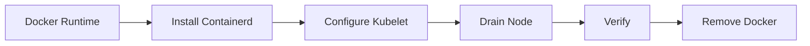

# Migration Guide: Docker to Containerd

> **Category:** Runtime / Migration
> Step-by-step guide for migrating from Docker to Containerd.

## Overview



## Why Migrate?

| Reason | Description |
|--------|-------------|
| **Deprecation** | Docker shim removed in K8s 1.24+ |
| **Performance** | Containerd is lighter than Docker |
| **Security** | Smaller attack surface |
| **Compliance** | CRI-native runtime |

## Phase 1: Pre-Migration

### Check Current Runtime

```bash
# Check current runtime
kubectl get nodes -o wide | grep CONTAINER-RUNTIME

# Check Docker version
docker version

# Check containerd version
containerd --version
```

### Backup Node Configuration

```bash
# Backup kubelet config
sudo cp /var/lib/kubelet/config.yaml /var/lib/kubelet/config.yaml.bak

# Backup containerd config
sudo cp /etc/containerd/config.toml /etc/containerd/config.toml.bak
```

## Phase 2: Install Containerd

### Install Containerd

```bash
# Install containerd
sudo apt-get update
sudo apt-get install -y containerd

# Generate default config
sudo mkdir -p /etc/containerd
containerd config default | sudo tee /etc/containerd/config.toml

# Enable SystemdCgroup
sudo sed -i 's/SystemdCgroup = false/SystemdCgroup = true/' /etc/containerd/config.toml

# Restart containerd
sudo systemctl restart containerd
sudo systemctl enable containerd
```

### Configure Kubelet

```bash
# Edit kubelet config
sudo sed -i 's/--container-runtime=docker/--container-runtime=containerd/' /var/lib/kubelet/config.yaml

# Or update node config
sudo sed -i 's/--container-runtime=docker/--container-runtime=containerd/' /var/lib/kubelet/kubeadm-flags.env
```

## Phase 3: Migrate Nodes

### Drain Node

```bash
# Drain node from control plane
kubectl drain <node-name> --ignore-daemonsets --delete-emptydir-data

# Stop kubelet
sudo systemctl stop kubelet

# Stop Docker
sudo systemctl stop docker
sudo systemctl disable docker
```

### Switch Runtime

```bash
# Stop containerd
sudo systemctl stop containerd

# Remove Docker socket
sudo rm -rf /var/run/docker.sock

# Start containerd
sudo systemctl start containerd

# Start kubelet
sudo systemctl start kubelet
```

### Uncordon Node

```bash
# Uncordon node
kubectl uncordon <node-name>

# Verify runtime
kubectl get nodes -o wide
```

## Phase 4: Validate

### Validation Checklist

| Check | Command |
|-------|---------|
| Node ready | `kubectl get nodes` |
| Pods running | `kubectl get pods -A` |
| Runtime correct | `kubectl get nodes -o wide` |
| Logs working | `kubectl logs <pod>` |
| Exec working | `kubectl exec -it <pod> -- sh` |

### Test Workloads

```bash
# Deploy test app
kubectl create deployment nginx --image=nginx:latest --replicas=3

# Verify pods
kubectl get pods -l app=nginx -o wide

# Check runtime
kubectl describe pod <pod-name> | grep Runtime

# Cleanup
kubectl delete deployment nginx
```

## Phase 5: Cleanup Docker

### Remove Docker

```bash
# Stop Docker
sudo systemctl stop docker
sudo systemctl disable docker

# Remove Docker packages
sudo apt-get purge -y docker-ce docker-ce-cli containerd.io

# Remove Docker files
sudo rm -rf /var/lib/docker
sudo rm -rf /var/lib/containerd
sudo rm -rf /etc/docker

# Remove Docker socket
sudo rm -rf /var/run/docker.sock
```

### Update Containerd Config

```bash
# Pull pause container image
sudo crictl pull registry.k8s.io/pause:3.9

# Verify images
sudo crictl images
```

## Common Issues

| Issue | Cause | Fix |
|-------|-------|-----|
| Pods not starting | Missing pause image | Pull pause image |
| kubelet not starting | Wrong runtime flag | Update kubelet config |
| Network issues | CNI not configured | Re-apply CNI manifest |
| Logs not working | containerd not running | Restart containerd |

## Rollback

### Rollback to Docker

```bash
# Drain node
kubectl drain <node-name> --ignore-daemonsets

# Stop containerd
sudo systemctl stop containerd
sudo systemctl disable containerd

# Start Docker
sudo systemctl start docker
sudo systemctl enable docker

# Update kubelet
sudo sed -i 's/--container-runtime=containerd/--container-runtime=docker/' /var/lib/kubelet/kubeadm-flags.env

# Restart kubelet
sudo systemctl restart kubelet

# Uncordon node
kubectl uncordon <node-name>
```

## Best Practices

| Phase | Practice |
|-------|----------|
| Pre-migration | Backup all configurations |
| Migration | One node at a time |
| Validation | Test all workloads |
| Cleanup | Keep Docker for 1 week |

## Related

- [Container Runtimes](../02-architecture/container-runtimes.md)
- [Cluster Upgrades](upgrades.md)
- [Node Management](kubelet.md)
