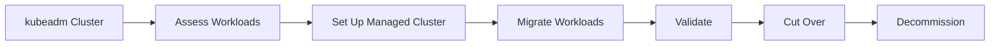

# Migration Guide: kubeadm to Managed Kubernetes

> **Category:** Operations / Migration
> Step-by-step guide for migrating from kubeadm to managed Kubernetes (EKS, GKE, AKS).

## Overview



## kubeadm vs Managed

| Feature | kubeadm | Managed (EKS/GKE/AKS) |
|---------|---------|------------------------|
| **Control plane** | You manage | Provider manages |
| **Upgrades** | You upgrade | Provider upgrades |
| **HA** | You configure | Built-in |
| **Scaling** | You configure | Auto-scaling |
| **Security patches** | You apply | Provider applies |
| **Cost** | Lower (infra only) | Higher (service fee) |
| **Complexity** | High | Low |

## Phase 1: Assessment

### Workload Inventory

```bash
# Export all workloads
kubectl get deployments,statefulsets,daemonsets,jobs,cronjobs -A -o yaml > workloads.yaml

# Export networking
kubectl get services,ingresses,networkpolicies -A -o yaml > networking.yaml

# Export storage
kubectl get persistentvolumes,persistentvolumeclaims,storageclasses -A -o yaml > storage.yaml

# Export RBAC
kubectl get roles,rolebindings,clusterroles,clusterrolebindings -A -o yaml > rbac.yaml

# Export config
kubectl get configmaps,secrets -A -o yaml > config.yaml
```

### Checklist

| Item | Action |
|------|--------|
| Control plane | Document etcd, API server, scheduler config |
| Networking | Document CNI, service CIDR, pod CIDR |
| Storage | Document storage provisioner, StorageClasses |
| RBAC | Document roles, bindings, service accounts |
| Ingress | Document ingress controller, TLS certs |
| Monitoring | Document Prometheus, Grafana, alerting |
| Logging | Document ELK, Loki, or other logging |

## Phase 2: Set Up Managed Cluster

### Create Managed Cluster

```bash
# AWS EKS
eksctl create cluster --name prod --region us-east-1 --nodegroup-name workers --node-type m5.xlarge --nodes 3

# Google GKE
gcloud container clusters create prod --zone us-central1-a --machine-type e2-standard-4 --num-nodes 3

# Azure AKS
az aks create --resource-group myRG --name prod --node-count 3 --node-vm-size Standard_D4s_v3
```

### Configure Access

```bash
# Update kubeconfig
aws eks update-kubeconfig --name prod --region us-east-1
gcloud container clusters get-credentials prod --zone us-central1-a
az aks get-credentials --resource-group myRG --name prod
```

## Phase 3: Migrate Workloads

### 3.1 Migrate Storage

```bash
# Create matching StorageClass
cat <<EOF | kubectl apply -f -
apiVersion: storage.k8s.io/v1
kind: StorageClass
metadata:
  name: gp3
provisioner: ebs.csi.aws.com
parameters:
  type: gp3
  encrypted: "true"
volumeBindingMode: WaitForFirstConsumer
EOF

# Migrate PVCs
kubectl get pvc -A -o yaml | sed 's/storageClassName: old-class/storageClassName: gp3/' | kubectl apply -f -
```

### 3.2 Migrate Networking

```bash
# Migrate Services
kubectl get services -A -o yaml | kubectl apply -f -

# Migrate Ingress
kubectl get ingresses -A -o yaml | kubectl apply -f -

# Migrate NetworkPolicies
kubectl get networkpolicies -A -o yaml | kubectl apply -f -
```

### 3.3 Migrate RBAC

```bash
# Migrate Roles
kubectl get roles -A -o yaml | kubectl apply -f -

# Migrate RoleBindings
kubectl get rolebindings -A -o yaml | kubectl apply -f -

# Migrate ClusterRoles
kubectl get clusterroles -o yaml | kubectl apply -f -

# Migrate ClusterRoleBindings
kubectl get clusterrolebindings -o yaml | kubectl apply -f -
```

### 3.4 Migrate Workloads

```bash
# Export deployments
kubectl get deployments -A -o yaml > deployments.yaml

# Update image references if needed
sed -i 's|myregistry.com/|newregistry.com/|g' deployments.yaml

# Apply to managed cluster
kubectl apply -f deployments.yaml
```

## Phase 4: Validate

### Validation Checklist

| Check | Command |
|-------|---------|
| Pods running | `kubectl get pods -A` |
| Services reachable | `kubectl get svc -A` |
| Ingress working | `kubectl get ingress -A` |
| Storage bound | `kubectl get pvc -A` |
| RBAC working | `kubectl auth can-i --list` |
| Logs flowing | `kubectl logs -f <pod>` |
| Metrics available | `kubectl top pods -A` |

### Load Testing

```bash
# Run load test
kubectl run loadtest --rm -it --image=loadtest -- /loadtest -c 100 -n 60 http://<service>

# Monitor metrics
kubectl top pods -A --sort-by=cpu
```

## Phase 5: Cut Over

### DNS Migration

```bash
# Update DNS to point to managed cluster
# Option 1: Update Ingress
kubectl annotate ingress my-ingress external-dns.alpha.kubernetes.io/hostname=app.example.com

# Option 2: Update Route53/Cloud DNS
aws route53 change-resource-record-sets --hosted-zone-id Z123 --change-batch file://dns.json
```

### Traffic Switch

```bash
# Blue-green: Switch traffic
kubectl patch svc my-service -p '{"spec":{"selector":{"version":"v2"}}}'

# Canary: Gradually shift
kubectl patch virtualservice my-service -p '{"spec":{"http":[{"route":[{"destination":{"host":"my-service","subset":"v1"},"weight":90},{"destination":{"host":"my-service","subset":"v2"},"weight":10}]}]}}'
```

## Phase 6: Decommission

```bash
# Scale down kubeadm workloads
kubectl scale deployment <name> --replicas=0

# Delete resources
kubectl delete namespace <old-namespace>

# Decommission kubeadm cluster
kubeadm reset -f
sudo apt-get purge kubeadm kubelet kubectl
sudo rm -rf /etc/kubernetes /var/lib/kubelet /var/lib/etcd
```

## Common Issues

| Issue | Cause | Fix |
|-------|-------|-----|
| Storage not migrating | Different StorageClass | Create matching StorageClass |
| Networking issues | Different CNI | Update NetworkPolicies |
| RBAC errors | Different API groups | Update role bindings |
| DNS not resolving | External DNS not configured | Set up external-dns |

## Best Practices

| Phase | Practice |
|-------|----------|
| Pre-migration | Backup all resources |
| Migration | Migrate one namespace at a time |
| Post-migration | Test all workloads thoroughly |
| Cleanup | Remove kubeadm cluster after validation |

## Related

- [kubeadm Bootstrap](kubeadm.md)
- [EKS Deep Dive](../09-cloud-integrations/eks-deep-dive.md)
- [GKE Deep Dive](../09-cloud-integrations/gke-deep-dive.md)
- [AKS Deep Dive](../09-cloud-integrations/aks-deep-dive.md)
