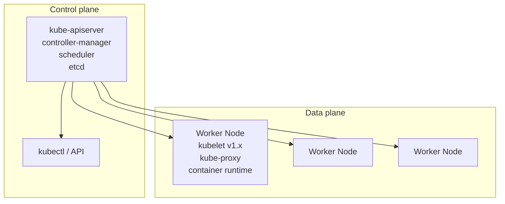

# Cluster & Component Upgrades

> **Category:** Cluster Operations

Upgrading Kubernetes is **upgrade the control plane first, then the Nodes**, and you must respect the **version skew policy**. The same pattern applies to add-ons (CNI, CSI, Ingress controllers, Helm charts) — but each has its own upgrade semantics.

## Version Skew Policy (the hard rule)

> kubelet **must not be newer than** the API server by more than one minor version.

| Component | Relationship |
|-----------|--------------|
| `kube-apiserver` | The highest-version component — **controls the cluster API surface**. |
| `kubelet` | Must be within **one minor version** of the API server (newer or older). |
| `kubectl` | Must be within **one minor version** of the API server. |

So during an upgrade, the API server is bumped to v1.x+1, the kubelets follow to v1.x+1 — never skip a minor version on the kubelet (the kubelet doesn't support being more than one ahead/behind).

## Architecture: Control Plane vs Data Plane



You upgrade:

1. **Control plane** components (etcd → kube-apiserver → controller-manager → scheduler).
2. **Worker Node** pools (one Node at a time, draining Pods first).

## Managed vs. Self-Managed

| Approach | How upgrade works |
|----------|--------------------|
| **Managed** (EKS/AKS/GKE) | Click "upgrade version" in the console/CLI → the provider drains and upgrades Nodes. You still `kubectl drain` + re-apply workloads if stateful. |
| **Self-managed** (kubeadm, RKE, K3s) | `kubeadm upgrade apply v1.x` for the control plane, then `kubeadm upgrade node` per worker. |
| **Metal / on-prem** | OS package updates + kubelet binary + control-plane flags. |

The **principles** are the same; the **commands** differ.

## kubeadm Upgrade Flow

### Control-plane node (HA or single)

```bash
# 1. Upgrade the API object + coreDNS:
kubeadm upgrade apply v1.30.0
# 2. Upgrade kubelet on the control-plane node:
apt-mark unhold kubelet && apt-get update && apt-get install -y kubelet=1.30.0-00
# 3. Restart kubelet:
systemctl daemon-reload && systemctl restart kubelet
apt-mark hold kubelet
```

If using stacked etcd (`kubeadm`), this upgrades etcd too. If using **external etcd** (production HA), you upgrade etcd first (separate from the control plane).

### Worker node

```bash
# On the worker (after control plane is done):
curl -s "https://packages.cloud.google.com/pks/....setup" | bash   # the same repo as the control plane
kubeadm upgrade node          # updates the kubelet binary + kube-proxy image
systemctl restart kubelet
# OR in automation:
apt-mark unhold kubelet && apt-get update && apt-get install -y kubelet=1.30.0-00 && apt-mark hold kubelet
systemctl restart kubelet
```

### Zero-downtime worker drain

```bash
# From the control plane, per node:
kubectl drain node worker-2 --ignore-daemonsets --delete-local-data --force
# then upgrade the node (or let an autoscaler replace it)
kubectl uncordon node worker-2
```

## Pre-Upgrade Checklist

Before anything:

1. **Back up etcd.**
   ```bash
   ETCDCTL_API=3 etcdctl --endpoints=https://127.0.0.1:2379 \
     --cacert=/etc/kubernetes/pki/etcd/ca.crt \
     --cert=/etc/kubernetes/pki/etcd/server.crt \
     --key=/etc/kubernetes/pki/etcd/server.key \
     snapshot save /tmp/snapshot.db
   ```
2. **Check skew against add-ons**: kube-proxy, CNI, CSI, ingress-nginx, cert-manager, metrics-server — each has its own supported version range.
3. **Verify capacity**: a drained node means its workloads move elsewhere—make sure the remaining Nodes have headroom.
4. **Freeze writes** to external stores (etcd, DBs) where possible.
5. **Read the release notes** for deprecated APIs / breaking changes.

### Backup + restore test

```bash
# Capture the state:
kubectl get all -A -o yaml > snapshot-1.30.yaml
# Test the restore path on a throwaway cluster — upgrade is a one-way door,
# restore is the "undo".
```

## Add-on Upgrade (the messy part)

After the cluster is upgraded, **each add-on** has its own upgrade path:

| Add-on | Upgrade path |
|--------|--------------|
| `kube-proxy` | Bundled with kubelet; auto-upgraded via DaemonSet on node upgrade, or `kubectl apply -f` the addon manifest. |
| CNI (Calico/Cilium/Flannel) | Upgrade CRDs + controller first, then DaemonSet manifests. Respecting the CNI's own skew window. |
| CSI drivers | Usually versioned per Kubernetes. Upgrade the controller Deployment, then the node DaemonSet. |
| Ingress (nginx/traefik) | Helm chart upgrade (`helm upgrade`), watching for `ingressClassName` renames. |
| CoreDNS | `kubectl apply -f` the new manifest after the API bump (it's a core addon — do NOT skip it). |
| Cert-manager | `kubectl apply -f <cert-manager-manifest>` — it ships its own CRDs, so apply `crds/` before the chart. |

### Cert-manager upgrade note

cert-manager is sensitive to CRD schema changes:
```bash
# Apply CRDs FIRST (they're versioned):
kubectl apply -f https://github.com/cert-manager/cert-manager/releases/download/v1.14.0/cert-manager.crds.yaml
kubectl apply -f https://github.com/cert-manager/cert-manager/releases/download/v1.14.0/cert-manager.yaml
```
Skipping the CRDs causes `Upgrade` CRDs to be silently incompatible and the controller can't read Issuers.

## Blue/Green + Canary (avoid the upgrade risk entirely)

Some teams treat upgrades as **"replace the control plane"**:

1. Build a **new (green)** cluster at the target version.
2. Validate against a copy (or a live canary of traffic).
3. **Flip traffic** by repointing Ingress/ExternalDNS to the green cluster.
4. Decommission blue.

Works great in the cloud (EKS blue/green via Terraform, GKE `gcloud container clusters create` + migrate). Less feasible on-prem because the control plane IPs are usually fixed.

## Rollback

If an upgrade breaks:

1. **etcd restore** to the last snapshot (disruptive — you lose writes after the snapshot).
2. **Component rollback** for a managed control plane (cloud providers allow downgrading API server versions for a window).
3. **Node rollback** is rarely worth it — drain + reprovision the Node is faster.

The **release itself is immutable** — you can't undo a kubeadm upgrade in place; you restore or you provision a fresh cluster.

## Common Issues

| Symptom | Likely cause |
|---------|--------------|
| `kube-apiserver` won't start after upgrade | Old static-pod flags (e.g., removed flag like `--runtime-config`) in `/etc/kubernetes/manifests/kube-apiserver.yaml` → kubelet recreates the pod and it crashesLoop. |
| `kubelet` on a node stays at the old version | `apt-mark hold kubelet` was re-applied and the worker upgrade step was skipped, OR kubelet service was never restarted. |
| Add-on crashes (CNI/CSI) | Add-on CRDs were not upgraded alongside, so the controller can't read the new resource version. |
| Workloads can't schedule post-upgrade | New taint (`node.kubernetes.io/unschedulable`/`beta.kubernetes.io/arch`) or a PodDisruptionBudget prevents eviction; `kubectl get pvc` shows PVCs bound to `WaitForFirstConsumer` on the drained node. |

## Interview Questions

**Q: What is the Kubernetes version skew policy, and why does it matter for upgrades?**
A: kubelet, API server, and kubectl must be **within one minor version** of each other. Specifically: (1) kube-apiserver can be newer than kubelet by one minor; (2) kubectl can be one minor ahead/behind the API server. It matters because a kubelet two versions ahead of the API can't read new fields, and a kubelet two behind can't talk to the newer API — so you upgrade control plane first, then Nodes.

**Q: When you `kubectl drain` a node during an upgrade, you see "Pod is excluded". Why?**
A: The `--ignore-daemonsets` flag is required because **DaemonSets** are explicitly tied to a Node's existence. By default `drain` would block on them; with the flag, the DaemonSet Pods are left alone (they're managed by the DS controller and rescheduled by the node's new kube-proxy when it comes up). Without the flag the drain hangs.

**Q: What's the #1 thing you must do before any cluster upgrade?**
A: Take an **etcd snapshot** (`etcdctl snapshot save`) AND run a restore drill into a scratch cluster. The control-plane upgrade is otherwise a one-way door; etcd restore is your "undo". You also read release notes for deprecated API versions (e.g., apps/v1 vs extensions/v1beta1) which is a common silent upgrade failure.

**Q: How do you upgrade CoreDNS on a kubeadm cluster?**
A: CoreDNS is a **core addon** — you don't skip it. After bumping the API server, `kubectl apply -f` the new `coredns` manifest (or `kubeadm upgrade apply` will print a notice). The new manifest pins the addon version compatible with the cluster. You do NOT treat it as an arbitrary chart.

**Q: Why can't you just upgrade the kubelet on every node in parallel?**
A: The **version skew**: you can't move kubelet ahead of the API server by more than a minor. So the API server must be on the target version before the kubelets can be. Additionally, `drain` + Pod eviction is per-Node (one at a time) to preserve PodDisruptionBudgets — draining 30 Nodes "in parallel" could violate a max-unavailable budget and evict too many Pods.

**Q: What's the difference between `kubeadm upgrade apply` and `kubeadm upgrade node`?**
A: `kubeadm upgrade apply` moves the **control plane** to the new version (it upgrades the static pods in `/etc/kubernetes/manifests`). `kubeadm upgrade node` runs on each **worker** to align the kubelet, kube-proxy, and the node's local certificates. You use `apply` once on the leader, then `node` on each worker (or let an auto-provisioner do it).

## Related Resources

- [Cluster Operations Overview](README.md)
- [etcd Backup/DR](backup-restore.md)
- [Workloads — Deployments](../03-workloads/deployments.md)
- [Helm](../10-package-management/helm.md)
- [Troubleshooting](../14-troubleshooting/troubleshooting-patterns.md)
