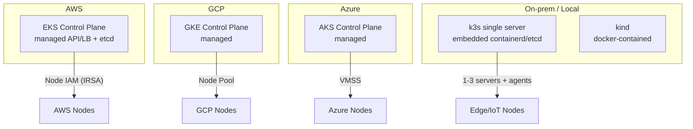

# 09. Cloud Integrations

> **Category:** Cluster Operations / Cloud Providers

Running Kubernetes on **managed cloud** providers (EKS, GKE, AKS) gives you the control plane as a service, while a **lightweight distro** (k3s, kind, minikube) is for local/edge. This category explains the managed-provider model, what each provider manages, and the ops implications.

## Core Concepts

| File | Topic |
|------|-------|
| [eks.md](eks.md) | EKS — node AMIs/AL2, managed add-ons, IRSA, IAM for service accounts |
| [gke.md](gke.md) | GKE — node pools, Autopilot, node auto-provisioning, GKE ingress |
| [aks.md](aks.md) | AKS — VMSS, managed identity (MSI), AAD integration |
| [k3s.md](k3s.md) | k3s/k0s/kind/minikube — lightweight + single-binary clustering |

## Architecture



## Shared Model Across Providers

| Concern | Managed (EKS/GKE/AKS) | Lightweight (k3s/kind) |
|---------|------------------------|------------------------|
| Control plane | Fully managed (+ patching, HA) | You run it (k3s embeds it) |
| Node pools | Versioned AMIs / Images + autoscaling groups | Single binary + sqlite/etcd |
| Identity | Cloud IAM (IRSA/MSI/GKE Workload Identity) | Local kubeconfig / default SA |
| Cost | Control-plane hourly; nodes charged separately | Free binary (single node) |
| Use | Production clusters | Dev, edge, CI runners |
| Upgrade | Click/version in provider UI or eksctl | `k3s-uninstall.sh` + reinstall |

## Key Questions

- **What does the provider manage vs. what do I?** They manage the API server, etcd, and scheduler HA. YOU manage the Pods, the node images, and (sometimes) the CNI.
- **What is IAM for Service Accounts (IRSA)?** AWS binds a Kubernetes SA to an IAM role via an OIDC provider — so a Pod can assume an IAM role and call `s3`/`rds` **without** embedding AWS keys. GKE calls this Workload Identity; Azure calls it Managed Identity (MSI).
- **What is a managed add-on?** The provider runs/maintains a DaemonSet/Service for you (e.g., EKS `vpc-resource-controller`, GKE's `metrics-server`, AKS `azure-network-policy`). You enable via the console/CLI, not `kubectl apply`.

## Common Patterns

- **Node groups / pools**: EKS `NodeGroup` (or `Managed Node Group`), GKE `NodePool`, AKS `AgentPool`. Use Spot/Low-priority instances for stateless workloads.
- **Blue/green upgrades**: providers offer cluster Auto-Upgrade with surge settings; the safer pattern is **provision a new cluster, migrate**, then decommission.
- **Cluster Autoscaler**: each provider ships it (`cluster-autoscaler` with the provider's ASG/VMSS integration) — wire up via Helm or the provider's own autoscaling group.

## Commands (AWS-focused)

```bash
# eksctl — the blessed way:
eksctl create cluster --name prod --region us-west-2 --version 1.31 \
  --nodegroup-name ng --node-type m6i.large --nodes 3 --nodes-max 9 \
  --managed

# Enable IRSA (OIDC provider):
eksctl utils associate-iam-oidc-provider --name prod --region us-west-2

# Create an IAM role for a SA, then annotate:
eksctl create iamserviceaccount --cluster prod --namespace myapp \
  --name my-sa --attach-policy-arn arn:aws:iam::aws:policy/AmazonS3ReadOnlyAccess \
  --approve --override-existing-serviceaccounts
# Then in the Pod: serviceAccountName: my-sa  -> Pod gets AWS creds via IRSA.

# List node groups, upgrade the control plane:
eksctl get nodegroup --cluster prod
eksctl upgrade cluster --name prod --version 1.31
```

## When NOT to use managed

- You need **admin/etcd access** you can't get via the provider.
- You need a **custom kernel module / CNI** the provider's node image disallows.
- **Compliance** forbids the provider's managed control plane (you must run etcd/PKI yourself).
- Cost: managed control planes charge hourly even at idle (for tiny dev clusters, k3s wins).

## Interview Questions

**Q: How does IAM integration work for Pods on EKS vs. GKE vs AKS?**
A: All three bind a K8s ServiceAccount to a cloud IAM principal and project short-lived credentials into the Pod: AWS = IRSA (OIDC provider + `eksctl create iamserviceaccount`; Pod gets AWS creds via the AWS SDK chain), GCP = Workload Identity (`GKE` annotation mapping SA to a GCP SA), Azure = AAD Workload Identity / MSI (pod identity). The Pod code then calls cloud APIs **without** baked-in keys.

**Q: What is a "managed add-on", and why can't I just helm-install everything?**
A: A managed add-on is operator/run by the provider's control plane (e.g., EKS-managed CoreDNS, kube-proxy, vpc-resource-controller, ALB controller). They're patched in lock-step with the control-plane version. You can install the same components yourself via Helm, but then version-skew + upgrade sequencing are your problem; managed add-ons just keep working across control-plane upgrades.

**Q: When would you choose k3s over EKS?**
A: k3s when you want a single-binary, low-footprint cluster: edge, IoT, CI runners, air-gapped labs, or "Kubernetes on a laptop". EKS when you need multi-AZ HA, IAM integration, managed upgrades, and a production SLO you can hand to a provider. You can run k3s at the edge and join it upstream to an EKS/GKE control plane if you need hybrid.

## Related Resources
- [Cluster Operations](../08-cluster-operations/upgrades.md)
- [Backup & Restore](../08-cluster-operations/backup-restore.md)
- [Troubleshooting](../14-troubleshooting/README.md)
- [Security](../06-security/README.md)
- [Companies Using Kubernetes](../companies-using-kubernetes.md)
