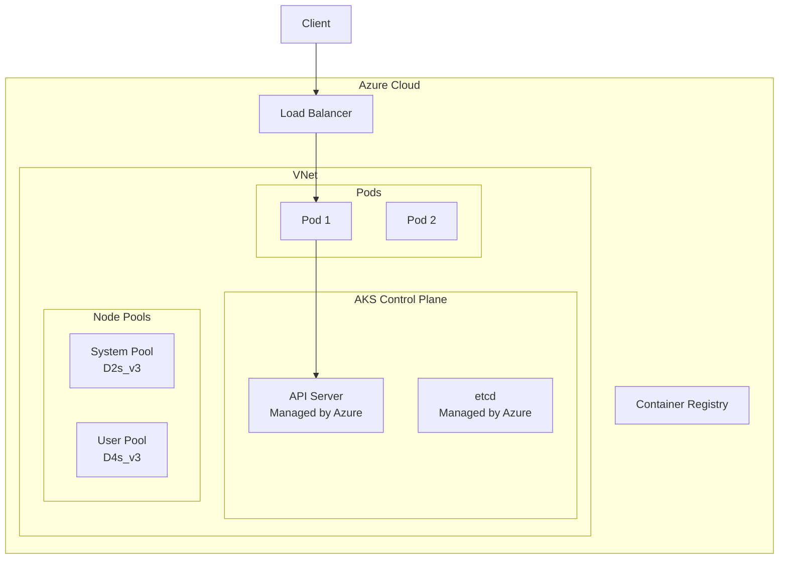

# Microsoft AKS Deep Dive

> **Category:** Cloud Integration / Azure
> AKS = Azure Kubernetes Service — Azure's managed Kubernetes control plane.

## What is AKS?

AKS runs the K8s control plane managed by Azure (free control plane). You manage node pools (or use Virtual Nodes for serverless).

| Component | Azure Responsibility | Your Responsibility |
|-----------|---------------------|---------------------|
| etcd | Managed | — |
| kube-apiserver | Managed | — |
| kube-scheduler | Managed | — |
| kube-controller-manager | Managed | — |
| Worker nodes | — | Provision & manage |
| kubelet | — | Installed on nodes |
| CNI plugin | — | Azure CNI or kubenet |

## Architecture



## Cluster Creation

### Azure CLI

```bash
# Create resource group
az group create --name my-rg --location eastus

# Create AKS cluster
az aks create \
  --resource-group my-rg \
  --name my-cluster \
  --node-count 3 \
  --node-vm-size Standard_D2s_v3 \
  --enable-addons monitoring \
  --enable-managed-identity \
  --generate-ssh-keys

# Get credentials
az aks get-credentials --resource-group my-rg --name my-cluster

# Verify
kubectl get nodes
```

### Terraform

```hcl
resource "azurerm_kubernetes_cluster" "my" {
  name                = "my-cluster"
  location            = "eastus"
  resource_group_name = azurerm_resource_group.my.name
  dns_prefix          = "mycluster"

  default_node_pool {
    name       = "default"
    node_count = 3
    vm_size    = "Standard_D2s_v3"
    enable_auto_scaling = true
    min_count  = 2
    max_count  = 10
  }

  identity {
    type = "SystemAssigned"
  }

  addon_profile {
    oms_agent {
      enabled = true
    }
  }
}
```

## Azure CNI vs Kubenet

| Feature | Azure CNI | Kubenet |
|---------|-----------|---------|
| **Pod IP range** | VNet IP range | Overlay (smaller range) |
| **Network policy** | Calico | Calico |
| **Performance** | Better (direct VNet) | Good (NAT) |
| **IP usage** | More IPs per node | Fewer IPs per node |
| **Best for** | Large clusters, VNet integration | Small clusters, IP conservation |

## Azure AD Integration

```bash
# Create Azure AD app
az ad app create --display-name my-app

# Create service principal
az ad sp create-for-app --id <app-id>

# Bind to AKS
az aks update-credentials --resource-group my-rg --name my-cluster \
  --client-id <client-id> --client-secret <client-secret>
```

## Workload Identity (Azure AD)

**Workload Identity** maps K8s ServiceAccounts to Azure AD identities.

```bash
# Enable workload identity
az aks update --resource-group my-rg --name my-cluster \
  --enable-workload-identity

# Create managed identity
az identity create --name my-identity --resource-group my-rg

# Bind identity to K8s SA
az identity federated-credential create \
  --name my-fic \
  --identity-name my-identity \
  --resource-group my-rg \
  --issuer <aks-oidc-url> \
  --subject system:serviceaccount:default:my-sa

# Annotate K8s SA
kubectl annotate serviceaccount my-sa \
  azure.workload.identity/client-id=<identity-client-id>
```

## Azure Load Balancer

```yaml
# LoadBalancer Service (provisions Azure LB)
apiVersion: v1
kind: Service
metadata:
  name: app
  annotations:
    # Azure-specific annotations
    service.beta.kubernetes.io/azure-load-balancer-internal: "true"
spec:
  type: LoadBalancer
  selector:
    app: app
  ports:
  - port: 80
    targetPort: 80
```

## Ingress (Application Gateway)

```yaml
# Application Gateway Ingress Controller (AGIC)
apiVersion: networking.k8s.io/v1
kind: Ingress
metadata:
  name: app
  annotations:
    kubernetes.io/ingress.class: azure/application-gateway
spec:
  rules:
  - host: app.example.com
    http:
      paths:
      - path: /
        pathType: Prefix
        backend:
          service:
            name: app
            port:
              number: 80
```

## AKS Addons

| Addon | Purpose | Install |
|-------|---------|---------|
| **Azure CNI** | Pod networking (VNet) | Default |
| **CoreDNS** | DNS resolution | Default |
| **kube-proxy** | Service load balancing | Default |
| **Azure Monitor** | Logs + metrics | `--enable-addons monitoring` |
| **Azure Policy** | OPA/Gatekeeper integration | `az aks enable-addons` |
| **Azure Key Vault** | Secret management | `az aks enable-addons` |
| **Cert Manager** | TLS certificates | Helm |
| **Ingress** | NGINX or App Gateway | Helm |

## Upgrades

```bash
# Check available upgrades
az aks get-upgrades --resource-group my-rg --name my-cluster

# Upgrade control plane + node pools
az aks upgrade --resource-group my-rg --name my-cluster --kubernetes-version 1.29.0

# Upgrade node pool only
az aks nodepool upgrade --resource-group my-rg --cluster-name my-cluster \
  --name default --kubernetes-version 1.29.0
```

## Cost Optimization

| Strategy | Implementation |
|----------|----------------|
| **Free control plane** | AKS control plane is free |
| **Spot nodes** | 90% cheaper for fault-tolerant workloads |
| **Right-sizing** | VPA recommendations |
| **Cluster Autoscaler** | Scale nodes based on demand |
| **Virtual Nodes** | Serverless pods (ACI) for burst |
| **Reserved instances** | 1-year/3-year commitment discounts |

## Related

- [AKS Overview](./aks.md)
- [EKS](./eks-deep-dive.md)
- [GKE](./gke-deep-dive.md)
