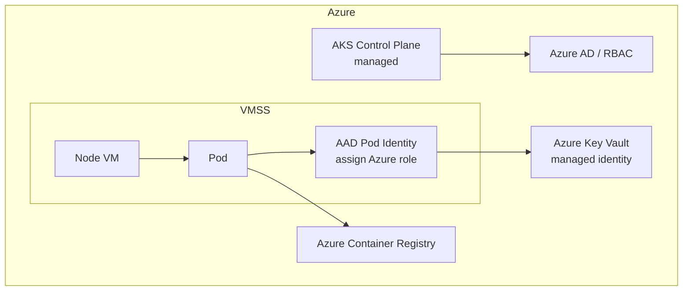

# AKS (Azure Kubernetes Service)

> **Category:** Cloud Integrations

**AKS** is Microsoft's managed Kubernetes. The control plane is managed; you pay per managed control-plane VM (free in most regions now) + per-agent VM. AKS integrates with **Azure AD** for cluster identity, **Managed Identities (MSI)** for Pod→Azure API access (the AAD Pod Identity / `AzureIdentity` model), and **Azure Monitor** for metrics/logs.

## Why It Matters

- **Azure AD integration**: cluster admins log in via `az aks get-credentials --admin` or RBAC via AAD.
- **Managed identity (MSI)**: a Pod gets an Azure role assigned (via `AzureIdentity` + `AADPodIdentity`/`aad-pod-identity` CSI driver) and calls Azure REST APIs without secrets.
- **VMSS**: nodes live in a Virtual Machine Scale Set (uniform or flexible orchestration).
- **Azure CNI**: each Pod gets a Node-based or VNet IP (no overlay if you use "Kubenet" + outbound.

## Architecture



## Installation / Bootstrap (`az`)

```bash
# Create a cluster with a default node pool:
az aks create -g rg-prod -n aks-prod --generate-ssh-keys \
  --node-vm-size Standard_D4s_v3 --node-count 3 \
  --enable-aad --attach-acr <acrName>.azurecr.io

# Enable a managed identity + cluster autoscaler:
az aks nodepool add -g rg-prod --cluster-name aks-prod \
  --name np-spot --priority Spot --eviction-rate 5 \
  --enable-cluster-autoscaler --min-count 0 --max-count 5 \
  --node-vm-size Standard_D4s_v3

# Get credentials:
az aks get-credentials -g rg-prod -n aks-prod --admin
```

## AAD Pod Identity vs. `AzureWorkloadIdentity` (newer)

| Mechanism | Status | Notes |
|-----------|--------|-------|
| `aad-pod-identity` (MI + NMI) | Classic, being superseded | Needs a NMI DaemonSet to intercept token requests |
| `azure-workload-identity` (Azure AD Workload Identity) | **Recommended** | OIDC issuer + federated identity credential (like IRSA for Azure) |

### Workload Identity (modern)

```bash
# 1. Enable OIDC + workload identity:
az aks update -g rg-prod -n aks-prod \
  --enable-oidc --enable-workload-identity

# 2. Create an Azure AD app + federated credential for the SA:
az ad app create --display-name "k8s-myapp"
# federated credential: issuer = the AKS OIDC issuer, subject = system:serviceaccount:default:my-sa

# 3. Annotate the K8s SA:
kubectl apply -f - <<'Y'
apiVersion: v1
kind: ServiceAccount
metadata:
  name: my-sa
  annotations:
    azure.workload.identity/client-id: <app-client-id>
Y
```

## Azure CNI vs. Kubenet

| CNI | How it works | When to use |
|-----|--------------|-------------|
| **Azure CNI** | Each Pod gets a real **VNet IP** (IP-per-Pod) from the Node's subnet. | You want Pod IPs routable in the VNet (on-prem VPN/ExpressRoute), or to apply NSGs per Pod. |
| **Kubenet** | Nodes get VNet IPs; Pods get an overlay CIDR (`10.x`). | Simpler setup, fewer IPs used; you lose per-Pod NSGs. |

## Storage on AKS

- **Azure Disk** (`disk.csi.azure.com`): per-Pod OS/Data disk (zonal; requires `WaitForFirstConsumer`).
- **Azure Files** (`file.csi.azure.com`): SMB/NFS shared file — RWX across Nodes.
- **Blob CSI**: expose Azure Blob containers as volumes.

```yaml
apiVersion: storage.k8s.io/v1
kind: StorageClass
metadata: { name: azurefile }
provisioner: file.csi.azure.com
volumeBindingMode: Immediate
allowVolumeExpansion: true
parameters:
  shareName: k8s-share
  azureStorageAccount: <storage-account>
```

## Common Issues

| Symptom | Cause | Fix |
|---------|-------|-----|
| Pod stuck `ContainerCreating` / `node unavailable` | VMSS out of capacity in the AZ for that SKU | Use another AZ, or a different VM size; add a new node pool |
| `AADSTS` / token errors | Wrong federated credential issuer or subject | Validate `az aks show --query "oidcIssuer"` + the SA subject name |
| ACR pull `denied` | AKS-managed identity lacks AcrPull | `az aks update -n <name> -g <rg> --attach-acr <acr>` |
| LoadBalancer stuck `pending` | No Public IP quota / SKUs mismatch | Check the `service.beta.kubernetes.io/azure-load-balancer-internal` annotation + Standard LB quota |

## Commands Cheatsheet

```bash
az aks get-credentials -g rg-prod -n aks-prod
kubectl get nodes -L agentpool,kubernetes.azure.com/agentpool
az aks nodepool list -g rg-prod --cluster-name aks-prod
kubectl get ingress -o wide
az monitor aks enable-addons -a monitoring   # Azure Container Insights
```

## Interview Questions

**Q: What is a managed identity / workload identity on AKS?**
A: Azure AD Workload Identity — AKS exposes an OIDC issuer; you create an Azure AD App Registration with a **federated credential** (issuer + subject = the K8s SA), then annotate the K8s `ServiceAccount` with `azure.workload-identity/client-id`. The Pod gets an Azure access token (OIDC token exchanged for an AAD token) and calls Azure APIs without secrets — Azure's equivalent of EKS IRSA.

**Q: Azure CNI vs. Kubenet — what's the cost trade-off?**
A: Azure CNI uses one VNet IP **per Pod** (from your subnet) → you consume a lot of IPs and need IP-space planning, but Pods are routable in the VNet. Kubenet uses an overlay CIDR → fewer VNet IPs, simpler, but you need a Service `type: LoadBalancer` and lose per-Pod NSGs. Pick CNI if you need Pod-VNet integration; Kubenet if you just need cluster networking.

**Q: Why is my AKS node pool out of capacity?**
A: AKS provisions VMs from an Azure **compute SKU** in a specific **Availability Zone**. If that SKU is sold out in the AZ, new Pods can't schedule. Fix: diversify node pools across SKUs and zones, or enable the cluster autoscaler to fall back to a different pool.

## Related Resources
- [Cloud Integrations Overview](README.md)
- [EKS](eks.md) · [GKE](gke.md)
- [Networking](../04-networking/README.md)
- [Secrets](../06-security/secrets.md)
- [Companies Using Kubernetes](../companies-using-kubernetes.md)
