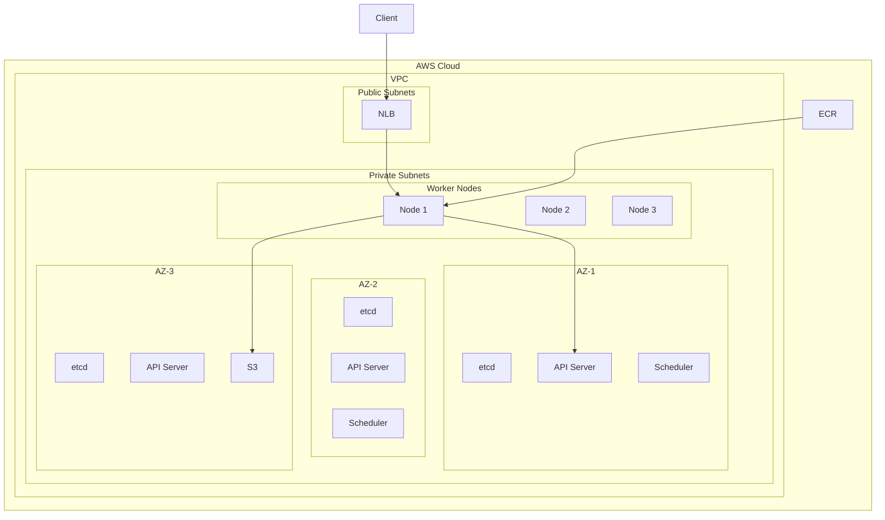

# Amazon EKS Deep Dive

> **Category:** Cloud Integration / AWS
> EKS = Elastic Kubernetes Service — AWS's managed Kubernetes control plane.

## What is EKS?

EKS runs the K8s control plane across 3 AWS AZs, managed by AWS. You manage the worker nodes (or use Fargate for serverless pods).

| Component | AWS Responsibility | Your Responsibility |
|-----------|-------------------|---------------------|
| etcd | Managed (3 AZs) | — |
| kube-apiserver | Managed (3 AZs) | — |
| kube-scheduler | Managed | — |
| kube-controller-manager | Managed | — |
| Worker nodes | — | Provision & manage |
| kubelet | — | Installed on nodes |
| CNI plugin | — | AWS VPC CNI (installed) |

## Architecture



## Cluster Creation

### Option A: eksctl (Recommended)

```bash
# Install eksctl
brew install eksctl

# Create cluster (creates VPC, subnets, nodes)
eksctl create cluster \
  --name my-cluster \
  --region us-east-1 \
  --nodegroup-name workers \
  --node-type t3.medium \
  --nodes 3 \
  --nodes-min 2 \
  --nodes-max 5 \
  --managed

# Wait ~15 min for cluster to be ready
kubectl get nodes
```

### Option B: Terraform

```hcl
module "eks" {
  source  = "terraform-aws-modules/eks/aws"
  version = "~> 19.0"

  cluster_name    = "my-cluster"
  cluster_version = "1.29"

  vpc_id     = "vpc-xxxxx"
  subnet_ids = ["subnet-xxx", "subnet-yyy", "subnet-zzz"]

  eks_managed_node_groups = {
    workers = {
      min_size     = 2
      max_size     = 5
      desired_size = 3
      instance_types = ["t3.medium"]
    }
  }
}
```

### Option C: Terraform + EKS Addons

```hcl
resource "aws_eks_addon" "vpc_cni" {
  cluster_name = module.eks.cluster_name
  addon_name   = "vpc-cni"
}

resource "aws_eks_addon" "coredns" {
  cluster_name = module.eks.cluster_name
  addon_name   = "coredns"
}

resource "aws_eks_addon" "kube_proxy" {
  cluster_name = module.eks.cluster_name
  addon_name   = "kube-proxy"
}

resource "aws_eks_addon" "ebs_csi" {
  cluster_name = module.eks.cluster_name
  addon_name   = "aws-ebs-csi-driver"
}
```

## Networking (VPC CNI)

EKS uses **AWS VPC CNI** — each Pod gets a real VPC IP address (ENI).

```bash
# Check CNI config
kubectl -n kube-system get configmap amazon-vpc-cni -o yaml

# Check Pod IPs
kubectl get pods -o wide
# Each pod has a 10.x.x.x IP from the VPC subnet
```

| Feature | Behavior |
|---------|----------|
| Pod IP | Real VPC IP (ENI) |
| Network policy | Calico or VPC CNI network policy |
| Load balancing | NLB (L4) or ALB (L7) via AWS Load Balancer Controller |
| DNS | CoreDNS on managed nodes |

## IAM Integration (IRSA)

**IAM Roles for Service Accounts** — pods assume IAM roles without storing AWS keys.

```bash
# Create IRSA for a pod
eksctl create iamserviceaccount \
  --name my-sa \
  --namespace default \
  --cluster my-cluster \
  --attach-policy-arn arn:aws:iam::policy/AmazonS3ReadOnlyAccess \
  --approve

# Deploy pod with the service account
kubectl run my-pod --image=amazon/aws-cli --serviceaccount=my-sa -- aws s3 ls
```

## AWS Load Balancer Controller

```bash
# Install AWS Load Balancer Controller (replaces default NLB behavior)
helm repo add eks https://aws.github.io/eks-charts
helm install aws-load-balancer-controller eks/aws-load-balancer-controller \
  --namespace kube-system \
  --set clusterName=my-cluster

# Create Ingress that provisions an ALB
cat <<EOF | k apply -f -
apiVersion: networking.k8s.io/v1
kind: Ingress
metadata:
  name: app
  annotations:
    kubernetes.io/ingress.class: alb
    alb.ingress.kubernetes.io/scheme: internet-facing
    alb.ingress.kubernetes.io/target-type: ip
spec:
  rules:
  - host: app.example.com
    http:
      paths:
      - path: /
        pathType: Prefix
        backend:
          service:
            name: app
            port:
              number: 80
```

## EKS Addons

| Addon | Purpose | Install |
|-------|---------|---------|
| **VPC CNI** | Pod networking (ENI per pod) | Default |
| **CoreDNS** | DNS resolution | Default |
| **kube-proxy** | Service load balancing | Default |
| **EBS CSI Driver** | Persistent EBS volumes | `eksctl create addon` |
| **EFS CSI Driver** | Persistent EFS volumes | `eksctl create addon` |
| **Load Balancer Controller** | ALB/NLB provisioning | Helm |
| **Metrics Server** | HPA metrics | `kubectl apply` |
| **Cluster Autoscaler** | Node scaling | Helm |

## Upgrades

```bash
# Check current version
eksctl get cluster --name my-cluster

# Upgrade control plane
eksctl upgrade cluster --name my-cluster

# Upgrade node group
eksctl upgrade nodegroup --name workers --cluster my-cluster

# Update add-ons
eksctl update addon --name vpc-cni --cluster my-cluster
```

## Cost Optimization

| Strategy | Implementation |
|----------|----------------|
| **Spot instances** | Use `t3.medium` spot for worker nodes |
| **Right-sizing** | VPA to right-size pod requests |
| **Cluster Autoscaler** | Scale nodes based on pod demand |
| **Fargate** | Serverless pods (no nodes to manage) |
| **Graviton** | Use `t4g.medium` (ARM) for 20% cost savings |

## Related

- [EKS Overview](./eks.md)
- [GKE](./gke-deep-dive.md)
- [AKS](./aks-deep-dive.md)
- [Incident Case Studies](../14-troubleshooting/incidents/README.md)