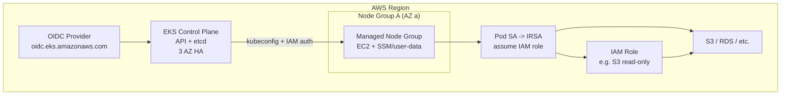

# EKS (Elastic Kubernetes Service)

> **Category:** Cloud Integrations

**EKS** is AWS's managed Kubernetes: the control plane (API server, etcd, scheduler, HA across 3 AZs) is fully managed and charges hourly; you pay for the **managed node groups** (EC2) separately. EKS integrates tightly with IAM via **IRSA**, IAM roles for service accounts.

## Why It Matters

- Zero-ops control plane + automatic version patching (minor version auto-upgrade opt-in).
- Each cluster gets a dedicated etcd (isolated) — no noisy-neighbor control plane.
- **IRSA**: a Pod's ServiceAccount gets an IAM role → no AWS keys in images.
- **Managed add-ons** keep CoreDNS/kube-proxy/vpc-resource-controller current.
- **Fargate profiles** for serverless Pods (per-Pod compute billing, no nodes to manage).

## Architecture



- The control plane endpoints only over **private** network paths unless you enable public access.
- Nodes register via a **node bootstrap script** (`/etc/eks/bootstrap.sh`) that joins them using a cluster API token; you rarely touch it on **managed** node groups.
- The **VPC CNI** (`amazon-vpc-cni`) assigns each Pod an **ENI IP** from the Node's subnet — Pods are real AWS ENIs, so security groups and AWS networking apply directly.

## Installation / Bootstrap (`eksctl`)

```bash
# Install eksctl (the blessed CLI):
curl --silent "https://github.com/eksctl-io/eksctl/releases/latest/download/eksctl_$(uname -m)-aws-ebsctl" -o /tmp/eksctl
# (see eksctl.io for the canonical binary — the above is abbreviated.)

# Create a managed cluster:
eksctl create cluster \
  --name prod --region us-west-2 --version 1.31 \
  --managed --nodegroup-name ng --node-type m6i.large \
  --nodes 3 --nodes-max 9

# Or with Fargate (serverless Pods for specific profiles):
eksctl create fargate profile --cluster prod --name fp-default \
  --namespace default --selector-match-labels 'matchLabels: {app: cron}'
```

## IRSA — the headline feature

IRSA lets a Pod assume an IAM role **without AWS keys**. Flow:

1. Enable the cluster's OIDC provider: `eksctl utils associate-iam-oidc-provider --name prod`.
2. Create an IAM role (trusting the OIDC issuer) + the IAM policy.
3. Create a K8s `ServiceAccount` **annotated** with that role ARN.
4. Pods using that SA get AWS credentials (via AWS SDK) bound to the role.

```bash
eksctl create iamserviceaccount \
  --cluster prod --namespace myapp --name my-sa \
  --attach-policy-arn arn:aws:iam::aws:policy/AmazonS3ReadOnlyAccess \
  --approve --override-existing-serviceaccounts
# Then, in the Pod spec: serviceAccountName: my-sa
```

## Managed Add-ons

```bash
# List / update managed add-ons:
aws eks list-addons --cluster-name prod
aws eks update-addon --cluster-name prod --addon-name vpc-cni --addon-version latest

# Or install via eksctl:
eksctl create addon --name vpc-cni --cluster prod
eksctl create addon --name coredns --cluster prod
```

| Add-on | Purpose |
|--------|---------|
| `vpc-cni` | Pod networking (ENI per Pod) |
| `CoreDNS` | Cluster DNS |
| `kube-proxy` | iptables/IPVS rules |
| `eks-node-viewer` | terminal cluster dashboard |

## Node Groups & Autoscaling

- **Managed Node Group**: EC2 ASG + a launch template + eksctl-managed updates. Use `m6i`/`c6i`/`r6i` (current gen).
- **Spot**: `--Spot` (via eksctl) cuts cost ~70%; use for stateless, replaceable workloads. Set `capacityType: SPOT`.
- **Mixed instances** via a custom launch template for `m5/c5/r5` diversification.
- **Cluster Autoscaler**: install via the Helm chart with `autoDiscovery.clusterName=prod`; it scales the managed node group ASG.

## Storage on EKS

- **EBS** (`ebs.csi.aws.com` add-on): per-Pod EBS volumes (GP3 default). Use `volumeBindingMode: WaitForFirstConsumer`.
- **EFS** (`efs.csi.aws.com`): shared POSIX across Nodes.
- **FSx for Lustre** / **EBS Multi-AZ GP3** are add-ons you enable explicitly.

```yaml
apiVersion: storage.k8s.io/v1
kind: StorageClass
metadata: { name: gp3 }
provisioner: ebs.csi.aws.com
volumeBindingMode: WaitForFirstConsumer
allowVolumeExpansion: true
parameters:
  type: gp3
  fsType: ext4
```

## Common Issues

| Symptom | Likely cause | Fix |
|---------|--------------|-----|
| `mount volume error` / pods stuck `ContainerCreating` | EBS CSI driver not installed (default `kubernetes.io/aws-ebs` is deprecated/migrating) | Install the `aws-ebs-csi-driver` add-on |
| Pod can't reach S3 with "AccessDenied" | SA not annotated / wrong IAM trust policy | `kubectl describe serviceaccount <sa>`, fix `role-arn` annotation + OIDC trust |
| Node stuck `NotReady` | IAM instance profile missing, or CNI IP exhaustion (no more ENIs) | Check CloudWatch for the node; increase subnet CIDR / ENI limits |
| CoreDNS pods not running | Forgot `--corefile` or the add-on didn't deploy | `eksctl create addon --name coredns --force` |
| High Pod launch latency | Default EBS gp2 throughput; or VPC CNI initializing | gp3 + higher bandwidth; check `ipamd` logs |

## Commands Cheatsheet

```bash
aws eks update-kubeconfig --name prod --region us-west-2
eksctl utils write-kubeconfig --cluster prod
kubectl get nodes -o wide                       # note the ENI IPs
kubectl get nodes -L beta.kubernetes.io/instance-type
# debug the VPC CNI:
kubectl describe daemonset aws-node -n kube-system
kubectl logs -n kube-system -l k8s-app=aws-node
# IRSA check:
kubectl describe sa my-sa -n myapp            # should show eks.amazonaws.com/role-arn
```

## When NOT to use EKS

- Small dev clusters where the control-plane hourly cost dominates — k3s or kind is cheaper.
- You need kernel-level tuning the managed AMI disallows.
- You're already deep in another cloud (lock-in + egress cost).

## Interview Questions

**Q: What is IRSA and why is it a big deal?**
A: IAM Roles for Service Accounts — EKS maps a K8s `ServiceAccount` to an AWS IAM role via the cluster's OIDC provider. Pods inherit the role **with short-lived AWS STS credentials** injected through the AWS SDK — so you store zero AWS keys in your images/Secrets. It's EKS's answer to "principle of least privilege for cloud API access from Pods."

**Q: How does Pod networking work on EKS?**
A: The VPC CNI assigns each Pod an IP from the Node's **Elastic Network Interface** (ENI) in the subnet. Each Pod is a real ENI with its own IP — so AWS security groups + Route Tables + VPC routing apply to Pods directly (no overlay). The trade-off: ENI limits per Node cap the number of Pods.

**Q: What are managed add-ons vs. self-managed Helm?**
A: Managed add-ons (`vpc-cni`, `CoreDNS`, `kube-proxy`) are operated and version-skewed by AWS — they update with your cluster version automatically. If you install them via Helm/CLI instead, you own the upgrade sequence and must avoid version skew vs. the control plane.

## Related Resources
- [Cloud Integrations Overview](README.md)
- [CNI & kube-proxy](../04-networking/cni-kube-proxy.md)
- [Secrets](../06-security/secrets.md)
- [Companies Using Kubernetes](../companies-using-kubernetes.md)
