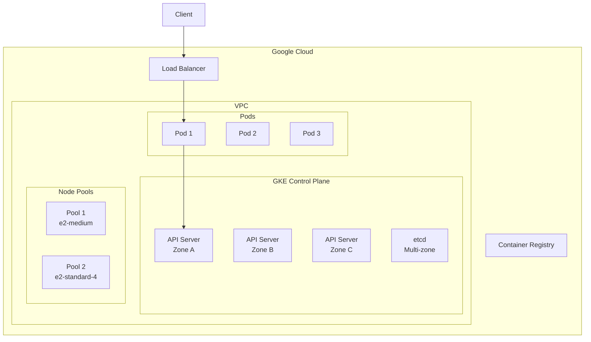

# Google GKE Deep Dive

> **Category:** Cloud Integration / Google Cloud
> GKE = Google Kubernetes Engine — Google's managed Kubernetes control plane.

## What is GKE?

GKE runs the K8s control plane across multiple zones, managed by Google. You manage node pools (or use Autopilot for fully managed).

| Component | Google Responsibility | Your Responsibility |
|-----------|----------------------|---------------------|
| etcd | Managed (multi-zone) | — |
| kube-apiserver | Managed (multi-zone) | — |
| kube-scheduler | Managed | — |
| kube-controller-manager | Managed | — |
| Worker nodes | — | Provision & manage |
| kubelet | — | Installed on nodes |
| CNI plugin | — | GKE Dataplane V2 (Cilium-based) |

## Architecture



## Cluster Creation

### gcloud CLI

```bash
# Create Autopilot cluster (fully managed)
gcloud container clusters create-auto my-cluster \
  --region=us-central1 \
  --project=my-project

# Create Standard cluster (you manage nodes)
gcloud container clusters create my-cluster \
  --zone=us-central1-a \
  --num-nodes=3 \
  --machine-type=e2-medium \
  --enable-autoscaling --min-nodes=2 --max-nodes=10 \
  --release-channel=regular

# Get credentials
gcloud container clusters get-credentials my-cluster --zone=us-central1-a
```

### Terraform

```hcl
module "gke" {
  source  = "terraform-google-modules/kubernetes-engine/google"
  version = "~> 29.0"

  project_id = "my-project"
  name       = "my-cluster"
  region     = "us-central1"
  zones      = ["us-central1-a", "us-central1-b", "us-central1-c"]

  network    = "default"
  subnetwork = "default"

  node_pools = [
    {
      name            = "default"
      machine_type    = "e2-medium"
      min_count       = 2
      max_count       = 10
      disk_size_gb    = 100
      disk_type       = "pd-standard"
      auto_repair     = true
      auto_upgrade    = true
      preemptible     = true
    }
  ]
}
```

## Autopilot vs Standard

| Feature | Autopilot | Standard |
|---------|-----------|----------|
| **Node management** | Fully managed by Google | You manage nodes |
| **Pricing** | Per-pod resource requests | Per-node |
| **Best for** | Most workloads | Custom node configs |
| **Node pools** | Not applicable | Yes |
| **Custom node config** | Limited | Full control |
| **Pod Security** | Enforced (restricted) | Configurable |

## GKE Dataplane V2

GKE uses **Dataplane V2** (Cilium-based CNI) for networking + network policies.

```bash
# Check CNI
kubectl -n kube-system get configmap calico-config -o yaml 2>/dev/null || \
kubectl -n kube-system get configmap gke-networking-config -o yaml

# Network policies work natively
kubectl apply -f network-policy.yaml
```

## Workload Identity (GCP IAM)

**Workload Identity** maps K8s ServiceAccounts to GCP IAM Service Accounts.

```bash
# Create GCP service account
gcloud iam service-accounts create my-sa --display-name="My K8s SA"

# Bind K8s SA to GCP SA
gcloud iam service-accounts add-iam-policy-binding my-sa@my-project.iam.gserviceaccount.com \
  --role=roles/iam.workloadIdentityUser \
  --member="serviceAccount:my-project.svc.id.goog[default/my-k8s-sa]"

# Annotate K8s SA
kubectl annotate serviceaccount my-k8s sa my-gcp-sa@my-project.iam.gserviceaccount.com

# Deploy pod with the SA
kubectl run my-pod --image=gcr.io/google.com/cloudsdktool/cloud-sdk --serviceaccount=my-k8s-sa
```

## GKE Ingress (GCE Load Balancer)

```yaml
# GKE-native Ingress provisions a GCE L7 Load Balancer
apiVersion: networking.k8s.io/v1
kind: Ingress
metadata:
  name: app
  annotations:
    kubernetes.io/ingress.class: "gce"
spec:
  rules:
  - host: app.example.com
    http:
      paths:
      - path: /*
        pathType: ImplementationSpecific
        backend:
          service:
            name: app
            port:
              number: 80
```

## Managed Certificates

```yaml
# GKE Managed Certificate (Let's Encrypt)
apiVersion: networking.gke.io/v1
kind: ManagedCertificate
metadata:
  name: my-cert
spec:
  domains:
  - app.example.com
---
apiVersion: networking.k8s.io/v1
kind: Ingress
metadata:
  name: app
  annotations:
    kubernetes.io/ingress.class: "gce"
    networking.gke.io/managed-certificates: my-cert
spec:
  rules:
  - host: app.example.com
    http:
      paths:
      - path: /*
        pathType: ImplementationSpecific
        backend:
          service:
            name: app
            port:
              number: 80
```

## Upgrades

```bash
# Check available upgrades
gcloud container clusters get-upgrades my-cluster --zone=us-central1-a

# Upgrade control plane
gcloud container clusters upgrade my-cluster --master --zone=us-central1-a

# Upgrade node pool
gcloud container clusters upgrade my-cluster --pool-name=default --zone=us-central1-a
```

## Cost Optimization

| Strategy | Implementation |
|----------|----------------|
| **Autopilot** | Pay per pod, no node management |
| **Preemptible nodes** | 80% cheaper, 24h max |
| **Spot VMs** | 91% cheaper, preemption possible |
| **Right-sizing** | VPA recommendations |
| **Node auto-provisioning** | GKE picks optimal machine types |
| **Shielded nodes** | Secure boot, integrity monitoring |

## Related

- [GKE Overview](./gke.md)
- [EKS](./eks-deep-dive.md)
- [AKS](./aks-deep-dive.md)
