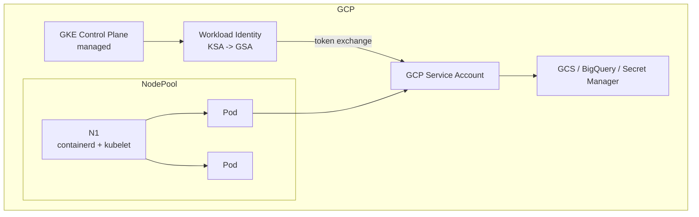

# GKE (Google Kubernetes Engine)

> **Category:** Cloud Integrations

**GKE** is Google's managed Kubernetes. It offers two compute models — **Standard** (node pools you manage, like EKS) and **Autopilot** (Google fully manages the nodes — you just run Pods and pay per Pod). GKE pioneered **Workload Identity** (GCP's IAM-for-SAs), auto-upgrades, and node auto-provisioning.

## Why It Matters

- **Autopilot** = no node management at all (Google provisions rightsized nodes per Pod).
- **Workload Identity** binds a K8s SA to a GCP SA → no GCP service-account keys.
- **Node auto-provisioning** adds node pools that match unschedulable Pods automatically.
- **GKE ingress** (GCLB) = a real L7 cloud load balancer with a single Ingress.
- **Private clusters** = API server on a private IP + private nodes (no public node IPs).

## Architecture



## Standard vs Autopilot

| Aspect | Standard | Autopilot |
|--------|----------|-----------|
| Nodes | You own node pools | Fully managed by GKE |
| Disk/etcd | You provision PVCs | Same (managed) |
| Cost model | Per-node | Per-Pod CPU+RAM (you pay idle overhead) |
| Pod density | You tune | GKE rightsizes |
| Best for | Long-running, known shapes | Sporadic, stateless, teams wanting zero ops |

## Installation / Bootstrap (`gcloud`)

```bash
gcloud container clusters create prod \
  --release-channel stable \
  --no-enable-master-authorized-networks \
  --enable-ip-alias \
  --num-nodes 3 --machine-type e2-standard-4 \
  --region us-central1

# Workload Identity (modern, preferred):
gcloud container clusters update prod \
  --workload-pool="${PROJECT_ID}.svc.id.goog"

# Create a GSA + KSA and bind:
gcloud iam service-accounts create k8s-sa
gcloud projects add-iam-policy-binding $PROJECT_ID \
  --member="serviceAccount:k8s-sa@$PROJECT_ID.iam.gserviceaccount.com" \
  --role='roles/storage.objectViewer'
kubectl apply -f - <<'Y'
apiVersion: v1
kind: ServiceAccount
metadata:
  name: k8s-sa
  namespace: default
  annotations:
    iam.gke.io/gcp-service-account: k8s-sa@PROJECT_ID.iam.gserviceaccount.com
Y
```

## GKE Ingress (GCLB) — the headline feature

GKE exposes `GCEIngressClass` / the GCLB via an `Ingress`:
```yaml
apiVersion: networking.k8s.io/v1
kind: Ingress
metadata:
  name: web
  annotations:
    kubernetes.io/ingress.class: "gce"
spec:
  defaultBackend:
    service:
      name: web-svc
      port: { number: 80 }
```
This spins up a **regional GCLB** — a real Google Cloud load balancer with SSL termination, Cloud Armor WAF, and Google-grade DDoS armor. You pay for the forwarding rule + the GCLB.

## Node pools, auto-provisioning, autoscaling

```bash
gcloud container node-pools create gpu-pool --cluster=prod \
  --accelerator type=nvidia-tesla-t4,count=1 \
  --machine-type e2-standard-8 --num-nodes 0 --enable-autoscaling \
  --min-nodes 0 --max-nodes 3

# Enable auto-provisioning (GKE creates pools by shape to fit pending Pods):
gcloud container clusters update prod --enable-autoprovisioning \
  --max-node-pool-count=4
```

## Storage on GKE

- **Persistent Disk (pd.csi.google.com)**: per-Pod, zonal (use `WaitForFirstConsumer`).
- **Filestore** (NFS) CSI for shared storage.
- **Regional Persistent Disk** for HA volumes.

## Common Issues

| Symptom | Cause | Fix |
|---------|-------|-----|
| Nodes `NotReady` after upgrade | Node pool version skew vs. control plane > 2 minor | Use **release channel**; GKE auto-upgrades within channel |
| Workload Identity "Permission denied" | KSA↔GSA bind missing, or `--workload-pool` not set | `kubectl describe sa`, check the binding + pool flag |
| Ingress stuck "creating" | GCLB quota exhausted in the region | Request quota via Google Cloud Console; or use GKE Gateway instead |
| Disk `ReadOnly` after Pod restart | PD mounted in `ReadOnly` mode; or stale mount | Delete + recreate PVC; use `fsGroup` for shared access |

## Commands Cheatsheet

```bash
gcloud container clusters get-credentials prod --region us-central1
kubectl get nodes -L cloud.google.com/gke-nodepool
kubectl get ingress -o wide
kubectl get --raw /readyz              # control-plane health
gcloud container clusters list
gcloud container node-pools list --cluster prod
```

## Interview Questions

**Q: What is the difference between Standard and Autopilot on GKE?**
A: Standard = you manage node pools (choose machine type, OS, size, autoscaling); you pay per-node. Autopilot = GKE manages provisioning/rightsizing nodes per workload; you pay per-Pod vCPU+RAM (with a small "per-pod overhead"). Autopilot is great for teams that want zero node management; Standard gives you full control.

**Q: How does Workload Identity work?**
A: GKE runs an OIDC issuer for the cluster; a K8s ServiceAccount is **annotated** with a GCP Service Account email. A token request to the cluster API is exchanged for a short-lived GCP access token — the Pod calls Google APIs (GCS, BigQuery) **without** any key file. It's Google's answer to IRSA.

**Q: What's special about GKE Ingress vs. an NGINX ingress controller?**
A: GKE Ingress provisions a **dedicated Google Cloud HTTP(S) Load Balancer** (GCLB) — a real L7 cloud resource with DDoS protection, Cloud Armor WAF, SSL certs, and global Anycast. An NGINX ingress controller is just a Pod doing L7 routing within the cluster; you'd still need a `Service type: LoadBalancer` in front of it.

## Related Resources
- [Cloud Integrations Overview](README.md)
- [EKS](eks.md) · [AKS](aks.md)
- [Ingress](../04-networking/ingress.md) · [Ingress Controllers](../04-networking/ingress-controllers.md)
- [Secrets](../06-security/secrets.md)
- [Companies Using Kubernetes](../companies-using-kubernetes.md)
