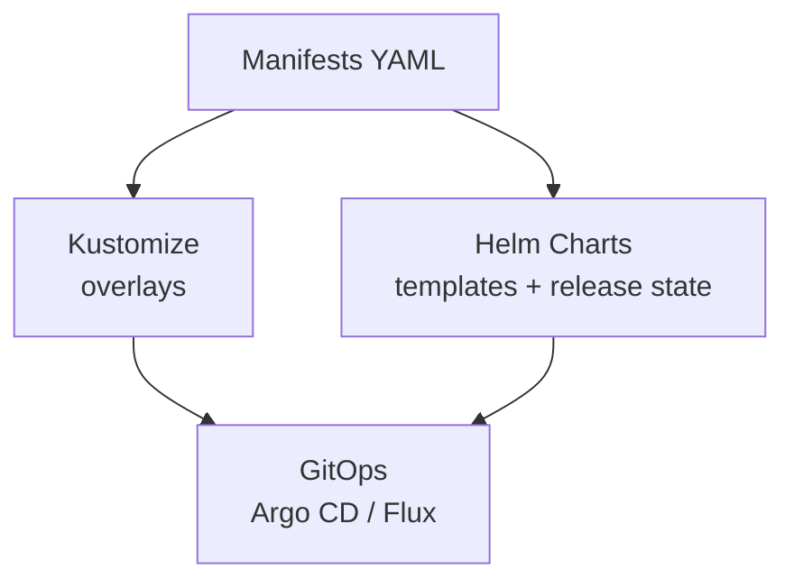

# 10. Package Management & Tooling

> **Category:** Package Management / GitOps

This category covers tools for **packaging, distributing, and managing** Kubernetes manifests.

## Contents

| File | Topic |
|------|-------|
| [helm.md](helm.md) | Helm package manager (charts, releases, repos) |
| [helm-charts.md](helm-charts.md) | Authoring Helm charts |
| [kustomize.md](kustomize.md) | Kustomize (overlay-based customization, `kubectl` native) |

## Package Managers

| Tool | Approach | Strengths |
|------|----------|-----------|
| **Helm** | Package (chart) + release lifecycle | Most popular, huge ecosystem |
| **Kustomize** | Native overlays (no templating) | GitOps friendly, `kubectl` built-in |
| **Kapp** | App CR + gitops | Simple, diffing |
| **Jsonnet / YTT** | Programmatic generation | Type-safe, reusable |

## Learning Path

## Key Questions

- **How do I package an app?** Helm chart (`Chart.yaml` + templates + values)
- **How do I environment-ize manifests?** Kustomize overlays (dev/staging/prod)
- **How do I see drift?** Helm `diff`, Kustomize + git diff
- **How do I upgrade?** `helm upgrade`, `kubectl apply`

## Related Resources

- [Workloads](../03-workloads/README.md)
- [CI/CD & GitOps](../11-ci-cd-gitops/README.md)
