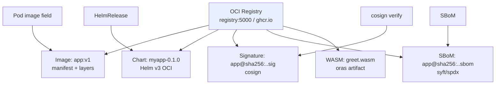

# OCI — The Image Spec Under Everything

> **Category:** Package Management / Runtime

The **OCI (Open Container Initiative)** image spec is the format behind *every* artifact that runs or travels in K8s: container images, yes — but also **Helm charts, Cosign signatures, SBOMs, CNAB bundles, and WASM modules** are now all **OCI artifacts** living in the same registry. K8s itself only runs `ImageSpec` images, but the broader ecosystem (Helm v3, Flux, Argo, ORAS) stores and fetches all of these via the **OCI Registry v2** HTTP API. This is why `docker pull` and `helm install` talk to the same `registry-1.docker.io`.



## OCI Image Index + Manifest shapes

- **Image manifest** (`application/vnd.oci.image.manifest.v1+json`): `config` blob + ordered `layers` (the rootfs layers for a container; or arbitrary layers for an artifact).
- **Image index** (`application/vnd.oci.image.index.v1+json`): a manifest *of manifests* — used for **multi-arch** (`linux/amd64` + `arm64`). When you `docker pull foo:latest` on an M-series Mac, the client consults the index and fetches the `arm64` entry. K8s nodes do this too.
- **Artifact (no config) manifest**: same shape, but `config` media-type is `text/plain` and the "config" is a JSON descriptor — this is how Helm charts, cosign signatures, and SBOMs live in a registry.

## Media types (conformance)

| Kind | mediaType |
|------|-----------|
| Image manifest | `application/vnd.oci.image.manifest.v1+json` |
| Image index (multi-arch) | `application/vnd.oci.image.index.v1+json` |
| Image config | `application/vnd.oci.image.config.v1+json` |
| Generic artifact (cosign, sbom) | `application/vnd.oci.image.manifest.v1+json` with a non-image config descriptor |
| Helm v3 chart | `application/vnd.cncf.helm.chartContent.v1.tar+tgz` |

## Pushing/pulling artifacts with ORAS & Helm OCI

```bash
# A WASM module as an OCI artifact:
oras push ghcr.io/acme/greet:v1 greet.wasm

# A Helm chart to an OCI registry:
helm chart save mychart oci://ghcr.io/acme/mychart --version 0.1.0
helm chart push oci://ghcr.io/acme/mychart:0.1.0

# Pulling in a workflow (Helm v3 / Flux):
helm install myrelease oci://ghcr.io/acme/mychart --version 0.1.0
```

## Registry auth

K8s nodes authenticate via **imagePullSecrets** (Kubernetes secrets of type `kubernetes.io/dockerconfigjson`), which map to the registry's `Bearer`/`Basic` token flow. Helm/Flux use the same via `imagePullSecrets` on the namespace or a service-account `imagePullSecrets`. For private registries, pre-create a dockerconfigjson secret and attach it to the SA.

## Common Issues

| Symptom | Cause | Fix |
|---------|-------|-----|
| `manifest unknown`/`wrongRepo` | registry is a *repository* (`repo:path`) but you used a namespace/repo; or manifest not pushed | push with correct repo + tag; `oras repo ls` to confirm |
| multi-arch image never resolves on `arm64` | index entry for `arm64` missing | rebuild with `--platform linux/amd64,linux/arm64` |
| cosign signature not found | annotation/descriptor mismatch | `cosign sign --type ambident` or verify the right `<name>@sha256:` |
| registry `405 Method Not Allowed` | pushed an OCI *artifact* to a v2-only registry, or used Docker v1 API | confirm `manifest` shape matches media type; use a v2.1+ registry |
| `imagepullsecret` invalid | dockerconfigjson `auth` block base64-encoded twice | regenerate secret via `kubectl create secret docker-registry` |

## Interview Questions

**Q: How is an OCI artifact different from a Docker/OCI image, and why do they share a registry?**
A: An OCI image is just a special **manifest shape**: a `config` + a list of `layers`. An **OCI artifact** uses that same manifest shape for *any* blob (Helm chart, SBOM, signature) — it just swaps the config descriptor and uses a generic media-type. Same registry API, same auth, same multi-arch index mechanics, so Helm, Flux, Cosign, and Syft all live alongside images.

**Q: What is an OCI image index for, and how does Kubernetes use it?**
A: An index is a manifest that points at per-architecture image manifests (amd64/arm64/ppc64le/...). When kubelet pulls a Pod image, it reads the index, picks the entry whose `platform` matches the node (`GOARCH`/`GOOS`), and pulls *that* manifest. That's why a single tag works across heterogeneous node pools.

**Q: Why does a private registry need an `imagePullSecret` of type `dockerconfigjson`?**
A: kubelet has to authenticate to the registry over the Bearer/Basic flow that the registry expects. K8s encodes the registry credentials in a `kubernetes.io/dockerconfigjson` Secret (the same `~/.docker/config.json` format), and the kubelet passes it as the `Authorization` header. The secret must live in the Pod's namespace (or the SA's `imagePullSecrets`).

## Related Resources
- [Helm](helm.md)
- [Helm Charts](helm-charts.md)
- [Signing & Supply Chain](../11-supply-chain/cosign.md)
- [WASM](../15-advanced-patterns/wasm.md)
- [Kubernetes Architecture](../02-architecture/architecture.md)
