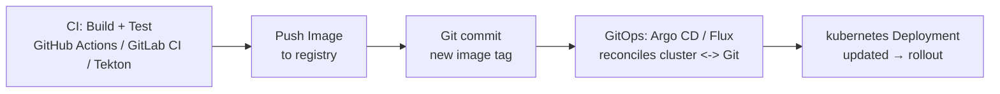
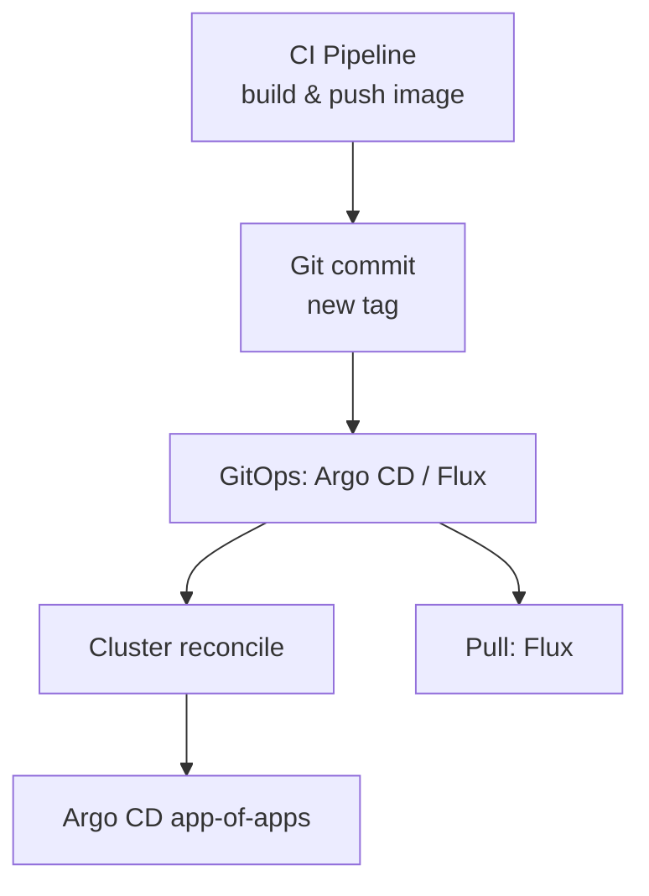

# 11. CI/CD & GitOps

> **Category:** CI/CD / GitOps

This category covers **delivering** containers into Kubernetes: CI pipelines (build + push), GitOps (Argo CD / Flux) for continuous **deployment**, and CI runners on Kubernetes (Tekton, Argo Workflows).

## Core Workflow

## Contents

| File | Topic |
|------|-------|
| [ci-cd.md](ci-cd.md) | CI/CD patterns, image builds, registry + signing |
| [argo-cd.md](argo-cd.md) | Argo CD — declarative GitOps CD |
| [flux.md](flux.md) | Flux (Git/Memory + Helm) |
| [tekton.md](tekton.md) | Tekton — cloud-native CI/CD (YAML pipelines) |

## CI vs CD vs GitOps

| Term | Scope | Tooling | Goal |
|------|-------|---------|------|
| **CI** | Build/test/push | GitHub Actions, GitLab CI, Tekton | Image in registry |
| **CD** | Deploy | Spinnaker, Jenkins X, Argo CD | Cluster updated |
| **GitOps** | Declarative CD | Argo CD, Flux | Cluster == Git desired state |

## Learning Path

## Key Questions

- **How is the image built?** CI runner / Kaniko / Tekton / BuildKit
- **How is the cluster kept in sync with Git?** Argo CD (pull) / Flux (pull + Helm)
- **How is config separated from code?** Helm `values/`, Kustomize overlays, SealedSecrets, External Secrets

## Related Resources

- [Package Management](../10-package-management/README.md)
- [Workloads](../03-workloads/README.md)
- [Security](../06-security/README.md)
