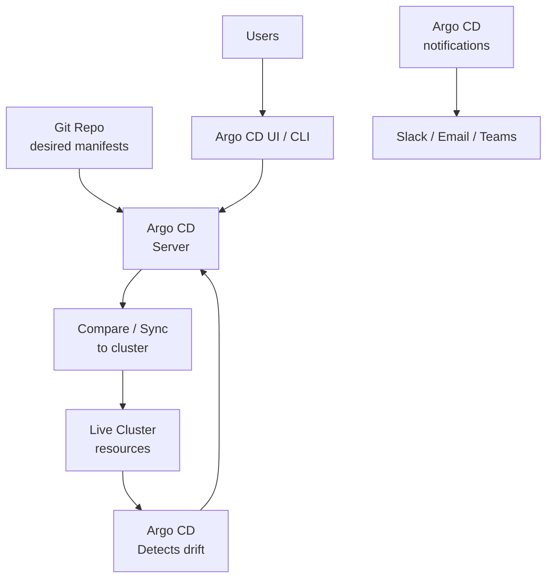

# Argo CD

> **Category:** CI/CD / GitOps

## What It Is

**Argo CD** is a **declarative GitOps** continuous delivery tool for Kubernetes. It runs as an application in your cluster, continuously comparing what is in a Git repo (the desired state) with what's actually live in the cluster — and reconciling them.

Argo CD provides a **web UI** and **CLI** for visualizing deployments, diffs, and sync history.

## Why It Exists

- **Drift detection**: if someone `kubectl apply`s manually, Argo CD flags it (and can auto-revert)
- **Auditable**: every cluster change comes from a Git commit
- **Self-service**: teams manage their own applications via Git; platform teams manage infra
- **UI**: a readable dashboard of what's deployed, where, and any divergence

## Architecture



### Components

| Component | Role |
|-----------|------|
| **Application Controller** (Deployment) | Watches clusters, syncs Apps, computes diffs |
| **Application Server** | The API server behind the UI/CLI |
| **Application CRD** | You declare the desired state (which repo + path + cluster) |
| **Repo Server** | Fetches Git + renders manifests (incl. Helm + kustomize) |
| **Dex / SSO** | Identity provider (OIDC) — for login |

### Multi-Tenant

- **AppProject** resource scopes which repos/clusters/users can deploy — multi-team isolation.

## Application CRD

```yaml
apiVersion: argoproj.io/v1alpha1
kind: Application
metadata:
  name: my-app
  namespace: argocd
  finalizers:
  - resources-finalizer.argocd.argoproj.io
spec:
  project: default
  source:
    repoURL: https://github.com/my-org/my-manifests.git
    targetRevision: HEAD
    path: prod              # The directory in the repo (kustomize or helm or yaml)
    # OR, for Helm:
    helm:
      valueFiles:
      - prod-values.yaml
    # OR, for a remote chart:
    # chart: nginx
    # helm:
    #   valueFiles:
    #   - values-prod.yaml
    #   parameters:
    #   - name: ingress.enabled
    #     value: "true"
    plugin:                 # Custom plugins (rare)
      name: my-plugin
    ref:                   # (K8s 1.29+ / plugin refs) multi-source references
    - ...
  destination:
    server: https://kubernetes.default.svc     # in-cluster; or https://<external>
    namespace: prod
    # OR: name: in-cluster   (uses the local cluster)
  syncPolicy:
    automated:
      prune: true                # Delete objects that left Git
      selfHeal: true             # Auto-fix drift
    retry:
      limit: 3
      backoff:
        duration: 5s
        factor: 2
        maxDuration: 300s
    syncOptions:
    - CreateNamespace=true
    - ApplyOutOfSyncFields=atCreation   # allow server-side set fields
  ignoreDifferences:
    - group: "apps"
      kind: Deployment
      jsonPointers:
      - /spec/replicas      # Ignore replica count drift (HPA manages it)
  info:
    - name: "backstage.io/link"
      value: "https://catalog.example.com/my-app"
```

## The `Application` lifecycle

```
Created → Synced? No → OutOfSync
  └─ (auto-sync or manual) → Sync → Synced? Yes → Healthy? Yes → Healthy
  └─ drift detected → OutOfSync (SelfHeal -> re-syncs)
```

## Installation

```bash
kubectl create namespace argocd
kubectl apply -n argocd -f https://raw.githubusercontent.com/argoproj/abi-cd/stable/manifests/install.yaml

# Expose (LoadBalancer for external):
kubectl patch svc argocd-server -n argocd -p '{"spec":{"type":"LoadBalancer"}}'
kubectl get svc argocd-server -n argocd

# Default admin password (after install):
kubectl -n argocd get secret argocd-initial-admin-secret \
  -o jsonpath="{.data.password}" | base64 -d
```

## Commands (CLI)

```bash
# Install the CLI
curl -sSL -o /usr/local/bin/argocd https://...argocd-linux-amd64
chmod +x /usr/local/bin/argocd
argocd login <argocd-server> --username admin --password <pwd>
# Or use SSO:
argocd login <server> --sso

# App management
argocd app list / argocd app create my-app -f my-app.yaml
argocd app sync my-app
argocd app diff my-app                  # Git vs live diff
argocd app wait my-app --health        # Wait for Healthy
argocd app rollback my-app <revision>
argocd app delete my-app --cascade
argocd app get my-app
argocd app history my-app               # Revision history

# SSO (OIDC) login
argocd login --sso

# Project management
argocd admin listprojects
argocd proj create myproj
```

## AppProject (multi-tenant scoping)

```yaml
apiVersion: argoproj.io/v1alpha1
kind: AppProject
metadata:
  name: team-a
  namespace: argocd
spec:
  description: Team A's project
  sourceRepos:            # Where this project can pull from
  - https://github.com/my-org/team-a-manifests.git
  destinations:           # Where it can deploy
  - server: https://kubernetes.default.svc
    namespace: team-a-prod
  clusterResourceWhitelist:   # Cluster-scoped resources allowed
  - group: "*"
    kind: Namespace
  namespaceResourceWhitelist:
  - group: "apps"
    kind: Deployment
  # OR a blacklist to deny certain kinds
  syncWindows:            # Maintenance windows
  - kind: allow
    schedule: "0 9-17 * * 1-5"
    duration: "8h"
```

## Sync Policies

| Policy | Behavior |
|--------|----------|
| **Manual** | Only deploys on explicit `argocd app sync` (or UI button) |
| **Automated** | Always reconciles Git → cluster (auto-sync) |
| Automated + `prune` | Also deletes resources removed from Git |
| Automated + `selfHeal` | Fixes manual drift by re-syncing to Git |

## ApplicationSets (template Apps)

Generate many Applications from a matrix (e.g., teams × environments):

```yaml
apiVersion: argoproj.io/v1alpha1
kind: ApplicationSet
metadata:
  name: my-apps
spec:
  generators:
  - git:
      repoURL: https://github.com/org/repos.git
      revision: main
      directories:
      - path: services/*      # One Application per directory
  template:
    metadata:
      name: '{{path.basename}}'        # Dynamic name
    spec:
        source:
        repoURL: https://github.com/org/my-manifests.git
        targetRevision: HEAD
        path: '{{path}}'
        destination:
          server: https://kubernetes.default.svc
          namespace: '{{path.basename}}'
```

## Health Checks

Argo CD reports a `Health` status (`Progressing`, `Healthy`, `Degraded`, `Missing`) and a `Sync` status. You can customize health checks or ignore drift via `resourceCustomization`/`ignoreDifferences` blocks on the `Application`.

A common customization is to **ignore server-side-set fields** that the cluster modifies (so Argo CD does not flag false drift):

```yaml
spec:
  ignoreDifferences:
  - group: "apps"
    kind: Deployment
    jsonPointers:
    - /spec/replicas              # HPA manages this
  - group: ""
    kind: Secret
    jsonPointers:
    - /data                # Secrets are often regenerated/changed
```

### Health hooks (Lua)
For resources Argo CD does not know how to assess, you can ship a Lua health plugin (advanced). For most built-in resources (Deployments, Services, Ingress... ) the defaults are sufficient.

## Commands / Common Tasks

```bash
# Sync + watch
argocd app sync my-app
argocd app wait my-app --health --timeout 300

# Diff
argocd app diff my-app
argocd app diff my-app --local overlays/prod   # Diff against local files

# Rollback
argocd app rollback my-app <revision>

# Set parameters (overrides a value) — like --set
argocd app set my-app -p image.tag=v1.1

# Sync with options
argocd app sync my-app --strategy=bg    # (requires app-of-apps or plugin)
argocd app sync my-app --force          # Replace (force) out-of-sync resources

# AppProject
argocd proj add-repo team-a https://github.com/my-org/manifests.git
argocd proj add-destination team-a https://1.2.3.4 default
```

## Common Issues

### "ComparisonError" / "Unknown" health
```bash
argocd app diff <name>
# A manifest can't be rendered (wrong Helm values, plugin missing).
# Check: the path/repo/targetRevision; the repo is reachable (credentialed).
```

### "Orphaned Resources" / drift after manual kubectl apply
```bash
argocd app diff <name>
# Shows resources added/mutated outside Git.
# With selfHeal: true, Argo CD reverts them automatically on next sync.
```

### "No tracked objects are found" (empty sync)
```bash
# The path is empty, OR kustomize/helm generated nothing.
argocd app set my-app --path .     # Check the path exists in the repo.
argocd app set my-app --helm-set ... # Check helm values render correctly.
```

### RBAC: "Permission denied for resource"
```yaml
# In a restricted Project, the destination namespace isn't allowed:
spec:
  destinations:
  - server: https://kubernetes.default.svc
    namespace: team-a-prod     # Must match the namespace EXACTLY.
```

### "Sync is in progress" forever
```
# Check: readinessProbe / liveness on the app; Argo CD waits for Healthy.
# Or: a resource is stuck (wrong API, missing CRD).
argocd app get <name>
```

### App stuck in Progressing
```yaml
# Argo CD considers the app "Progressing" until health is Healthy.
# Add: spec.syncOptions:
# - PrunePropagationPolicy=background  (deletes without waiting)
```

### "Invalid spec: Repository is not permitted"
```
# AppProject.sourceRepos does not include the repo.
# Add the repo URL to the project's sourceRepos list.
```

### Multi-source + Helm values from another repo
```yaml
spec:
  sources:
  - repoURL: https://github.com/my-org/platform-helm.git
    chart: my-chart
    targetRevision: v1.2
    helm:
      valueFiles:
      - $my-app-values/prod.yaml       # ref to another source
  - repoURL: https://github.com/my-org/my-app-overrides.git
    targetRevision: HEAD
    ref: my-app-values
```

## RBAC (AppProject scoping)

Argo CD enforces that:
1. A User must be allowed to view/sync the **AppProject**
2. The Application's **source** repo is in the project's `sourceRepos`
3. The Application's **destination** namespace/server is in the project's `destinations`

## Best Practices

1. **Automated + selfHeal** for prod apps (drift-proof)
2. **AppProjects** per team — scope repos + destinations + users
3. **Ignore auto-generated fields** (`spec.replicas` if HPA, `metadata.resourceVersion`, checksums)
4. **Use ApplicationSets** to template many apps
5. **Enable notifications** (Slack, Teams) on sync / drift
6. **Pin `targetRevision`** (a tag/commit) for reproducibility — not `latest`
7. **Health hooks/customizations** for apps Argo doesn't know how to assess
8. **Out-of-band (manual `kubectl`) is discouraged** — let Git + Argo own state
9. **Use SSO (OIDC)** — don't share the admin password
10. **Monitor Argo CD's own health** (it is a workload; it needs HA + a backup plan)

## GitOps Principles (summary)

| Principle | Argo CD supports |
|-----------|------------------|
| **Declarative config** in Git | Yes — manifests + values |
| **Pull-based** | Yes — Argo CD pulls Git and the cluster |
| **Drift detection/reconciliation** | Yes — OutOfSync → Healthy |
| **Auditable / traceable** | Yes — every change is a Git commit |
| **Self-healing** | Yes — `selfHeal: true` |
| **Role separation** | Yes — AppProject scoping |

## Interview Questions

**Q: What is the core loop of Argo CD?**
A: It **compares** the desired state (Git) with the Live state (cluster); if they differ, it's `OutOfSync`. It then **syncs** (applies Git state to the cluster), aiming for `Synced`+`Healthy`.

**Q: How is Argo CD different from a CI pipeline (e.g., GitHub Actions)?**
A: CI **pushes** a deploy command. Argo CD is **declarative + pull-based**: it watches Git and reconciles; CI just commits the desired state.

**Q: What is an AppProject?**
A: A scoping boundary — it restricts which Git repos an app can use and which clusters/namespaces it can deploy to — for multi-team isolation.

**Q: What is a "drift" and how is it handled?**
A: Drift = a live cluster change not matching Git (e.g., a manual `kubectl apply`). Argo CD flags it as `OutOfSync`; with `selfHeal: true` it auto-reconciles.

**Q: What is ApplicationSet?**
A: A CRD that **generates multiple Applications** from a matrix (e.g., teams x environments, or one-application-per-Git-directory) from generators (Git, cluster, matrix/params).

**Q: What does `prune: true` do?**
A: On automated sync, it **deletes** live resources that have been removed from the Git manifest — keeping the cluster matching Git exactly.

## Related Resources

- [Flux](flux.md)
- [CI/CD Overview](ci-cd.md)
- [Helm](../10-package-management/helm.md)
- [Kustomize](../10-package-management/kustomize.md)
- [Security](../06-security/README.md)
